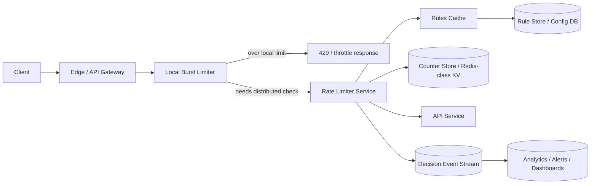

Generated by Codex with gpt-5

Selected problem: API Rate Limiter

Scope: Design a distributed server-side rate limiter that enforces per-user, per-IP, per-tenant, and per-route API quotas with very low decision latency across many stateless services.

## Problem framing

This is the classic server-side API rate limiter from Grokking and Alex Xu: every request should get a cheap admission decision before it reaches expensive application logic.

Functional requirements:

- Enforce limits by one or more descriptors such as API key, user ID, tenant ID, IP address, route, method, or device.
- Support different limits for different plans, APIs, and abuse-sensitive endpoints.
- Return a clear throttle response when requests are rejected.
- Allow rule changes without redeploying every API service.
- Support both coarse burst protection and longer-window quotas.
- Emit logs or metrics so operators can tune rules and investigate abuse.

Non-functional requirements:

- Very low latency on the decision path. The limiter sits on every request.
- High availability. The protection layer must not become a single point of failure.
- Horizontal scalability across many stateless API servers or gateways.
- Concurrency-safe behavior under heavy contention.
- Bounded memory growth for hot keys and expiring counters.
- Multi-region support with explicit tradeoffs between strictness and latency.
- Graceful degradation when the counter store or config distribution path is unhealthy.

Scale assumptions:

- Assume global peak ingress of about 1 million requests per second.
- Assume bursty traffic, with hot tenants or abusive IPs briefly spiking 5 to 10 times above normal.
- Assume millions of active rate-limit descriptors per day, but only a fraction are hot in a single time window.
- Assume product teams want a mix of limits:
  - short burst limits such as `10 req/s`
  - contract limits such as `5,000 req/hour`
  - abuse limits such as `5 failed logins/minute`
- These are interview assumptions, not claims about any current provider's production traffic.

Core APIs:

```http
POST /v1/check
{
  "descriptors": {
    "tenantId": "t_123",
    "userId": "u_456",
    "apiKeyId": "key_789",
    "ip": "203.0.113.10",
    "route": "POST:/v1/messages"
  },
  "cost": 1,
  "timestamp": "2026-04-22T06:45:00Z"
}
-> 200 OK
{
  "allowed": true,
  "matchedRuleIds": ["premium-write-minute"],
  "limit": 600,
  "remaining": 41,
  "resetAfterSeconds": 12
}

PUT /v1/rules/{ruleId}
{
  "scope": "plan=premium route=POST:/v1/messages",
  "algorithm": "token_bucket",
  "requestsPerUnit": 600,
  "unit": "minute",
  "burst": 60,
  "mode": "enforce"
}

GET /v1/rules?scope=route=POST:/v1/messages
-> active rules + rule version
```

On rejection, the gateway or middleware typically turns the decision into an external `429 Too Many Requests` response with retry metadata.

Core data model:

| Entity | Key | Important fields | Notes |
| --- | --- | --- | --- |
| `RateLimitRule` | `rule_id` | `scope_matchers`, `algorithm`, `limit`, `window_seconds`, `burst`, `priority`, `mode`, `version` | Durable control-plane definition |
| `DescriptorKey` | derived from request | `tenant_id`, `user_id`, `api_key_id`, `ip`, `route`, `method` | Input used to match rules and build counter keys |
| `CounterBucket` | `rule_id + descriptor_hash + bucket_start` | `count`, `expires_at` | Good fit for fixed/sliding counter variants |
| `TokenBucketState` | `rule_id + descriptor_hash` | `tokens_available`, `last_refill_at`, `expires_at` | Good fit for burst control |
| `DecisionEvent` | append-only event | `descriptor_hash`, `rule_id`, `allowed`, `remaining`, `region`, `timestamp` | Used for analytics and tuning, not synchronous enforcement |

## Architecture



High-level design:

- Put the limiter in gateway or middleware, not in the client. Both books make this point clearly.
- Derive one or more descriptors from the request, such as tenant, user, IP, and route.
- Apply a local burst limiter first. This protects the gateway itself and cuts load on the distributed path.
- For quotas that must be shared across many API instances, call a distributed rate-limiter service or shared counter store.
- Store rule definitions in a durable control-plane system and cache them aggressively near the decision path.
- Keep hot mutable quota state in an in-memory distributed key-value store with TTL-based expiry.
- Emit decision events asynchronously for analytics, customer support, rule tuning, and abuse forensics.

Practical request flow:

1. A request arrives at the edge or API gateway.
2. Middleware matches the route and derives descriptors such as `tenant + api_key + route`.
3. A local token bucket handles immediate bursts cheaply in process.
4. If the request passes the local check, the limiter evaluates shared quotas using the distributed counter store.
5. If over limit, the gateway returns `429`.
6. If under limit, the request is forwarded to the API service.
7. The limiter emits an async decision event for monitoring and analytics.

Storage choices:

- Rule store:
  - Use a durable database or config service with versioned rules.
  - Rules change infrequently compared with request traffic.
- Hot counter state:
  - Use an in-memory distributed KV store with atomic increment or script support.
  - TTLs should match bucket lifetime or idle-state expiry.
  - This is closer to DDIA's "specialized components" model than a single all-purpose relational design.
- Analytics:
  - Use an append-only stream plus downstream OLAP or timeseries storage.
  - Do not block the request path on dashboard or reporting writes.

Caching strategy:

- Cache rules inside the gateway or limiter worker with a version number.
- Use local token buckets for the hottest short-term decisions.
- Keep distributed counter entries short-lived with TTLs to bound memory.
- Treat analytics as derived data and compute aggregates asynchronously.

Partitioning and sharding:

- Partition shared counter state by a hash of `rule_id + descriptor`.
- Avoid leading with timestamps in the partition key. DDIA's hot-spot warning applies directly: if the key starts with the current time window, current traffic clusters on the same partitions.
- A practical key shape is:
  - `hash(rule_id|descriptor) + bucket_start`
- If the product has route-specific limits, include route or API group in the descriptor so different APIs do not fight over the same counter.
- Use consistent hashing or a similarly stable sharding scheme when scaling the counter fleet.

Consistency tradeoffs:

- In a single region, exactness is straightforward if each decision uses an atomic counter update.
- In multiple regions, exact global limits are expensive. Per-request consensus increases latency and harms availability.
- A practical default is:
  - strict local or regional enforcement on the hot path
  - eventual or leased global coordination across regions
- Rule updates should propagate quickly, but not through synchronous per-request reads. Use versioned caches plus push or frequent pull refresh.
- Analytics, monitoring, and customer-facing usage dashboards can be eventually consistent.

Main bottlenecks to call out in an interview:

- Hot keys from one abusive IP, tenant, or route.
- Counter-store saturation from every request needing remote state.
- Rule rollout lag creating inconsistent behavior across gateways.
- Memory blow-up if using per-request timestamp logs for too many active subjects.
- Clock skew and uneven refill behavior in distributed token or window algorithms.

## Deep dives

### Algorithm choice

Alex Xu and Grokking both walk through the standard algorithm menu:

- Fixed window counter:
  - simplest and cheapest
  - allows edge bursts around window boundaries
- Sliding window log:
  - very accurate
  - expensive in memory because it stores many timestamps
- Sliding window counter:
  - smoother than fixed window
  - much cheaper than full logs
- Token bucket:
  - excellent for burst absorption
  - easy to reason about operationally
- Leaky bucket:
  - useful when you want a steadier drain rate

Practical interview answer:

- Use a local token bucket for immediate burst protection at the gateway.
- Use a sliding window counter or token bucket in the shared store for customer-visible quotas.
- Avoid full sliding logs except for low-cardinality or especially sensitive endpoints, because Grokking's memory discussion is still relevant.

### Correctness under concurrency

The dangerous pattern is:

1. read current count
2. compare with threshold
3. increment

That sequence races under concurrency. Alex Xu explicitly calls this out.

Better options:

- atomic increment primitives when the algorithm supports them
- Redis Lua scripts or equivalent server-side logic
- sorted sets only when accuracy justifies the extra memory and CPU

Also handle weighted requests explicitly. Some APIs should consume more than one unit of quota, so `cost` must be part of the atomic update.

### Multi-region design

This is where DDIA thinking matters most.

If the interviewer asks for a single global limit across regions, there are three broad choices:

- One home region or one linearizable store:
  - strictest
  - worst latency
  - weakest availability during regional trouble
- Independent regional limits:
  - fastest
  - easiest to operate
  - not a true global quota
- Regional token leases from a global allocator:
  - good practical compromise
  - each region spends a local budget and periodically refreshes
  - allows bounded overshoot equal to unused lease capacity

For most public APIs, the third option is the best interview answer because it is honest about the CAP-style tradeoff instead of pretending global exactness is free.

### Failure handling and degradation

The limiter protects the platform, but it can also become an outage multiplier if designed poorly.

Practical behavior:

- If config distribution fails, keep serving with last-known-good rules.
- If the distributed counter store is slow or unavailable:
  - fail-open for general product APIs if availability is more important
  - fail-closed for abuse-sensitive flows such as login, signup, password reset, or card testing defenses
- Keep a coarse local emergency limiter even when the distributed system is unhealthy.
- Prefer time-bounded stale caches over synchronous config-store reads on the hot path.

### Observability and tuning

Rate limiting is not finished once requests are blocked.

Operators need to know:

- which rules trigger most often
- whether good traffic is being blocked
- which tenants or IPs are hot
- whether current burst settings are too strict or too loose
- whether one region is consuming quota much faster than others

Decision events belong in a stream or log so that aggregates, alerts, and experiments can be computed out of band.

## Modern considerations

- Gateway and proxy enforcement is now the default mental model, not an edge case. Current Envoy docs explicitly support using local and global rate limiting together, with the local token bucket absorbing bursts before a finer-grained shared limit is checked. Sources: [Envoy local rate limiting overview](https://www.envoyproxy.io/docs/envoy/latest/intro/arch_overview/other_features/local_rate_limiting) and [Envoy global rate limiting overview](https://www.envoyproxy.io/docs/envoy/latest/intro/arch_overview/other_features/global_rate_limiting.html).
- Returning `429 Too Many Requests` is still the standard client-facing answer. [RFC 6585](https://www.rfc-editor.org/rfc/rfc6585) also notes that under real attack load, generating a `429` for every request is not always required; dropping work can be more appropriate.
- Modern gateways often support dry-run or shadow rollout. Current Envoy HTTP local rate-limit docs separate `filter_enabled` from `filter_enforced`, which is exactly the kind of safe rollout knob worth mentioning in an interview. Source: [Envoy HTTP local rate limit filter](https://www.envoyproxy.io/docs/envoy/latest/configuration/http/http_filters/local_rate_limit_filter).
- Response metadata is less ad hoc than it used to be, but not fully uniform across providers. Cloudflare's current API docs document `Ratelimit`, `Ratelimit-Policy`, and `retry-after` headers on their REST APIs. Source: [Cloudflare API rate limits](https://developers.cloudflare.com/fundamentals/api/reference/limits/).
- Older book examples sometimes attach dated traffic numbers or specific vendor counts to the design. Those examples are useful for intuition, but the better modern interview answer is to state explicit assumptions and reason from them instead of repeating old numbers as facts.
- The main practical update since the books is deployment style: more enforcement now happens at gateways, proxies, and edges, so a two-stage design with local burst absorption plus distributed shared quotas is usually more realistic than one giant centralized limiter.
- Perfect global accuracy is still possible, but it remains expensive in latency and availability terms. The modern default is usually bounded inaccuracy with clearly stated limits rather than pretending worldwide exactness is free.

## Interview follow-ups

- How would the design change for login abuse protection versus a paid public API?
  - For login, fail closed more often, combine per-IP and per-account limits, use tighter windows, and favor abuse resistance over perfect user experience. For a paid API, favor clearer quota contracts, better client feedback, and more fail-open behavior during limiter incidents.
- Would you use token bucket, sliding window counter, or both for a `100 req/min` product contract?
  - Use both when possible. A token bucket handles short bursts well, while a sliding window counter keeps the effective minute-level contract smoother and less gameable at window edges.
- How would you implement a true global tenant quota across three regions?
  - Use a global allocator that hands out regional token leases, or route all quota decisions through one strongly consistent home region if strictness matters more than latency. In most interview settings, regional leases are the better default because they bound overshoot without forcing every request through consensus.
- How would you expose remaining quota to clients without making the numbers misleading under eventual consistency?
  - Return approximate remaining quota with a reset hint, and make the documentation explicit that globally aggregated numbers may lag slightly. For strict customer billing views, compute usage from the durable event stream rather than the hot-path counters alone.
- What should happen if Redis is down for five minutes?
  - Keep last-known-good rules in memory, fall back to coarse local emergency buckets, and choose fail-open or fail-closed by endpoint criticality. Public read APIs often fail open; login, signup, and fraud-sensitive operations usually fail closed.
- How would you rate limit by both user and IP without doubling every hot-path call?
  - Evaluate both dimensions in one combined limiter request and keep the relevant counters in the same distributed store or Lua script. That preserves multi-dimensional enforcement without two separate network round trips.
- How would you design quotas for weighted requests, such as image generation or expensive search operations?
  - Add a request cost field so one call can consume more than one token, and define quotas in normalized cost units rather than raw request counts. This prevents cheap and expensive operations from sharing an unrealistic one-request-equals-one-unit budget.
- How would you keep one noisy tenant from hot-spotting a single counter shard?
  - Hash the descriptor, spread hot tenants across partition space where possible, and place a local front-line limiter at the edge so not every burst reaches the shared store. If one tenant is predictably huge, dedicate per-tenant partitions or leased regional budgets instead of treating it like an ordinary key.
