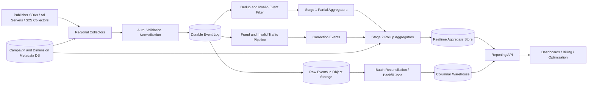

Generated by Codex with gpt-5

Selected problem: Ad Click Aggregation

Scope: Design a high-throughput ad event aggregation pipeline that ingests impression and click events, deduplicates them, produces near-real-time campaign rollups, and supports slower reconciled reporting for analytics, optimization, and billing-adjacent use cases.

## Problem framing

This interview problem is less about serving ads and more about turning a firehose of raw events into trustworthy aggregates. Grokking and Alex Xu push the same early habit here: clarify scope, keep the write path simple and durable, and decouple slow downstream consumers with queues or logs. DDIA adds the deeper constraint: aggregated counters are derived data, so correctness depends on event ordering, idempotence, late-event handling, and replay, not on pretending one synchronous write magically updates every store exactly once.

Functional requirements:

- Ingest high-volume impression and click events from ad servers, SDKs, or server-to-server collectors.
- Validate event schema, authentication, and required campaign or publisher metadata.
- Deduplicate retried or duplicated events.
- Aggregate counts by time bucket and dimensions such as campaign, ad, publisher, country, device type, and placement.
- Expose recent dashboard queries with minute- or hour-level granularity.
- Preserve immutable raw events for replay, audit, and backfill.
- Support invalid-traffic or fraud verdicts that can adjust previously published counts.
- Allow replay or recomputation for a bounded time range after a bug fix or schema change.
- Distinguish provisional near-real-time numbers from slower reconciled reporting.

Non-functional requirements:

- Very high write throughput with region-local durability.
- Sub-minute freshness for recent campaign dashboards.
- Horizontal scalability across producers, partitions, aggregators, and query nodes.
- Predictable behavior under retries, duplicates, late arrivals, and consumer restarts.
- Bounded query cost so one large report does not stall ingestion.
- Clear semantics around correction windows, fraud adjustments, and finalization.
- Operational simplicity: replayable pipelines, observable lag, and safe schema evolution.

Scale assumptions:

- Assume about 10 billion raw impression and click events per day globally.
- Assume clicks are a small single-digit percentage of total events, but the pipeline ingests both because CTR and spend reporting need the denominator as well.
- Assume peak regional ingest on the order of 1 to 2 million events per second after batching and compression.
- Assume advertisers expect recent dashboard freshness within 30 to 60 seconds, while billing-grade reconciliation can lag by a few hours.
- Assume most queries scan 15 minutes to 30 days and group by a small approved set of dimensions.
- Assume raw events are retained in cheaper storage for replay and historical rebuilds, while hot aggregates keep only the recent working set.

## Core APIs

```http
POST /v1/events/collect
Authorization: Bearer <collector-token>
Content-Encoding: gzip
{
  "events": [
    {
      "eventId": "evt_01JT3J6Y1W0D0Q8K3A2R6H8T9N",
      "eventType": "click",
      "occurredAt": "2026-04-27T15:32:10Z",
      "receivedAt": "2026-04-27T15:32:11Z",
      "campaignId": "camp_4821",
      "adId": "ad_99",
      "publisherId": "pub_17",
      "placementId": "plc_home_top",
      "country": "US",
      "deviceType": "ios",
      "auctionId": "auc_884201",
      "impressionId": "imp_442211",
      "priceMicros": 180000
    }
  ]
}
-> 202 Accepted
{
  "accepted": 1,
  "rejected": 0,
  "ingestBatchId": "ib_01JT3J71BQ2G9Q0V7Z4T2W0JWW"
}

GET /v1/reports/campaigns/camp_4821?from=2026-04-27T15:00:00Z&to=2026-04-27T16:00:00Z&granularity=minute&dimensions=publisherId,country
-> 200 OK
{
  "rows": [
    {
      "bucketStart": "2026-04-27T15:32:00Z",
      "publisherId": "pub_17",
      "country": "US",
      "impressions": 124400,
      "clicks": 1821,
      "invalidClicks": 17,
      "spendMicros": 327780000,
      "ctr": 0.014638,
      "freshnessSeconds": 24,
      "isFinalized": false
    }
  ]
}

POST /v1/rebuild-jobs
{
  "from": "2026-04-27T14:00:00Z",
  "to": "2026-04-27T15:00:00Z",
  "reason": "fix-parser-bug-v3",
  "dimensions": ["campaignId", "publisherId", "country"]
}
-> 202 Accepted
{
  "jobId": "rb_01JT3J8PMJ5M8Q4K8XN9V5AF1Q"
}
```

API notes:

- The collector API is usually internal or partner-facing, not a public browser API.
- Events should be batched, compressed, and schema-versioned to reduce edge overhead.
- `eventId` or another stable dedupe key is mandatory; without it, retries become guesswork.
- Query responses should return freshness and finalization metadata so consumers know whether numbers are provisional.

## Core data model

| Entity | Key | Important fields | Notes |
| --- | --- | --- | --- |
| `AdEvent` | `event_id` | `event_type`, `campaign_id`, `ad_id`, `publisher_id`, `placement_id`, `occurred_at`, `received_at`, `auction_id`, `impression_id`, `price_micros`, `source`, `schema_version` | Immutable raw event |
| `DedupeRecord` | `dedupe_key` | `first_seen_offset`, `expires_at`, `event_hash` | TTL-backed record for retry suppression |
| `PartialAggregate` | `bucket_start + dimension_hash + salt` | `impressions`, `clicks`, `invalid_clicks`, `spend_micros`, `max_offset` | First-stage hot-key mitigation |
| `AggregateBucket` | `bucket_start + dimension_hash` | `dimensions`, `impressions`, `clicks`, `invalid_clicks`, `spend_micros`, `version`, `is_finalized` | Query-facing rollup |
| `CampaignMetadata` | `campaign_id` | `advertiser_id`, `budget_model`, `status`, `timezone`, `start_at`, `end_at` | Control-plane metadata |
| `FraudVerdict` | `event_id` or `impression_id` | `verdict`, `reason_code`, `decided_at`, `model_version` | Can emit compensating updates |
| `RebuildJob` | `job_id` | `from`, `to`, `reason`, `status`, `target_version` | Replay and backfill coordination |

The main modeling decision is that `AggregateBucket` is derived state. The system of record is the raw event log plus the metadata needed to interpret those events.

## Architecture



High-level design:

- Regional collectors terminate authentication, validate schema, enrich events, and append them to a durable log before acknowledging the batch.
- All downstream aggregates are derived from the log. This keeps the ingest path short and makes replay possible.
- Stream processors maintain minute-level and hour-level aggregates for recent reporting.
- A second-stage rollup merges salted partial aggregates into queryable buckets so one hot campaign does not overload a single counter key.
- Raw immutable events are also written to object storage for audit, backfill, and offline analytics.
- A separate batch reconciliation path recomputes or corrects aggregates after delayed events, fraud verdicts, or parser bugs.
- The query layer reads recent data from the realtime store and older or finalized data from a columnar warehouse.

## Data flow

Ingestion and aggregation flow:

1. A publisher ad server or SDK batches events and sends them to a regional collector.
2. The collector authenticates the sender, validates required fields, adds ingestion metadata, and appends the batch to the durable log.
3. Deduplication consumers read the log, suppress repeated `eventId` or equivalent dedupe keys, and reject obviously malformed or out-of-policy records.
4. First-stage aggregators update salted partial buckets such as `(campaign_id, minute_bucket, salt, country, device_type)`.
5. Second-stage rollup processors merge those partials into final per-bucket aggregates used by the reporting API.
6. Fraud or invalid-traffic systems emit verdicts later; those verdicts produce compensating updates rather than mutating history in place.
7. The raw event stream is continuously copied into object storage for replay and into a warehouse-friendly layout for historical reporting.

Query flow:

1. The reporting API validates the query shape and enforces allowed dimensions and time ranges.
2. For recent time ranges, it reads hot aggregates from the realtime store.
3. For older or finalized windows, it reads precomputed data from the warehouse.
4. If the query spans both ranges, it merges the hot and cold paths at the bucket boundary.
5. The API returns both metrics and freshness metadata so the caller knows whether the answer is still within the correction window.

## Storage, caching, and partitioning

Storage choices:

- Durable event log:
  - The log is the backbone of the system because it provides buffering, replay, and loose coupling between producers and consumers.
- Realtime aggregate store:
  - Use a write-friendly store for mutable recent buckets, typically something LSM-friendly or merge-oriented rather than a pure read-optimized warehouse.
  - Keep only the recent window that needs low-latency serving.
- Object storage:
  - Store raw immutable events in partitioned files for cheap retention and replay.
- Columnar warehouse:
  - Use a read-optimized analytical store for older or finalized aggregates and wide scans across many campaigns.
  - DDIA's warehouse discussion is relevant here: large analytical queries want columnar layout and compression, but not direct row-by-row event updates on the serving path.
- Metadata store:
  - Keep campaign, advertiser, placement, dimension catalog, and retention policy in a durable control-plane database.

Caching strategy:

- Cache hot dashboard responses for very short TTLs because many advertisers repeatedly refresh the same recent report.
- Cache campaign and dimension metadata near the collectors and query service.
- Precompute common dashboard slices such as top campaigns for the last 5 minutes or last hour.
- Avoid using cache as the only source of aggregate truth; the hot aggregate store itself should remain replayable and rebuildable.

Partitioning and sharding:

- Partition raw ingest by a stable dedupe key so retries route to the same logical consumer shard.
- Do not key the hot aggregate store only by `(campaign_id, minute)` because one large campaign can turn that into a hot shard.
- Use salted or virtual sub-buckets for the first aggregation stage, then merge them asynchronously.
- Use time as part of the storage layout, but not as the only top-level partition key, or the newest bucket becomes a hotspot.
- Keep query-side partitions aligned with approved dimensions and time granularity, not arbitrary user-defined group-bys.

## Consistency tradeoffs

- A collector should acknowledge a batch after the event log append succeeds in the local region, not after every aggregate store is updated.
- The practical target is at-least-once delivery with idempotent aggregation, not a hand-wavy promise of global exactly-once across logs, stream processors, hot stores, warehouses, and fraud systems.
- Recent dashboard counts are provisional while the lateness window is still open.
- Fraud classification may arrive after the original click was counted, so the system needs correction events and versioned aggregates.
- Billing-grade or finance-grade numbers should come from a reconciled path with stronger validation and a declared freeze time, not from the low-latency dashboard path.
- Multi-region analytics should converge asynchronously; trying to synchronously coordinate every click globally would add latency and hurt availability with little reporting value.

## Bottlenecks and mitigations

Hot campaigns or placements:

- One major campaign can dominate writes for one bucket. Salt first-stage aggregates and merge later.

Cardinality explosions:

- Letting advertisers group by arbitrary fields such as `user_id`, raw URL, or request ID will destroy storage and query cost. Maintain an approved dimension catalog.

Duplicate events:

- SDK retries, dual client and server beacons, or producer bugs will double count unless stable dedupe keys are required and enforced.

Invalid traffic:

- Bots, click farms, and replayed events can corrupt both dashboards and billing if the system treats every event as trustworthy.

Backfill contention:

- Rebuild jobs can compete with live aggregation. Run them in separate pools or on separate compute budgets.

Expensive report fanout:

- Long-range, high-cardinality queries should hit the warehouse or precomputed rollups, not the realtime serving path.

## Deep dives

### Immutable log plus derived aggregates

This is the most important architectural choice.

- Grokking and Alex Xu both emphasize queues as the decoupling layer when producers and consumers scale independently.
- DDIA takes the idea further: derived data systems are easier to recover when the source is an ordered log and consumers are replayable.
- The collector should not try to synchronously update the dashboard cache, warehouse, fraud system, and billing table in one request.
- Instead, append once to the log, then let specialized consumers derive the views they need.

This gives the system four properties that matter in interviews:

- buffering during bursts
- replay after bugs
- independent scaling of consumers
- simpler failure handling than cross-system distributed transactions

### Event time, late arrivals, and corrections

DDIA's event-time discussion is directly applicable here.

- Aggregate by event time (`occurredAt`), not only processing time, or delayed events will land in the wrong minute or hour.
- Keep a bounded lateness window open for recent buckets.
- When late events arrive after a bucket was already published, either:
  - ignore them and track the drop rate as an explicit metric
  - or publish a correction and version the aggregate
- For ad reporting, the second option is usually better because small percentage changes matter to campaign analysis and billing.

Practical default:

- Keep recent buckets mutable for a configurable correction window.
- Mark them finalized only after the lateness threshold and fraud-adjustment window pass.

### Two-stage aggregation for hot keys

Naive counters break under skew.

- If every click for a large campaign increments the same `(campaign_id, minute)` row, one partition becomes a bottleneck.
- Stage 1 spreads writes across many salted partial buckets.
- Stage 2 periodically merges those partials into the query-facing aggregate bucket.
- Query-serving can either read merged buckets only or temporarily sum merged plus still-open partials for the newest minute.

This pattern trades a little extra complexity for a much better write path under uneven traffic.

### Reconciliation, fraud, and billing-grade numbers

Near-real-time dashboards and canonical numbers should not be conflated.

- The streaming path is optimized for freshness.
- The reconciliation path is optimized for correctness, replay, and late adjustments.
- Fraud verdicts, source-side retries, or schema bugs may force recomputation for a time range.
- Because raw events are immutable and retained, rebuild jobs can replay the affected partitions and publish a new aggregate version.

In an interview, the strong answer is not "real-time and final are the same." The strong answer is "the system exposes explicit freshness and finalization semantics."

## Modern considerations

Modern ad measurement is much more constrained by privacy and platform rules than many older system design books assume. On iOS, App Tracking Transparency governs cross-app or cross-site tracking permission, while AdAttributionKit delivers privacy-preserving install or re-engagement postbacks on delayed windows rather than raw user-level logs. On the web and Android, Privacy Sandbox Attribution Reporting similarly shifts some measurement away from third-party-cookie-style identity graphs toward delayed, limited reports. Practically, that means a current design should treat browser- or OS-generated attribution as a separate delayed input stream into reconciliation and analytics, keep consent and measurement source as first-class metadata, and avoid using privacy-preserving attribution postbacks as the only signal for low-latency budget pacing or bidder feedback loops. Server-side provenance, bot defenses, and explicit retention controls matter more than ever because client-side identifiers are less reliable and more restricted.

## Interview follow-ups

- How would you prevent double counting when SDKs retry the same click?
  - Require a stable dedupe key such as `eventId` or `impressionId + clickOrdinal`, partition by that key, store a TTL-backed dedupe record, and make downstream aggregate updates idempotent.

- Would you promise exactly-once aggregation?
  - Usually no. The practical answer is at-least-once delivery with idempotent consumers and replayable logs. End-to-end exactly-once across heterogeneous systems is expensive and rarely worth the complexity.

- What if one campaign is 100x hotter than the rest?
  - Use two-stage aggregation with salted partial buckets, then merge them into the final bucket. If skew remains extreme, split further by publisher or placement and merge again.

- How do you handle late mobile events or delayed fraud verdicts?
  - Keep raw immutable events, leave recent buckets mutable for a correction window, and publish versioned corrections or rebuilds when delayed inputs change the answer.

- Can the same system serve both dashboards and billing?
  - Yes, but not with identical semantics. Dashboards can use the fast provisional path, while billing should read from a reconciled path with stricter validation and a declared freeze point.

- Why not run every report directly on raw events?
  - The write volume is too high and the common queries are repetitive. Pre-aggregating recent data keeps dashboards fast, while the warehouse handles large historical scans and uncommon breakdowns.

- What changes in a multi-region deployment?
  - Keep ingestion region-local for durability and latency, replicate or export the log asynchronously, and merge aggregates later. Global synchronous counting is usually the wrong tradeoff.

- How would you support arbitrary new dimensions added by product teams?
  - Separate the approved hot-path dimension catalog from the raw event schema. Put only a bounded set of dimensions in realtime aggregates, and route ad hoc exploratory dimensions to the warehouse or offline jobs instead.
