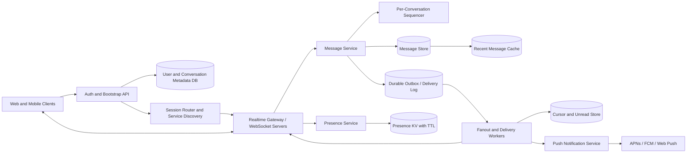

Generated by Codex with gpt-5

Selected problem: Chat/Messaging System

Scope: Design a text-first chat platform for one-to-one and small-to-medium group conversations with presence, multi-device sync, offline delivery, and durable message history.

## Problem framing

This is the classic interview problem of designing a real-time chat system without over-promising impossible guarantees. Grokking and Alex Xu both frame the core problem similarly: keep message delivery low-latency, keep history durable, handle offline users, and make multiple devices converge on the same conversation state. DDIA adds the deeper constraint: ordering, replication, partitioning, and delivery semantics must be chosen deliberately instead of hand-waving toward "global consistency."

Functional requirements:

- Support one-to-one conversations.
- Support group chat for bounded groups; assume up to 500 members for the base design.
- Deliver new messages to connected recipients in near real time.
- Persist message history so users can reconnect and resync older messages.
- Support multiple active devices per user with per-device catch-up.
- Track basic presence such as online/offline and last active.
- Send push notifications to inactive mobile devices.
- Expose message status primitives such as accepted, delivered, and read cursor progression.

Non-functional requirements:

- Low end-to-end latency for active users; a newly sent text should usually appear within a few hundred milliseconds.
- Durability after server acknowledgement; once the system returns success, the message should survive chat-server failure.
- Per-conversation ordering, not a global order across all chats.
- High availability and graceful degradation under partial failures.
- Horizontal scalability across conversations, users, devices, and regions.
- Bounded backpressure so slow consumers or hot conversations do not destabilize the whole system.
- Clear security boundaries for authentication, authorization, metadata, and stored content.

Scale assumptions:

- Assume 20 million daily active users and roughly 1 billion text messages per day.
- Assume a 10x peak over average traffic, yielding a peak write rate on the order of 100,000 to 150,000 messages per second.
- Assume 95% of traffic is one-to-one chat and 5% is group chat.
- Assume the average active user has 2 to 3 devices.
- Assume text payloads are small, under 4 KB after encoding and metadata.
- Assume recent history is read frequently, while older history is read rarely and can live on colder storage.
- These are interview assumptions, not claims about any current production system.

Core APIs:

```http
POST /v1/sessions/bootstrap
Authorization: Bearer <token>
{
  "deviceId": "dev_abc123",
  "platform": "ios"
}
-> 200 OK
{
  "userId": "u_42",
  "websocketUrl": "wss://chat.example.com/connect",
  "sessionToken": "sess_789"
}

POST /v1/conversations/direct
{
  "participantIds": ["u_42", "u_77"]
}
-> 201 Created
{
  "conversationId": "c_1001"
}

POST /v1/conversations/{conversationId}/messages
{
  "clientMessageId": "01HZY8H6R7EM4AB4D0JQ4Q8W4K",
  "senderId": "u_42",
  "body": {
    "kind": "text",
    "text": "ship it"
  }
}
-> 202 Accepted
{
  "messageId": "m_884422",
  "conversationSeq": 10524,
  "status": "accepted"
}

GET /v1/conversations/{conversationId}/messages?afterSeq=10500&limit=50
-> 200 OK
{
  "messages": [
    {
      "messageId": "m_884422",
      "conversationSeq": 10524,
      "senderId": "u_42",
      "createdAt": "2026-04-23T09:45:00Z",
      "body": {
        "kind": "text",
        "text": "ship it"
      }
    }
  ],
  "nextAfterSeq": 10524
}

POST /v1/conversations/{conversationId}/read-cursors
{
  "deviceId": "dev_abc123",
  "readThroughSeq": 10524
}
```

WebSocket events:

```json
// client -> server
{
  "type": "message.send",
  "conversationId": "c_1001",
  "clientMessageId": "01HZY8H6R7EM4AB4D0JQ4Q8W4K",
  "body": {
    "kind": "text",
    "text": "ship it"
  }
}

// server -> client
{
  "type": "message.ack",
  "clientMessageId": "01HZY8H6R7EM4AB4D0JQ4Q8W4K",
  "messageId": "m_884422",
  "conversationId": "c_1001",
  "conversationSeq": 10524
}
```

Core data model:

| Entity | Key | Important fields | Notes |
| --- | --- | --- | --- |
| `User` | `user_id` | `profile`, `settings`, `status_visibility` | Account metadata in relational storage |
| `Conversation` | `conversation_id` | `type`, `created_at`, `created_by`, `home_region` | Stable metadata for direct or group chats |
| `ConversationParticipant` | `conversation_id + user_id` | `role`, `joined_at`, `last_read_seq`, `notification_pref` | Membership and read state |
| `Message` | `conversation_id + conversation_seq` | `message_id`, `sender_id`, `client_message_id`, `body`, `created_at`, `state` | Append-only primary history model |
| `DeviceSession` | `user_id + device_id` | `connected_server`, `last_seen_seq_map`, `push_token_ref` | Used for live delivery and resync |
| `Presence` | `user_id` | `state`, `last_heartbeat_at`, `expires_at` | Ephemeral TTL-backed record |
| `NotificationEndpoint` | `user_id + endpoint_id` | `provider`, `token`, `platform`, `enabled` | APNs/FCM/web-push routing |
| `OutboxEvent` | `conversation_id + conversation_seq` | `recipient_ids`, `delivery_state`, `retry_count` | Durable fanout/retry workflow |

## Architecture



High-level architecture:

- Use normal HTTP APIs for authentication, profile changes, membership management, and bootstrap.
- Use persistent WebSocket connections for active message delivery and presence updates.
- Route every conversation to a logical home shard. All writes for that conversation go through the same sequencer so ordering stays local and simple.
- Acknowledge a message only after it is durably written to the message store and the corresponding outbox entry is recorded.
- Use a delivery pipeline to fan out to online devices immediately and to offline devices through cursor updates plus push notifications.
- Keep user, membership, and settings metadata in a relational database.
- Keep message history in a write-optimized distributed store keyed by `conversation_id + conversation_seq`.
- Keep presence in a TTL-based in-memory store because it is ephemeral and updated frequently.

Practical data flow:

1. The client authenticates, gets a `websocketUrl`, and opens a persistent connection to a realtime gateway.
2. When the user sends a message, the gateway authenticates the session and forwards the request to the message service for that conversation shard.
3. The message service deduplicates by `clientMessageId`, obtains the next conversation sequence number, and appends the message to durable storage.
4. In the same logical write path, it records an outbox event for recipient delivery.
5. The sender gets an acknowledgement containing the authoritative `messageId` and `conversationSeq`.
6. Delivery workers examine recipient device sessions. Connected devices get the message pushed over WebSocket.
7. For disconnected devices, the system updates unread/read state and triggers push notifications through APNs, FCM, or web push.
8. On reconnect, each device sends its last known sequence per conversation and the server streams the gap from durable history.
9. Presence servers update online/offline state via heartbeats and publish presence changes to relevant contacts, with coarser behavior for large groups.

Storage choices:

- Metadata store:
  - A relational database fits conversation membership, settings, muted threads, block lists, and notification preferences.
  - Use leader-based replication for writes and read replicas where slightly stale reads are acceptable.
- Message store:
  - Use a distributed key-value or wide-column store with primary key `(conversation_id, conversation_seq)`.
  - This matches the access pattern: append writes and range reads for recent history.
  - An LSM-friendly engine is a good fit because chat history is write-heavy and mostly read in order.
- Delivery log / outbox:
  - Use a durable broker or append-only stream for fanout, retries, and replay.
  - This follows DDIA's argument for asynchronous message passing and log-based delivery: buffering, redelivery, and replay simplify failure handling.
- Cold history:
  - Archive older conversation segments to cheaper storage if product requirements allow slower access for old messages.

Caching strategy:

- Cache recent message pages for hot conversations.
- Cache conversation list summaries, unread counts, and last-message previews.
- Keep presence in an in-memory TTL store rather than a database.
- Avoid caching the full source of truth for durable history; cache should accelerate reads, not become the only copy.

Partitioning and sharding:

- Partition message history by `conversation_id`, not by `message_id`.
- This keeps one conversation's ordered history together and makes range scans cheap.
- For one-to-one chat, the conversation ID is stable and deterministic from the participant set.
- For group chat, the same partitioning works until a group becomes extremely hot.
- If a single group becomes a hotspot, split responsibilities instead of splitting ordering blindly:
  - Keep authoritative ordering on one conversation shard.
  - Offload fanout, search indexing, analytics, and media processing to separate asynchronous workers.
- Pre-split logical partitions and remap them to physical nodes as traffic grows.

Consistency tradeoffs:

- Guarantee per-conversation ordering after acknowledgement, not a global total order across all chats.
- Favor at-least-once delivery with idempotent deduplication over pretending to offer exactly-once end to end.
- Read-your-writes should hold for the sender because the ack returns the committed sequence number.
- Multi-device convergence is driven by durable sequence numbers plus per-device cursors.
- Presence is naturally approximate. Eventual accuracy with heartbeat-based expiry is good enough.
- Cross-region replicas may lag slightly; make the home region authoritative for each conversation unless the product explicitly requires active-active conflict resolution.

Bottlenecks and mitigations:

- Persistent connections:
  - WebSocket servers can become memory-bound before CPU-bound. Use connection-aware load balancing and keep chat gateways mostly stateless except for socket state.
- Hot conversations:
  - Large or celebrity-style rooms can overwhelm one shard. Keep the base interview design focused on bounded groups and call out a specialized large-room design as an extension.
- Slow consumers:
  - Apply per-device outbound queue limits and drop the realtime session if the client stops draining messages, then require resync from storage.
- Fanout spikes:
  - Separate message commit from notification fanout with durable queues.
- Storage growth:
  - Use retention tiers, compression, and cold archival for old history.

## Deep dives

### Ordering and IDs

Alex Xu's chapter makes the right simplification: message ordering only needs to be correct within a conversation. A global sequence generator adds complexity without helping the user experience much. The practical design is:

- Use a unique `messageId` for deduplication and tracing.
- Use a monotonic `conversationSeq` scoped to one conversation for display order and sync.
- Persist messages as append-only records keyed by `(conversation_id, conversation_seq)`.

This aligns with DDIA's warning about ordering across distributed systems: total order is expensive, causal order is often enough, and unrelated conversations do not need to share one global timeline.

### Multi-device sync

Grokking and Alex Xu both emphasize per-device synchronization. Each device maintains the highest committed sequence it has applied for each conversation. On reconnect:

1. The client presents `lastSeenSeq`.
2. The server streams all messages with higher sequence numbers.
3. The device advances its cursor only after durable local processing.

This is simple, replay-friendly, and resilient to retries. It also avoids the trap of assuming a live socket is the only source of truth. The socket is for fast delivery; the message store is for correctness.

### Presence

Presence should not be modeled like durable business data. It is ephemeral state with churn, so keep it in an in-memory TTL-backed store:

- On connect, mark the user online and set an expiry.
- Refresh expiry with heartbeats.
- On explicit logout, mark offline immediately.
- On silent disconnect, let TTL expiry flip the state after a grace period.

For direct contacts and small groups, publish-subscribe fanout works. For very large groups, presence fanout becomes too expensive. In that case, fetch presence lazily when the user opens the room or views a participant list.

### Reliability and retries

DDIA's messaging chapters are directly useful here. The system should assume components fail independently:

- Chat gateway crashes after accepting a send request.
- Delivery worker fails after sending to one device but before checkpointing progress.
- Push provider accepts or drops notifications asynchronously.

The answer is not "exactly-once." The answer is durable writes, replayable logs, and idempotent consumers:

- Deduplicate sends by `clientMessageId` per conversation.
- Keep delivery attempts in an outbox or broker until processing is checkpointed.
- Let clients ignore duplicate `messageId` values if retries race with reconnect logic.
- Use dead-letter handling for poison messages or repeatedly failing pushes.

### Group chat evolution

The base design works well for bounded groups because the write path is still a single ordered append and the delivery path can fan out to a limited member set. Once group size grows far beyond the interview assumption:

- Stop copying one durable inbox row per recipient on write if fanout cost dominates.
- Store the message once in the conversation log.
- Track per-user read watermarks rather than per-message per-user state.
- Push live events only to currently connected members.
- Compute unread counts and catch-up reads from the shared log.

That shifts the design from small-group messaging toward Slack- or Discord-style channel infrastructure.

## Modern considerations

For a current interview answer, keep WebSockets as the default transport for active sessions, but do not assume mobile apps can rely on a permanently alive socket in the background. Modern iOS and Android delivery still depends on platform push systems, and background pushes can be throttled or deprioritized, so push is a wake-up or notification path, not the durable message path. On the web, newer transports such as WebTransport exist, but for text chat they are usually an optional evolution rather than a better default than a simpler WebSocket design. The more important modern update is operational: prefer idempotent message submission, per-conversation sequencing, explicit retention tiers, encryption at rest, and regional data placement over dated claims about one vendor, one queue, or one scale number being universally correct.

## Interview follow-ups

- How would you support a group with 100,000 members instead of 500?
  - Store each message once in the shared conversation log, stop per-recipient write fanout, keep per-user read watermarks, and only push live events to connected members. Presence becomes pull-on-enter instead of full broadcast.

- Do we need a global ordering of all messages in the system?
  - No. Users care about order within a conversation. Global ordering is expensive, adds coordination, and gives little product value for normal chat.

- How do you prevent duplicate messages when clients retry?
  - Require a `clientMessageId`, deduplicate per conversation for a bounded window, and return the original server-assigned sequence number if the first attempt already committed.

- What happens if a chat server with many WebSocket connections crashes?
  - Clients reconnect through service discovery or load balancing, reauthenticate, and resync from the last acknowledged sequence. Correctness is preserved because durable history lives outside the gateway process.

- How would you add end-to-end encryption?
  - Move message bodies to client-side encrypted payloads, keep only ciphertext plus routing metadata on the server, and add device key management, session establishment, and recovery flows. This improves privacy but makes search, moderation, and multi-device key sync harder.

- How would you model message edits and deletes?
  - Treat them as events appended to the conversation log rather than in-place mutation. The client materializes the latest visible state from the event stream, which is easier to replicate and audit.

- How would you make search work without overloading the message store?
  - Keep the message store as the source of truth and feed a separate search index asynchronously from the committed log or CDC stream. Search can lag slightly without affecting send correctness.

- What consistency level should read receipts use?
  - Per-user read cursors can be eventually consistent across devices as long as they never move backward. They do not need to block message sends or the main chat write path.
