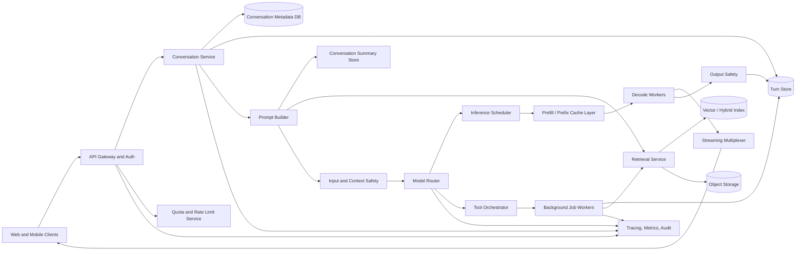

Generated by Codex with gpt-5.4

Selected problem: ChatGPT

Scope: Design a text-first ChatGPT-style assistant that supports multi-turn conversations, streamed responses, document-backed answers, bounded tool use, and durable conversation history for consumers and teams.

## Problem framing

This interview problem combines ideas from several classic designs instead of mapping neatly to one old chapter. Grokking's framework still applies: clarify scope, define APIs, estimate scale, pick a data model, then explain the high-level design and bottlenecks. Alex Xu's chat-system chapter is useful for session handling, streaming delivery, and multi-device conversation sync; the YouTube chapter is useful for large-object storage and asynchronous processing; DDIA adds the deeper foundation for logs, caches, replication, partitioning, derived data, and backpressure. The key modern shift is that the assistant is not only a chat transport problem. It is a stateful product sitting on top of an expensive inference pipeline.

Functional requirements:

- Support creating and resuming conversations across web and mobile clients.
- Accept user turns and stream assistant output back token by token.
- Persist conversation history and allow a client to reload or paginate older turns.
- Support regeneration from the latest user turn.
- Support optional document retrieval so the assistant can answer using uploaded or indexed content.
- Support bounded tool calls such as web search, code execution, or internal business actions.
- Support citations or source references when retrieval or tools are used.
- Enforce authentication, authorization, quotas, abuse controls, and policy checks.
- Surface long-running tool or reasoning workflows without forcing the client to hold one connection open forever.

Non-functional requirements:

- Low time-to-first-token for ordinary chat turns.
- Durable conversation history after the system acknowledges a committed turn.
- Horizontal scalability across users, conversations, model pools, and retrieval namespaces.
- High cost efficiency because inference is much more expensive than ordinary CRUD traffic.
- Graceful degradation when retrieval, tools, or a premium model pool is degraded.
- Strong data isolation between users and enterprise tenants.
- Full observability for latency, safety actions, model routing, token usage, and tool execution.
- Bounded tail latency so a few very long prompts do not block short interactive turns.

Scale assumptions:

- Assume 15 million daily active users and roughly 150 million user turns per day.
- Assume 6x peak over the daily average, giving roughly 10,000 new user turns per second at peak.
- Assume median input context of 1,500 tokens after prompt assembly and P95 around 16,000 tokens.
- Assume median assistant output of 500 tokens and P95 around 2,000 tokens.
- Assume 15% of turns use retrieval, 8% invoke at least one tool, and 2% require a long asynchronous workflow.
- Assume most conversations are short, but a small fraction are large enough that naive "send the full history every turn" becomes too expensive.
- Assume uploaded files are stored durably and indexed asynchronously; indexing freshness may lag the raw upload by seconds or minutes.

## Core APIs

```http
POST /v1/conversations
Authorization: Bearer <token>
{
  "workspaceId": "ws_123",
  "title": "Release planning"
}
-> 201 Created
{
  "conversationId": "conv_01K3KQ2R9EJ7F5R4A6P2V9G8QW",
  "createdAt": "2026-04-25T17:10:00Z"
}

POST /v1/conversations/{conversationId}/turns
Idempotency-Key: turn_01K3KQ5JQJ6Q9PZQ4M8B1X9J4H
{
  "input": [
    {
      "type": "text",
      "text": "Summarize the design tradeoffs of our caching layer."
    }
  ],
  "attachments": ["file_847"],
  "toolMode": "auto",
  "responseMode": "stream"
}
-> 202 Accepted
{
  "runId": "run_01K3KQ60YB2J9J8JAHKQX4W9P2",
  "turnSeq": 44,
  "streamUrl": "/v1/runs/run_01K3KQ60YB2J9J8JAHKQX4W9P2/stream"
}

GET /v1/conversations/{conversationId}/turns?afterSeq=40&limit=20
-> 200 OK
{
  "turns": [
    {
      "turnSeq": 44,
      "role": "user",
      "state": "completed"
    },
    {
      "turnSeq": 45,
      "role": "assistant",
      "state": "completed",
      "citations": [
        {
          "sourceId": "doc_22",
          "chunkId": "c_814"
        }
      ]
    }
  ],
  "nextAfterSeq": 45
}

GET /v1/runs/{runId}
-> 200 OK
{
  "runId": "run_01K3KQ60YB2J9J8JAHKQX4W9P2",
  "status": "in_progress",
  "mode": "interactive"
}

POST /v1/runs/{runId}/cancel
-> 202 Accepted
```

Streaming events:

```json
{ "type": "run.started", "runId": "run_01K3KQ60YB2J9J8JAHKQX4W9P2" }
{ "type": "assistant.delta", "text": "A practical design starts by..." }
{ "type": "tool.call", "toolName": "file_search", "callId": "tc_991" }
{ "type": "tool.result", "callId": "tc_991", "status": "completed" }
{ "type": "assistant.completed", "turnSeq": 45 }
```

API notes:

- Use idempotency keys for user turns because mobile and browser clients retry aggressively.
- Return a durable `runId` immediately so the same run can continue even if the streaming connection drops.
- Separate interactive streaming from background completion status. Some turns should keep streaming; others should switch to an async job-style lifecycle.
- Treat tool use as an internal workflow detail. The client should observe tool status events, not orchestrate backend retries itself.

## Core data model

| Entity | Key | Important fields | Notes |
| --- | --- | --- | --- |
| `UserAccount` | `user_id` | `org_id`, `tier`, `policy_profile`, `created_at` | Identity, subscription, and policy scope |
| `Conversation` | `conversation_id` | `owner_id`, `workspace_id`, `title`, `home_region`, `latest_turn_seq`, `summary_ref` | Stable metadata and routing home |
| `Turn` | `conversation_id + turn_seq` | `role`, `content_ref`, `state`, `model_route`, `parent_turn_seq`, `created_at` | Append-only source of truth for user and assistant turns |
| `Attachment` | `attachment_id` | `object_uri`, `mime_type`, `ingestion_state`, `acl_scope` | Raw uploads live in object storage |
| `RetrievalChunk` | `doc_id + chunk_id` | `text_ref`, `embedding_ref`, `source_uri`, `acl_scope` | Derived data for semantic and lexical retrieval |
| `ToolRun` | `run_id + call_id` | `tool_name`, `input_ref`, `status`, `retry_count`, `idempotency_key` | Durable tool execution state |
| `SafetyDecision` | `turn_id + stage` | `action`, `classifier_scores`, `policy_version`, `review_ref` | Input, retrieval, tool, and output stages |
| `UsageLedger` | `org_id + time_bucket` | `prompt_tokens`, `cached_tokens`, `output_tokens`, `cost_units` | Quotas, billing, and analytics |

The most important modeling decision is to keep `Turn` as the durable source of truth and treat summaries, retrieval indexes, cached prompts, and tool traces as derived state. That matches DDIA's core idea that expensive read models and indexes should be rebuildable from durable logs.

## Architecture



High-level architecture:

- Keep the chat control plane separate from the inference plane. The Conversation Service owns durable state, while model workers stay as stateless as possible.
- Build prompts just in time from several sources: system instructions, recent turns, a rolling conversation summary, retrieved documents, and tool schemas.
- Route each run through a Model Router that chooses model family, latency tier, region, and online-versus-background execution mode.
- Feed interactive requests into an inference scheduler optimized for streaming latency and prefix reuse, not just raw throughput.
- Run tool calls through a separate orchestrator so slow external systems do not block GPU workers.
- Persist the final assistant turn only after output checks pass and the system knows whether the answer completed, was interrupted, or moved to background mode.

Practical data flow:

1. The client submits a new turn with an idempotency key.
2. The gateway authenticates the user, checks quotas, and appends the raw user turn to the turn store.
3. Prompt Builder fetches recent conversation turns, a compact rolling summary, optional memories, and retrieval candidates from approved document scopes.
4. Lightweight safety checks run on user input and retrieved context before inference starts.
5. Model Router selects the serving pool based on latency target, context size, tool policy, and budget.
6. The scheduler places the request into the right model queue, ideally preserving cache locality for common prompt prefixes.
7. Prefill computes or reuses the shared prompt prefix, decode workers stream tokens, and the Streaming Multiplexer pushes deltas to the client.
8. If the model emits a tool call, the orchestrator executes it with idempotent bookkeeping and returns the result into the same run state.
9. Output safety checks evaluate the final answer and either allow it, redact it, or replace it with a safer fallback.
10. The assistant turn, citations, usage, tool traces, and observability events are persisted asynchronously for analytics and evaluation.

Storage choices:

- Conversation metadata:
  - Use a relational database for accounts, conversation headers, quotas, and workspace permissions.
  - This data is relational and consistency-sensitive.
- Turn store:
  - Use a sharded document or wide-column store keyed by `(conversation_id, turn_seq)`.
  - The dominant access pattern is append plus ordered range reads.
- Blob storage:
  - Store raw files, long code outputs, images, and attachment payloads in object storage.
  - Keep only references in the hot metadata path.
- Retrieval index:
  - Build a derived chunk store plus vector or hybrid index for searchable corpora.
  - Enforce ACL filtering before or during retrieval, not only after generation.
- Event log:
  - Use a durable stream for ingestion completion, tool outcomes, billing events, and offline evaluation traces.

Caching strategy:

- Keep a prompt-prefix or KV cache close to the inference workers for repeated system prompts, tool schemas, and long shared prefixes.
- Cache recent conversation summaries so prompt assembly does not resummarize on every turn.
- Cache retrieval results for hot documents and repeated workspace queries, but only within the same authorization scope.
- Cache the last few conversation pages for fast reload on reconnect.
- Avoid using a generic semantic answer cache as the default source of truth; it is acceptable for deterministic grounded FAQ flows, but risky for personalized or freshness-sensitive chat.

Partitioning and sharding:

- Partition conversation state by `conversation_id`; this keeps one turn sequence together and makes range reads simple.
- Partition retrieval data primarily by tenant or workspace, then by document or embedding shard.
- Partition inference queues by model deployment, region, and context size class. A small fast model and a large long-context model should not share one flat queue.
- Isolate hot or premium tenants onto dedicated quotas or queues when needed so one organization cannot consume all low-latency capacity.

Consistency tradeoffs:

- Guarantee read-your-writes for accepted conversation turns once they are committed to the turn store.
- Treat streamed partial tokens as provisional. Only the completed assistant turn is durable.
- Let retrieval indexing be eventually consistent with newly uploaded files; the raw upload can exist before it becomes searchable.
- Use at-least-once execution for tool calls with idempotency keys rather than pretending to offer exactly-once side effects.
- Let summaries, titles, and suggested memories lag slightly behind the main turn log.

Bottlenecks and mitigations:

- Long prompts:
  - Prefill latency grows with prompt length. Use rolling summaries, retrieval budgets, prompt compaction, and prefix reuse.
- GPU memory pressure:
  - KV cache size often becomes the real scaling limit. Use paged KV storage, admission control, and model routing by context class.
- Tool latency:
  - Never let long web or code tools occupy the same critical path as fast plain-chat turns unless the user explicitly needs synchronous waiting.
- Safety overhead:
  - Keep cheap blocking checks inline and move slower secondary review or analytics checks out of band.
- Tail latency:
  - Prevent a few giant runs from monopolizing decode workers by separating prefill-heavy and decode-heavy traffic where justified.

## Deep dives

### Context management and conversation memory

The naive design is to send the entire conversation history to the model on every turn. That works for demos and fails in production because cost and latency grow with history length. A better design is:

- Keep a durable append-only turn log.
- Build prompts from:
  - a stable system prefix
  - the most recent turns
  - a rolling summary of older context
  - retrieved external documents
  - optional user or workspace memory
- Store summaries as derived state that can be recomputed from the turn log if needed.

This is very similar to DDIA's idea of materialized views. The turn log is the source of truth; the summary is a compact derived representation optimized for prompt assembly.

### Inference serving and latency control

The inference path has two distinct phases:

1. Prefill, where the model processes the input prompt and builds KV state.
2. Decode, where it generates output tokens incrementally.

They have different performance characteristics. Prefill is sensitive to prompt length; decode is sensitive to output length and scheduler fairness. For a ChatGPT-style assistant:

- Keep common system instructions and tool schemas stable so prefix reuse is possible.
- Batch requests continuously rather than waiting for fixed-size batches.
- Separate extremely long prompts from ordinary interactive turns.
- Consider split prefill and decode pools if tail latency becomes a business problem.

This is the LLM analogue of separating write-heavy and read-heavy paths in more traditional systems.

### Retrieval and grounding

Retrieval should be treated as its own subsystem, not a helper function hidden inside the model wrapper. The ingestion side:

- stores raw files in object storage
- extracts text and metadata
- chunks documents
- computes embeddings
- builds a vector or hybrid index
- records ACL scope for every chunk

The online side:

- accepts a query plus authorization context
- retrieves candidate chunks
- reranks or deduplicates them
- passes a bounded number of chunks into Prompt Builder
- records which chunks were used so citations and audits are possible

The main product tradeoff is between recall and token budget. Pulling too little context hurts grounding; pulling too much hurts latency and model quality.

### Tool execution and asynchronous runs

A modern assistant is not just "prompt in, text out." Tool use introduces side effects, retries, timeouts, and external failures. Keep tool execution separate from the model path:

- The model proposes a tool call.
- The Tool Orchestrator validates policy, arguments, and user permissions.
- The tool runs with a durable idempotency key.
- Results return to the same run state for another model step or a final answer.

If the workflow is long-running, switch the run into background mode and let the client poll or reconnect later. This avoids holding an expensive interactive stream open while an external system works slowly.

### Safety, abuse prevention, and data isolation

Safety is multi-stage:

- input checks on the user turn
- context checks on retrieved snippets or uploaded documents
- tool policy checks before execution
- output checks before persisting the final assistant answer

For enterprise use, isolation matters as much as model quality:

- namespace retrieval indices by tenant or workspace
- encrypt stored content
- keep audit trails for retrieval and tool actions
- prevent prompt-cache or retrieval reuse across unrelated tenants

In other words, the hard part is not only generating a good answer. It is generating the answer without leaking the wrong context or taking the wrong action.

## Modern considerations

Current LLM serving changes the shape of this interview answer. OpenAI's current prompt-caching guidance explicitly recommends keeping repeated static content at the beginning of the prompt and dynamic user content at the end, which should influence prompt-builder design and routing decisions ([Prompt caching](https://developers.openai.com/api/docs/guides/prompt-caching)). OpenAI's current API docs also expose background execution as a first-class pattern for long runs, which supports a clean separation between low-latency interactive turns and slower tool-heavy workflows ([Background mode](https://developers.openai.com/api/docs/guides/background)). On the open serving side, current vLLM docs describe hash-based prefix caching and experimental disaggregated prefilling, while current TensorRT-LLM docs describe cross-request KV-cache reuse, offloading, prioritized eviction, and cache salting for secure reuse ([vLLM prefix caching](https://docs.vllm.ai/en/stable/design/prefix_caching/), [vLLM disaggregated prefilling](https://docs.vllm.ai/en/v0.10.0/features/disagg_prefill.html), [TensorRT-LLM KV cache](https://nvidia.github.io/TensorRT-LLM/latest/features/kvcache.html)). The modern update is that a strong answer should talk about cache-aware routing, prompt compaction, tenant-safe reuse, and online-versus-background execution, not just draw one generic "LLM service" box.

## Interview follow-ups

- How would you keep latency low when a conversation becomes very long?
  - Persist the full turn log, but only send a rolling summary plus the recent turns and any retrieved facts to the model. Add prompt compaction and prefix reuse so the prompt builder does not rebuild the entire world every turn.

- How would you add multimodal support for images or PDFs?
  - Keep the conversation API the same, but store blobs in object storage, run modality-specific ingestion, and route the run to a multimodal serving pool. The rest of the architecture still relies on durable turns, prompt assembly, safety checks, and streaming.

- How would you prevent hallucinations when using retrieval?
  - Treat retrieval as a bounded evidence selection step, record exactly which chunks were passed to the model, and require the answering layer to cite those chunks. If retrieval confidence is weak, prefer uncertainty or clarification over fabricated certainty.

- How would you support personalized memory without making the system creepy or unsafe?
  - Keep memory in a separate user-scoped store with explicit write rules, retention controls, and review visibility. Retrieve memory selectively into prompts rather than silently mutating the durable conversation log.

- What happens if the streaming connection drops halfway through a response?
  - The run should continue under a durable `runId`. The client reconnects and either resumes streaming from a buffered checkpoint or fetches the final committed assistant turn once the run completes.

- How would you control tool loops or runaway agent behavior?
  - Enforce a step budget, a wall-clock timeout, an allowlist of tools, argument validation, and idempotency keys. Long workflows should move to background execution instead of blocking the online chat path indefinitely.

- How would you serve multiple model sizes efficiently?
  - Put a router in front of the serving pools and choose the smallest acceptable model for the turn based on context length, difficulty, latency target, and tool requirements. Keep queues separate so the large-model pool does not degrade the small fast path.

- How would you make the design enterprise-safe?
  - Namespace storage and retrieval by tenant, enforce ACLs before retrieval, isolate caches, encrypt stored content, and keep audit logs for retrieval and tool actions. Privacy failures matter more than a few hundred milliseconds of extra latency.

- How would you evaluate regressions in answer quality?
  - Persist traces of prompt assembly, retrieval choices, tool actions, and final outputs, then run offline eval sets and shadow traffic comparisons. Quality is not only BLEU-like text similarity; it includes citation correctness, tool success rate, latency, and policy adherence.
