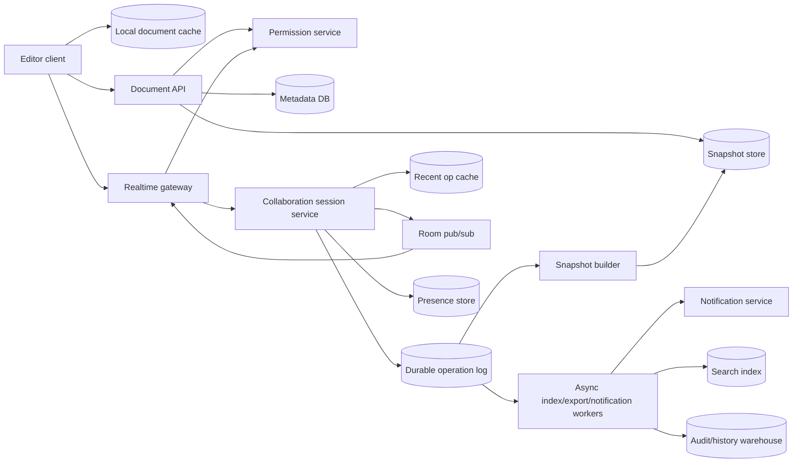

Generated by Codex with gpt-5

Selected problem: Collaborative Document Editing

Scope: Design a Google Docs-style collaborative editor for text documents that supports concurrent editing, revision history, permissions, offline recovery, and low-latency presence without losing user edits.

Source grounding: Grokking's Dropbox chapter supplies the interview frame for sync, offline edits, client metadata, long polling, queues, chunking, dedupe, metadata partitioning, and bottleneck analysis; Alex Xu's Google Drive chapter adds sync conflicts, revision history, notification service, offline backup queue, strong metadata consistency, and failure handling; DDIA supplies the deeper model for multi-leader-style collaboration, write conflicts, causality, version vectors, operational transformation, CRDTs, total ordering, append-only logs, stream-derived state, and the distinction between timeliness and integrity. Modern refresh: current [Yjs](https://docs.yjs.dev/) and [Automerge](https://automerge.org/docs/hello/) documentation show practical CRDT-backed collaborative application patterns, while [MDN's WebSocket documentation](https://developer.mozilla.org/en-US/docs/Web/API/WebSocket) is a useful reminder that browser WebSocket APIs do not provide built-in backpressure.

## Problem framing

A collaborative document editor is not just a file sync service. File sync can treat a document as a blob and surface conflicts when two users edit at once. Real-time collaborative editing must make tiny concurrent changes, usually keystrokes or formatting operations, converge into one document state while users are actively editing.

The core design decision is the collaboration model:

- A centralized operational transformation model accepts client operations, orders them through a document session leader, transforms concurrent operations, and fans out the transformed stream.
- A CRDT model lets clients produce mergeable updates that can be applied in different orders and still converge, often with a server for authentication, persistence, fan-out, compaction, and abuse control.

For an interview, pick one primary path and explain the alternative. This note uses a practical centralized collaboration service with OT-style ordered operations as the main design because it is easier to reason about for permissions, moderation, server validation, revision history, and product behavior. It also calls out where CRDTs fit when offline-first or peer-capable editing is a stronger requirement.

Functional requirements:

- Create, open, edit, rename, share, and delete text documents.
- Support multiple users editing the same document at the same time.
- Propagate inserts, deletes, formatting changes, comments, and cursor or selection presence with low latency.
- Preserve user edits during temporary disconnects and client crashes.
- Support offline edits with bounded conflict recovery when a client reconnects.
- Maintain revision history and allow viewing or restoring prior versions.
- Enforce document permissions: owner, editor, commenter, viewer, and link-sharing policies.
- Notify active collaborators about document changes and offline users about important edits or mentions.
- Support search indexing, export, and audit logs asynchronously.

Non-functional requirements:

- Editing latency should feel interactive for users in the same region. Local echo should be immediate; remote edits should usually arrive quickly enough that collaboration feels live.
- Integrity matters more than freshness. A delayed remote update is acceptable; silently losing or duplicating edits is not.
- The system must converge: all authorized clients should eventually see the same document state for the same committed revision.
- The write path must tolerate reconnects, duplicate client submissions, leader failover, and replay.
- The read path must load popular documents quickly without reconstructing a long operation history from the beginning.
- Presence can be ephemeral and eventually consistent; committed document content cannot be treated that loosely.
- The design should isolate hot documents so one popular meeting note does not overload the whole collaboration fleet.
- Permission changes must take effect promptly enough that revoked users cannot keep mutating the document.

Scale assumptions:

- Assume a mature productivity product with 20 million daily active users for sizing conversation, not as a claim about any real platform.
- Assume the average active document has 1 to 5 concurrent editors, while rare hot documents can have hundreds or thousands of viewers and a smaller number of active editors.
- Assume an editing session emits small operations: text inserts, deletes, formatting marks, cursor moves, and comments. Presence messages are much more frequent but do not need durable storage.
- Assume most documents are small enough to load from a recent snapshot plus a short tail of operations, while large documents need sectional loading and pagination.
- Assume documents are read far more often than edited, but the collaboration path must be optimized for bursts during meetings, classes, interviews, and incident reviews.

Core APIs:

```http
POST /v1/documents
Authorization: Bearer ...
{
  "title": "Design Review Notes",
  "initialContent": "",
  "visibility": "private"
}
-> 201 Created
{
  "documentId": "doc_123",
  "headRevision": 1
}

GET /v1/documents/{documentId}
-> 200 OK
{
  "documentId": "doc_123",
  "title": "Design Review Notes",
  "headRevision": 98172,
  "snapshotRevision": 98000,
  "snapshotUrl": "...",
  "permissions": {...}
}

POST /v1/documents/{documentId}/sessions
{
  "clientId": "client_abc",
  "lastSeenRevision": 98150
}
-> 200 OK
{
  "sessionId": "sess_456",
  "realtimeUrl": "wss://collab.example.com/v1/realtime",
  "resumeFromRevision": 98150,
  "token": "short_lived_session_token"
}

GET /v1/documents/{documentId}/operations?afterRevision=98150&limit=500
-> 200 OK
{
  "operations": [...],
  "headRevision": 98172
}

GET /v1/documents/{documentId}/revisions?limit=50
-> 200 OK
{
  "revisions": [...]
}
```

Realtime protocol over WebSocket:

```json
{
  "type": "client_op",
  "documentId": "doc_123",
  "sessionId": "sess_456",
  "clientSeq": 184,
  "baseRevision": 98172,
  "op": {
    "kind": "insert",
    "position": 42,
    "text": "hello"
  }
}
```

```json
{
  "type": "server_ack",
  "clientSeq": 184,
  "committedRevision": 98173,
  "transformedOp": {...}
}
```

```json
{
  "type": "remote_op",
  "committedRevision": 98174,
  "authorId": "user_789",
  "op": {...}
}
```

Core data model:

| Entity | Key | Important fields | Notes |
| --- | --- | --- | --- |
| `Document` | `document_id` | `owner_id`, `title`, `head_revision`, `snapshot_revision`, `status`, `created_at`, `updated_at` | Metadata and current head pointer |
| `DocumentSnapshot` | `document_id + revision` | `content_blob_uri`, `schema_version`, `created_at`, `checksum` | Compact state used for fast loading |
| `EditOperation` | `document_id + revision` | `op_id`, `client_id`, `client_seq`, `base_revision`, `author_id`, `operation_payload`, `transform_metadata`, `created_at` | Durable append-only operation record |
| `ClientSession` | `session_id` | `document_id`, `user_id`, `client_id`, `connected_gateway`, `last_acked_revision`, `expires_at` | Active editing session control data |
| `PresenceState` | `document_id + session_id` | `cursor`, `selection`, `user_color`, `last_heartbeat_at` | Ephemeral; TTL-based |
| `Permission` | `document_id + principal_id` | `role`, `inherited_from`, `created_by`, `updated_at` | Authoritative access control |
| `RevisionLabel` | `document_id + label_id` | `revision`, `label`, `author_id`, `created_at` | Named versions and restore points |
| `NotificationEvent` | `event_id` | `document_id`, `recipient_id`, `event_type`, `revision`, `delivery_state` | Async notifications and mentions |

## Architecture



High-level design:

- The editor client keeps a local document cache and applies local edits immediately for responsive typing.
- The Document API handles document metadata, permissions, snapshots, revision history, and session creation.
- The Realtime Gateway terminates WebSocket connections, authenticates short-lived session tokens, enforces connection-level quotas, and forwards document operations to the collaboration session service.
- The Collaboration Session Service is the authority for a live document shard. It validates operations, orders them, transforms them against committed operations since the client's base revision, appends them to the durable operation log, and publishes them to connected clients.
- The durable operation log is the source of truth for edit history. It gives replay, recovery, deduplication, and rebuildability.
- Snapshot builders compact the operation log into periodic document snapshots so clients do not load an entire document by replaying years of edits.
- Presence is stored separately with short TTLs. Cursor and selection state should never block committed content edits.
- Async workers consume committed operations for search indexing, document export, mentions, audit history, analytics, and notification delivery.

Data flow for opening a document:

1. The client calls the Document API with the document ID.
2. The API checks permissions and returns document metadata, the latest usable snapshot, and the current head revision.
3. The client loads the snapshot, then fetches or receives operations after the snapshot revision.
4. The client creates an editing session and opens a WebSocket connection to the assigned realtime gateway.
5. The gateway joins the document room and starts forwarding remote operations and presence updates.

Data flow for a local edit:

1. The user types; the client converts the change into an operation and applies it locally.
2. The client sends `client_op` with `client_id`, monotonic `client_seq`, `base_revision`, and operation payload.
3. The gateway verifies the session token and forwards the operation to the document's collaboration shard.
4. The collaboration service rejects stale permissions, deduplicates by `client_id + client_seq`, transforms the operation against newer committed operations, assigns the next revision, and appends it to the operation log.
5. The service sends an acknowledgment to the author and publishes the committed operation to other active sessions.
6. Other clients transform any pending local operations against the remote operation, apply it, and advance their known revision.

Storage choices:

- Store metadata and permissions in a transactional database. Permission changes, document status, and head pointers benefit from ACID semantics.
- Store edit operations in a durable append-only log keyed by `document_id` and revision. DDIA's event-log framing fits this problem well: the current document is derived state, and the operation log preserves the history that produced it.
- Store snapshots in object storage or a blob store with checksums. The snapshot is a performance optimization and recovery point, not the only source of truth.
- Store recent operations in a memory cache or low-latency key-value store so reconnecting clients can resume without hitting colder storage.
- Store presence in an ephemeral TTL store. It should be optimized for high churn, not durability.
- Store audit and analytics data downstream from the operation log. Do not put expensive analytics queries on the live editing metadata path.

Caching strategy:

- Cache document metadata, permission decisions, and recent snapshots near the Document API.
- Cache the last N operations per hot document in the collaboration service or a colocated recent-op cache.
- Cache read-only rendered previews separately from live edit state.
- Use short-lived permission cache entries and explicit invalidation on sharing changes.
- Never rely on a stale permission cache to authorize a content mutation after a user has been revoked.

Partitioning and sharding:

- Partition active collaboration sessions by `document_id` so all live operations for one document go through one logical sequencer.
- Use consistent hashing or a placement service to map document IDs to collaboration shards.
- Split cold metadata by `document_id` or workspace/tenant plus `document_id`, depending on the product's tenancy model.
- Keep the operation log partitioned by document for per-document ordering. A global order is unnecessary for normal editing and would reduce scalability.
- Hot documents need special handling: cap active editors, separate viewers from editors, batch fan-out, and consider regional read replicas for presence and view-only updates.
- Very large documents can be sectioned, but sectioning complicates cross-section edits, comments, and global undo. Start with document-level ordering unless scale forces a finer grain.

Consistency tradeoffs:

- Committed content requires convergence and no lost edits. This is an integrity requirement.
- Presence requires freshness but not durability. Missing a cursor heartbeat is acceptable.
- Search indexing, notifications, analytics, and exports are derived data. They can lag the operation log.
- A single document can use one logical ordering authority for simpler conflict handling. This is similar to DDIA's point that a leader establishes a replication-log order.
- Offline editing turns each client into a temporary writer, similar to DDIA's multi-leader and offline-client examples. Reconnection must explicitly reconcile concurrent edits.
- Last-write-wins is wrong for document content because it silently drops successful edits. It may be acceptable only for ephemeral fields like cursor color or last viewed timestamp.

Bottlenecks to call out in an interview:

- One hot document overloading a collaboration shard.
- Fan-out to thousands of connected viewers.
- Long operation histories causing slow document load.
- Large paste operations or formatting changes producing expensive transformations.
- Client reconnect storms after a gateway or region failure.
- Backpressure gaps on WebSocket connections.
- Permission revocation racing with active sessions.
- Snapshot corruption or mismatched editor schema versions.
- Offline clients replaying stale operations after days away.

## Deep dives

### OT versus CRDT

Operational transformation and CRDTs are both ways to make concurrent edits converge, but they make different tradeoffs.

With OT, the server usually keeps the authoritative operation order. If user A inserts text at position 5 while user B deletes text around position 3, the server transforms one operation against the other so every client can apply operations in a consistent order. This model is natural when the product already has a central service, strict permissions, audit logging, and server-side validation.

With CRDTs, operations or updates carry enough identity and causal information that replicas can merge concurrent changes without a single central conflict resolver. This is attractive for offline-first, peer-to-peer, or local-first products. The cost is that the data model, metadata growth, compaction, editor binding, access control, and deletion semantics need careful design.

In an interview, a defensible answer is:

- Use centralized OT-style sequencing for a mainstream hosted document editor when simple server authority, permission enforcement, and predictable product semantics matter most.
- Use CRDTs when offline-first collaboration, peer sync, or multi-device local ownership is a core requirement.
- Avoid claiming either algorithm solves the whole system. The system still needs auth, persistence, snapshots, schema evolution, monitoring, recovery, and abuse controls.

### Operation identity and deduplication

Every client operation needs a stable identity:

- `client_id`: stable per installation or browser profile.
- `session_id`: current authenticated editing session.
- `client_seq`: monotonically increasing sequence per client.
- `base_revision`: document revision the client had when it created the operation.
- `op_id`: server-derived or client-derived idempotency key.

If a client sends an operation and loses the acknowledgment, it will retry. The collaboration service must detect `client_id + client_seq` and return the original committed revision instead of appending the same edit twice. This follows DDIA's broader integrity point: retrying after uncertain success must not corrupt state.

### Ordering and causality

Within one document, the system needs a clear committed order. The simplest design assigns a monotonically increasing revision number in the collaboration shard after validation and transformation. All clients apply committed operations in revision order.

This per-document order is enough for document content. It does not require a global total order across all documents. DDIA's total-order-broadcast discussion is useful because it separates "everyone sees the same ordered log" from "every read is instantly fresh." Collaborative editing usually needs a finalized order for committed edits, but it can tolerate small delays in delivering those edits to every client.

Clients also need causal context. A `base_revision` tells the server what document state the client operation was based on. If the base is behind the head, the server transforms the operation against the missing operations before commit. If the operation is too old or cannot be transformed safely because of schema changes, the server asks the client to resync.

### Offline editing and reconnect

Offline support is where blob sync and real-time editing collide. Grokking and Alex Xu both treat offline edits as a core sync concern, but real-time documents require a smaller conflict unit than a whole file.

A practical reconnect flow:

1. The client stores pending local operations in its local document cache.
2. On reconnect, the client fetches the latest snapshot or operations after its last acknowledged revision.
3. The client applies remote committed operations, rebases or transforms pending local operations, and sends them to the server with original client sequence numbers.
4. The server commits transformable operations and rejects operations that violate permissions or cannot be reconciled.
5. The client surfaces a human conflict only when automatic reconciliation is unsafe, such as incompatible rich-text schema changes or permission loss.

For a CRDT design, the reconnect path sends compact CRDT updates rather than OT operations. The server still authenticates the sender, persists updates, broadcasts them, and may compact the document state.

### Snapshots and revision history

Replaying every keystroke from document creation is not viable. Use snapshots:

- Build snapshots every fixed number of operations, fixed time interval, or size threshold.
- Store `snapshot_revision`, content blob, schema version, and checksum.
- Keep the operation tail after the snapshot so clients can reconstruct the exact head.
- Retain older snapshots for revision history and fast restore.
- Use background validation to compare snapshot-derived state with operation-log replay.

Revision history should not necessarily expose every operation as a user-facing version. The system can group operations into revisions by time, author activity, save boundary, heading change, or explicit named version. Internally, the operation log remains finer-grained.

### Permissions and sharing

Permissions belong on the authoritative write path, not just the UI:

- The Document API validates reads, session creation, revision history access, export, and sharing changes.
- The Realtime Gateway validates session tokens and expiry.
- The Collaboration Service checks the latest permission state before committing content operations.
- Permission changes publish invalidation messages to active gateways and collaboration shards.
- Revoked sessions are disconnected or downgraded to viewer mode.

This is one reason centralized collaboration services remain attractive. If every peer can directly exchange document updates, permission revocation and auditability become harder.

### Presence, comments, and notifications

Presence should be separated from durable content:

- Cursor moves and selections are high-frequency, ephemeral messages.
- Presence state can be stored in a TTL map and fanned out best-effort.
- Dropping presence updates under load is preferable to delaying committed text edits.

Comments and mentions are durable collaboration artifacts:

- Store comment threads as structured records tied to document positions or stable anchors.
- Anchors must move as text is inserted or deleted nearby.
- Mentions generate notification events asynchronously after the related operation commits.
- Resolved comments remain in history if auditability or revision review matters.

### Failure handling

Collaboration failures are usually more subtle than simple request failures:

- If a gateway dies, clients reconnect and resume from their last acknowledged revision.
- If a collaboration shard dies before appending an operation, the client retry commits it on the new shard.
- If a shard dies after appending but before acknowledging, deduplication returns the already committed revision after retry.
- If pub/sub drops a fan-out message, clients detect a revision gap and fetch missing operations.
- If snapshot building fails, clients can still load from an older snapshot plus more operations.
- If the operation log is temporarily unavailable, the system should stop accepting content commits rather than accept edits that cannot be durably recovered.

### Hot document mitigation

A document with many active participants stresses sequencing and fan-out:

- Separate editors from viewers. Viewers can receive batched patches or rendered updates.
- Cap active editors or require moderator-controlled edit access for very large sessions.
- Batch remote operations for high-latency viewers while keeping author acknowledgments fast.
- Use regional gateways for connection locality, but keep one per-document authority unless the algorithm and product semantics support multi-region writes.
- Move presence fan-out to a separate path so cursor traffic does not compete with content commits.
- For extremely large documents, consider section-level collaboration shards, but explain the added complexity around global undo, comments, search, and cross-section edits.

## Modern considerations

CRDT-backed libraries make local-first and offline-heavy collaboration much more practical than older interview treatments suggest, but they do not remove the need for a product-specific data model. A hosted editor still needs server-side authorization, durable storage, replay, compaction, schema migration, observability, rate limits, and a way to prevent unbounded metadata growth. For many mainstream interview designs, a central sequencer per active document remains a clear default because it gives straightforward revision numbers, permission enforcement, and audit trails. A CRDT design is stronger when the interviewer emphasizes offline-first editing, peer sync, cross-device local ownership, or operation through unreliable networks.

Transport choices should also be treated as engineering details, not the heart of the design. WebSockets are a common fit for live editing, but the service must implement flow control, message size limits, heartbeats, reconnect backoff, and replay from a known revision. Presence updates, comments, notifications, search indexing, export, and analytics should be downstream consumers of the committed operation stream. The evergreen principle from DDIA is the key: prioritize integrity over timeliness. A slightly stale cursor is fine; a lost edit is not.

## Interview follow-ups

- How would you choose between OT and CRDT for this system?
  - Use OT with a central per-document sequencer when the product is a hosted editor with strict permissions, audit history, and predictable server authority. Use CRDTs when offline-first behavior, local-first ownership, peer sync, or disconnected multi-device editing is central to the problem.

- Why not store the whole document as one row and overwrite it on each save?
  - Whole-document overwrites lose concurrency information, create large writes, make conflicts coarse, and prevent precise replay. An append-only operation log plus periodic snapshots preserves edit history and lets the system recover, deduplicate, and rebuild derived state.

- How do clients handle typing latency if every operation must go to the server?
  - The client applies local edits immediately, records them as pending operations, and later reconciles them with server acknowledgments and remote operations. The server still decides the committed revision order.

- How do you prevent duplicate edits when clients retry?
  - Give every operation an idempotency identity such as `client_id + client_seq`. If the same operation arrives again, return the existing committed revision instead of appending another operation.

- What happens when two users insert text at the same position?
  - The collaboration algorithm defines a deterministic order. In an OT design, the server sequences and transforms the operations. In a CRDT design, the operation identifiers and ordering rules make both inserts converge in the same order on all replicas.

- How do you support offline editing?
  - Keep a local snapshot and pending operation queue. On reconnect, fetch remote operations after the last acknowledged revision, rebase or transform local pending operations, submit them with original sequence IDs, and surface a manual conflict only when automatic reconciliation is unsafe.

- How often should the system create snapshots?
  - Use thresholds based on operation count, elapsed time, and replay cost. A document that receives many small edits needs more frequent snapshots than a rarely edited document. The goal is to bound load time while retaining enough operation history for revision review and recovery.

- How do you enforce permission revocation for users who are already connected?
  - Publish permission invalidations to gateways and collaboration shards, expire short-lived session tokens, recheck permissions before committing operations, and disconnect or downgrade revoked sessions.

- How do you scale a document with thousands of viewers?
  - Separate the editor path from the viewer path. Active editors receive low-latency operation fan-out; viewers can receive batched updates, rendered patches, or periodic snapshots. Presence can be sampled or disabled for large audiences.

- What data can be eventually consistent?
  - Presence, notifications, search indexing, exports, analytics, and rendered previews can lag. Committed content order, permission checks for writes, operation deduplication, and revision history need stronger integrity guarantees.

- How would you recover after a collaboration server crashes?
  - Elect or assign a new owner for the document shard, reload the latest snapshot and recent operations, resume from the durable operation log head, and rely on client retries plus operation idempotency to repair uncertain acknowledgments.

- How do you know clients missed an operation?
  - Every committed operation has a revision number. If a client receives revision 105 after revision 103, it detects the gap, pauses application of later operations if needed, fetches revision 104, and then resumes.

- Why separate presence from document content?
  - Presence is high-volume and ephemeral. Treating cursor moves like durable edits would waste storage and increase write-path pressure. A TTL store and best-effort fan-out are sufficient for presence.

- How do comments stay attached to the right text as the document changes?
  - Store comments against stable anchors that are transformed along with text operations or represented in the same collaborative data model. If nearby text is deleted, preserve enough context to show the comment as detached or resolved rather than silently dropping it.

- What is the biggest correctness risk in this design?
  - The biggest risk is accepting an edit without durable, idempotent commit semantics. Network retries, server crashes, and concurrent edits are normal; the system must make them converge without losing or double-applying operations.
