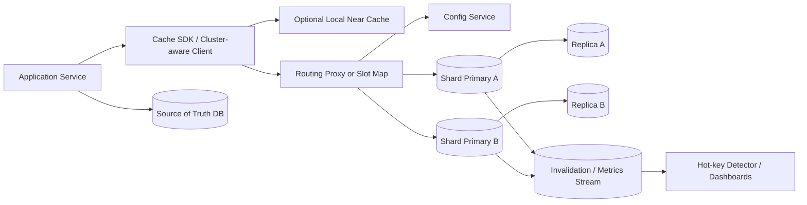

Generated by Codex with gpt-5

Selected problem: Distributed Cache

Scope: Design a distributed in-memory cache service that provides very low-latency `GET`/`SET`/`DELETE`/`INCR` operations with TTLs, eviction, sharding, and failover for many stateless application services.

## Problem framing

This is the classic "design Memcache / Redis-class cache" interview problem: build a shared cache tier that is much faster than the system of record, scales horizontally, and fails gracefully instead of turning into a new bottleneck.

Functional requirements:

- Store and retrieve opaque values by key.
- Support `GET`, `SET`, `DELETE`, `MGET`, `INCR`, and `EXPIRE`-style operations.
- Allow per-key or per-namespace TTLs.
- Support explicit invalidation and natural expiry.
- Support replication and failover so one node loss does not wipe out the whole cache.
- Expose metrics for hit rate, misses, evictions, memory pressure, hot keys, and replica lag.
- Support multi-tenant isolation with namespaces, quotas, and item-size limits.

Non-functional requirements:

- Very low latency, typically single-digit milliseconds inside one region.
- High throughput for read-heavy workloads with skewed hot-key access patterns.
- Horizontal scalability for both memory capacity and request volume.
- Graceful degradation under node loss, resharding, or hot-key amplification.
- Bounded memory growth through TTLs, quotas, and eviction policies.
- Clear consistency semantics so application teams understand stale-read behavior.
- Operationally simple enough that most product teams can use it as infrastructure, not as a hand-built subsystem per service.

Scale assumptions:

- Assume peak cluster traffic of about 2 million cache operations per second in one region.
- Assume 80% to 95% of operations are reads, but some namespaces contain counters or write-heavy session data.
- Assume average item size is a few KB, with a hard product limit such as 1 MB to avoid giant objects dominating memory.
- Assume tens to hundreds of billions of keys may be created over time, but only the live working set needs to fit in RAM because expired or evicted data can be reloaded from the source of truth.
- Assume a small percentage of keys become extremely hot due to celebrity users, popular content, or synchronized application behavior.
- These are interview assumptions, not claims about any vendor's current production numbers.

Core APIs:

```http
PUT /v1/cache/{namespace}/{key}
{
  "value": {
    "userId": "u_123",
    "preferences": {
      "theme": "light"
    }
  },
  "ttlSeconds": 300,
  "ifVersion": "optional-cas-token"
}
-> 201 Created
{
  "written": true,
  "version": "v_884201",
  "expiresAt": "2026-04-22T09:05:00Z"
}

GET /v1/cache/{namespace}/{key}?readPreference=primary
-> 200 OK
{
  "hit": true,
  "value": {
    "userId": "u_123",
    "preferences": {
      "theme": "light"
    }
  },
  "version": "v_884201",
  "ttlRemainingSeconds": 247
}

POST /v1/cache/batch/get
{
  "namespace": "user-profile",
  "keys": ["u_123", "u_456", "u_789"]
}

POST /v1/cache/incr
{
  "namespace": "rate-limit",
  "key": "tenant:t_55:minute:2026-04-22T09:00",
  "delta": 1,
  "ttlSeconds": 120
}

DELETE /v1/cache/{namespace}/{key}
-> 204 No Content
```

Core data model:

| Entity | Key | Important fields | Notes |
| --- | --- | --- | --- |
| `CacheEntry` | `namespace + key` | `value_blob`, `version`, `expires_at`, `size_bytes`, `last_access_at`, `freq_counter` | Main in-memory object |
| `NamespacePolicy` | `namespace` | `default_ttl_seconds`, `max_item_bytes`, `eviction_policy`, `replication_factor`, `quota` | Multi-tenant controls |
| `ShardAssignment` | `slot_id` | `primary_node_id`, `replica_node_ids`, `state`, `config_epoch` | Routing metadata for the data plane |
| `InvalidationEvent` | append-only event | `namespace`, `key`, `op`, `version`, `timestamp` | Used for near-cache fanout, audit, and analytics |
| `HotKeyObservation` | `namespace + key + time_bucket` | `qps`, `hit_rate`, `fanout_count` | Derived telemetry, not part of the serving path |

## Architecture



High-level design:

- Keep the cache service separate from the system of record. DDIA's framing is useful here: the cache is one component in a composite data system, not the database itself.
- Use a cluster-aware client or lightweight proxy to route requests to the correct shard. Do not let every application invent its own routing logic.
- Partition keys across many cache shards using hash-based sharding or slot-based sharding.
- Replicate each shard to at least one replica so node failure does not immediately drop the entire partition.
- Keep routing metadata and namespace policy in a durable control-plane store, not only in RAM on cache nodes.
- Treat metrics, hot-key detection, and invalidation fanout as asynchronous side channels, not blockers on the hot path.

Practical request flow:

1. An application calls the cache SDK for a `GET`, `SET`, or `INCR`.
2. The SDK may check a tiny local near-cache first for ultra-hot data with a very short TTL.
3. The SDK or proxy hashes `namespace + key` to a slot or shard.
4. The request is sent to the shard primary, or to a replica for explicitly allowed stale reads.
5. The primary serves reads from RAM, or mutates the in-memory object for writes.
6. The primary replicates the mutation to replicas asynchronously by default.
7. Metrics and invalidation events are emitted asynchronously for operators and optional L1 near-cache refresh.

Storage choices:

- RAM:
  - The core working set lives in memory because the cache exists to avoid slower network or disk reads elsewhere.
- Optional disk or log persistence:
  - Use snapshots or append-only logs only if warm restart, counters, or short-lived durability matter.
  - The cache should still be treated as a cache, not as the only source of truth.
- Control plane:
  - Store shard maps, health state, and namespace policy in a durable metadata store.
- Source of truth:
  - Product data remains in the backing database, object store, or search system.

Caching strategy:

- Default to a shared distributed cache as the L2 cache for many stateless app servers.
- Add a tiny L1 local near-cache only for very hot reads where a little extra staleness is acceptable.
- Prefer cache-aside for general applications because it keeps the cache service simpler and avoids forcing every database write through the cache.
- Use negative caching for frequent misses when the underlying object is known not to exist.
- Add TTL jitter so many keys created together do not all expire at the same instant.

Partitioning and sharding:

- Shard by a stable hash of `namespace + key`, not by time.
- Use consistent-hashing or slot-based routing so adding nodes does not remap the whole keyspace.
- Keep the routing plan explicit through epochs or versions so clients can recover cleanly during resharding.
- For multi-key operations, require the keys to share a partitioning tag or degrade to scatter-gather with clear limits.
- Hot keys still exist even with good sharding. Hashing spreads many keys well, but it cannot help when all traffic is for one key.

Consistency tradeoffs:

- Default to eventual consistency across replicas. This is the normal cache answer, not a flaw to hide.
- For read-after-write semantics, route reads to the primary, use session stickiness, or include a version token instead of pretending all replica reads are fresh.
- Invalidation is inherently racy across many app servers and near-caches. Prefer versioned values or delete-on-write invalidation rather than trying to synchronize every layer perfectly.
- If the cache cluster is unavailable, application behavior depends on the workload:
  - fail-open for optional performance caches
  - fail-closed only for correctness-sensitive cached state such as locks or rate-limit counters
- Do not promise stronger semantics than the application truly needs.

Bottlenecks to call out in an interview:

- Hot keys that overload one shard.
- Stampedes when many clients miss the same key after expiry.
- Resharding churn causing temporary routing misses or uneven load.
- Replication lag creating stale reads on replicas.
- Large objects wasting RAM and network bandwidth.
- Multi-tenant noisy neighbors consuming memory or CPU disproportionally.

## Deep dives

### Population and write policy

Grokking's cache-invalidating write modes and Alex Xu's cache-tier framing fit together well here.

- Cache-aside:
  - The application reads from cache first, falls back to the database on miss, and then repopulates the cache.
  - This is the best default interview answer for a general-purpose distributed cache because it keeps ownership of the source of truth outside the cache cluster.
- Read-through:
  - The cache service itself loads from the backing store.
  - This simplifies application code but couples the cache to database access patterns.
- Write-through:
  - Update the cache and backing store in the same logical request path.
  - Better when the cache is tightly integrated with one storage layer and stale reads are expensive.
- Write-around:
  - Write only to the source of truth and let future reads repopulate cache.
  - Good when many writes are never read again soon.
- Write-back:
  - Acknowledge the cache write first and flush later.
  - Highest write throughput, but operationally dangerous if teams start treating cached state as durable business data.

Practical default:

- Use cache-aside for most product data.
- Use write-through selectively for counters or mutable derived state where stale cache reads are painful.
- Avoid write-back unless the interviewer explicitly wants a performance-first design and accepts the durability risk.

### Expiration, eviction, and admission control

The books treat expiration and eviction as core cache behavior, and they are.

- Expiration answers "when should a key naturally disappear?"
- Eviction answers "what should we throw away when memory is full?"

Practical implementation:

- Store an absolute expiry per key.
- Use lazy expiration on read plus background sweeps so expired keys do not live forever.
- Keep memory quotas per namespace so one team cannot evict everyone else's hot data.
- Reject oversized items instead of letting giant objects crowd out the whole cache.

Interview tradeoffs:

- LRU is the easiest answer and still a good default when recency predicts reuse.
- LFU is often better when a relatively stable hot set dominates traffic.
- Random or TTL-driven eviction can be acceptable in simpler or highly uniform workloads.
- Admission control can outperform naive caching for one-hit-wonder traffic. If the working set is noisy, do not cache every miss blindly.

### Replication, failover, and durability

DDIA's replication chapter is the right lens for this part.

- Each shard has one primary and one or more replicas.
- Writes go to the primary, which sequences mutations and replicates them.
- Replica reads improve scale, but they are eventually consistent.
- On primary failure, a control plane promotes a replica and updates the routing view.

Important interview point:

- A distributed cache usually prefers low-latency asynchronous replication over strict durability.
- That means some acknowledged writes may still be lost during failover.
- This is acceptable for many caches because the source of truth still exists elsewhere.
- It is not acceptable if the cache is secretly being used as the only store for money movement, locks, or irreplaceable session state.

If the interviewer pushes on durability, offer a tunable mode:

- normal mode:
  - ack after primary memory write
- stronger mode:
  - ack after one or more replicas confirm receipt
- warm-restart mode:
  - keep snapshots or append-only logs for faster recovery

### Hot keys and cache stampede protection

This is one of the most important deep dives because sharding alone does not solve it.

For hot-read keys:

- Add an L1 near-cache with a tiny TTL.
- Replicate hot keys to more readers or allow replica reads.
- Use request coalescing so one miss reloads the value while other requests wait briefly.
- Refresh ahead of expiry when a key is both hot and expensive to rebuild.

For hot-write keys:

- Keep the mutation logic on one shard to preserve ordering.
- If the workload is counter-like, use striped counters and merge on read only when necessary.
- Be honest that a single strongly ordered key cannot scale infinitely without semantic compromises.

For synchronized expiry:

- Add random TTL jitter.
- Support soft TTL plus background refresh.
- Allow stale-on-error so a temporary backend failure does not turn every key into a miss storm.

### Multi-region design

This is where teams often over-promise.

- For most applications, deploy one cache cluster per region near the application servers.
- Treat each regional cache as an acceleration layer for that region's traffic.
- Replicate the source of truth across regions separately; do not assume the cache is the replication system.
- Cross-region cache invalidation can be event-driven, but it is usually eventually consistent.
- If a product truly needs strict global read-after-write across regions, the cache is no longer the hard problem; the underlying data-consistency model is.

Practical interview answer:

- keep the cache regional
- keep the database as source of truth
- accept bounded cross-region staleness
- invalidate or version keys through async events

## Modern considerations

- A modern interview answer should not assume naive `hash(key) % N` routing. Current Redis Cluster documentation uses slot-based sharding, with the keyspace split into 16,384 slots and routed by `CRC16(key) mod 16384`; this is the practical modern version of the books' consistent-hashing discussion. Source: [Redis Cluster spec](https://redis.io/docs/latest/operate/oss_and_stack/reference/cluster-spec/).
- LRU is still a fine default answer, but it should no longer be the only eviction policy mentioned. Current Redis docs support LRU, LFU, and newer LRM-style policies, so the right answer is "pick the policy that matches the workload and measure hit rate, evictions, and memory pressure," not "always use LRU." Source: [Redis key eviction docs](https://redis.io/docs/latest/develop/reference/eviction/).
- Reads from replicas remain a performance optimization, not a free consistency upgrade. Current Redis and ElastiCache docs are explicit that replication is asynchronous by default and replica reads are eventually consistent, so primary reads or session stickiness are still the cleanest answers for read-after-write semantics. Sources: [Redis replication docs](https://redis.io/docs/latest/operate/oss_and_stack/management/replication/) and [ElastiCache best practices](https://docs.aws.amazon.com/AmazonElastiCache/latest/dg/WorkingWithRedis.html).
- Managed caches today make horizontal scaling and failover much easier than the older "build everything yourself" framing suggests. For example, current ElastiCache guidance recommends cluster-mode enabled configurations for horizontal scale, and Multi-AZ failover promotes a replica to primary automatically. That changes the operational answer in interviews: discuss the architecture and failure semantics first, then note that managed platforms can supply the mechanics. Sources: [ElastiCache best practices](https://docs.aws.amazon.com/AmazonElastiCache/latest/dg/WorkingWithRedis.html) and [ElastiCache Multi-AZ failover](https://docs.aws.amazon.com/AmazonElastiCache/latest/dg/AutoFailover.html).
- The evergreen book principles still hold: make assumptions explicit, keep the cache out of the critical system-of-record role unless you truly need that complexity, and explain hot-key, stampede, and invalidation behavior before talking about specific vendors.

## Interview follow-ups

- How would you handle cache stampede when a popular key expires?
  - Use request coalescing, soft TTLs, background refresh, and TTL jitter so one expiry does not cause a thundering herd to the database.
- When would you choose write-through over cache-aside?
  - Choose write-through when the cached object is updated frequently and stale reads are expensive enough that you want the write path to keep cache and backing data aligned more tightly.
- Can read replicas safely serve all traffic?
  - They can serve read-mostly traffic where a little staleness is acceptable, but they are the wrong answer for strict read-after-write semantics because replica lag is real.
- How would you invalidate many related keys after a product update?
  - Prefer versioned namespaces or tag-style indirection so a schema or product change can invalidate a whole family of keys without issuing millions of point deletes.
- What would you do if one tenant becomes a noisy neighbor?
  - Enforce per-namespace memory quotas, QPS throttles, max item sizes, and separate eviction accounting so one tenant cannot evict the working set for everyone else.
- How would you support atomic counters and rate-limit tokens in the same cache?
  - Keep those operations on a single shard per key, use server-side atomic primitives, and document that failover may still lose a small amount of recent state unless stronger acknowledgement rules are enabled.
- What changes in a multi-region deployment?
  - Run regional caches close to users, keep the database as the source of truth, and accept eventual cross-region invalidation unless the product is willing to pay the latency and availability cost of stricter coordination.
- When should the cache use persistence at all?
  - Use persistence only when warm restart, short-lived durability, or replay of ephemeral state matters enough to justify extra memory, CPU, and operational complexity.

Closing view:

The strongest interview answer is not "put Redis in front of the database." It is: define the cache's contract, keep it RAM-first and horizontally partitioned, replicate each shard with explicit staleness tradeoffs, mitigate hot keys and stampedes deliberately, and never let the cache quietly become the only source of truth unless the design discussion is explicitly about that risk.
