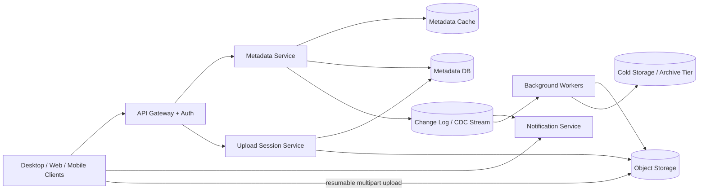

Generated by Codex with gpt-5

Selected problem: Distributed File Storage

Scope: Design a cloud file storage and sync service that stores large files durably, keeps file and folder metadata consistent, and propagates changes across devices and shared workspaces.

## Problem framing

This is the classic Dropbox / Google Drive interview problem. Grokking and Alex Xu both push the same core split early: separate the metadata and synchronization plane from the binary file storage plane. DDIA adds the more durable framing: the namespace, versions, and permissions are the system of record, while notifications, sync cursors, search indexes, thumbnails, and audit views are derived data built from change streams.

Functional requirements:

- Upload and download files from web, desktop, and mobile clients.
- Organize files into folders and expose a stable namespace per user or workspace.
- Sync changes across a user's devices with low delay.
- Support sharing files or folders with other users.
- Keep version history so users can inspect or restore older revisions.
- Support resumable uploads for large files and unreliable networks.
- Allow offline edits and reconcile when a device reconnects.
- Notify clients when relevant files are created, updated, moved, deleted, or shared.

Non-functional requirements:

- Very high durability for stored file contents.
- High availability for reads, metadata lookups, and sync APIs.
- Fast sync for metadata changes and efficient transfer of large files.
- Reasonable read-your-writes behavior for the user who just uploaded or renamed a file.
- Bounded conflict semantics for concurrent edits.
- Horizontal scalability for metadata volume, blob storage, and notification fanout.
- Efficient bandwidth use through resumable transfer, chunking, and caching.
- Operationally safe recovery for orphaned uploads, retries, and regional failures.

Scale assumptions:

- Assume 10 million registered users and about 2 million daily active users.
- Assume an active user uploads roughly 2 files per day.
- Assume the median file is small, but the tail includes media files up to 5 GB.
- Assume average daily ingest on the order of 20 TB and peak ingest several times higher.
- Assume each active user connects 2 to 4 devices, so one metadata change often fans out to multiple sync consumers.
- Assume shared folders and team workspaces create hot spots that are much busier than the median personal folder.

## Core APIs

The public API should mostly be a control plane. Large file bytes should avoid the metadata service once authorization and upload intent are established.

```http
POST /v1/files:start-upload
{
  "parentFolderId": "fld_901",
  "name": "design-review.mp4",
  "sizeBytes": 734003200,
  "contentType": "video/mp4",
  "sha256": "optional-full-file-checksum",
  "clientMutationId": "dev_12:op_8841"
}
-> 200 OK
{
  "fileId": "file_781",
  "uploadSessionId": "upl_4481",
  "partSizeBytes": 8388608,
  "uploadMode": "resumable_multipart",
  "uploadTargets": [
    {
      "partNumber": 1,
      "url": "short-lived-upload-url"
    }
  ],
  "expectedBaseVersion": "v_41"
}

POST /v1/files:complete-upload
{
  "uploadSessionId": "upl_4481",
  "parts": [
    {
      "partNumber": 1,
      "etag": "etag-or-checksum",
      "sha256": "optional"
    }
  ],
  "clientObservedBaseVersion": "v_41"
}
-> 201 Created
{
  "fileId": "file_781",
  "versionId": "ver_42",
  "syncCursor": "cur_992100"
}

GET /v1/files/{fileId}/download?version=current
-> 200 OK
{
  "versionId": "ver_42",
  "sizeBytes": 734003200,
  "downloadUrl": "short-lived-download-url",
  "contentHash": "sha256:..."
}

GET /v1/changes?cursor=cur_992100&limit=500
-> 200 OK
{
  "changes": [
    {
      "sequence": 992101,
      "workspaceId": "ws_20",
      "fileId": "file_781",
      "eventType": "FILE_VERSION_COMMITTED",
      "versionId": "ver_42"
    }
  ],
  "nextCursor": "cur_992150"
}

POST /v1/files/{fileId}:share
{
  "principalId": "user_44",
  "role": "editor"
}
-> 200 OK
```

API notes:

- `start-upload` is a metadata reservation plus authorization step.
- `complete-upload` is the logical commit step that flips a file pointer to a new immutable version.
- `changes` is the canonical sync API. Push notifications are only hints that tell clients to call it sooner.

## Core data model

| Entity | Key | Important fields | Notes |
| --- | --- | --- | --- |
| `Workspace` | `workspace_id` | `owner_id`, `region_home`, `quota_bytes`, `plan`, `created_at` | Root scope for files, folders, sharing, and home-region routing |
| `FolderEntry` | `parent_folder_id + name` | `entry_type`, `file_id_or_folder_id`, `deleted_at` | Namespace mapping for listings and moves |
| `File` | `file_id` | `workspace_id`, `current_version_id`, `state`, `latest_sequence`, `created_by` | Stable logical file identity |
| `FileVersion` | `version_id` | `file_id`, `manifest_id`, `size_bytes`, `content_hash`, `created_at`, `base_version_id` | Immutable revision record |
| `ChunkBlob` | `chunk_hash` | `object_key`, `size_bytes`, `checksum`, `storage_class`, `ref_state` | Physical blob or chunk object in storage |
| `Manifest` | `manifest_id` | `ordered_chunk_hashes`, `logical_offsets`, `encryption_info` | Reconstructs a file version from immutable chunks |
| `UploadSession` | `upload_session_id` | `file_id`, `status`, `expires_at`, `expected_parts`, `idempotency_key` | Lets large uploads finish safely across retries |
| `ShareGrant` | `resource_id + principal_id` | `role`, `inherited`, `created_at`, `revoked_at` | Permissions model |
| `ChangeEvent` | `workspace_id + sequence` | `event_type`, `resource_id`, `version_id`, `actor_id`, `occurred_at` | Source of truth for sync fanout and rebuildable derived views |
| `DeviceCursor` | `device_id` | `workspace_id`, `last_sequence`, `last_ack_at` | Tracks sync progress per device |

## Architecture



High-level design:

- Keep metadata and file bytes on separate paths. Metadata requests are small, transactional, and latency-sensitive; file transfers are bandwidth-heavy and should not overload the same servers.
- Treat file contents as immutable objects once committed. A write creates a new `FileVersion` and advances `File.current_version_id`.
- Represent each version as a manifest over ordered chunks or object parts. This supports resumable upload, delta sync, deduplication, and version history.
- Emit every committed metadata mutation into an ordered change stream per workspace. Notifications, search indexing, audit logs, and sync cursors are built from that stream.
- Let clients maintain a local metadata cache or lightweight local database so they can detect changes, operate offline, and reconcile later.

Main components:

- Metadata service: handles namespace operations, permissions, version commits, and change-sequence assignment.
- Upload session service: creates pending uploads, authorizes data-plane writes, verifies completion, and turns uploaded parts into a committed file version.
- Object storage: stores immutable chunks or full objects durably.
- Notification service: pushes change hints using long polling, server-sent events, or WebSockets.
- Background workers: perform dedup cleanup, cold-tier moves, malware scanning, thumbnail extraction, retention, and repair workflows.

## Data flow

Upload flow:

1. The client detects a new or modified file through its local watcher.
2. The client calls `start-upload` with file metadata and an idempotency key.
3. The metadata plane creates or reuses a pending `UploadSession`.
4. The client uploads file parts directly to object storage or through an ingest proxy if server-side transforms are required.
5. The client calls `complete-upload` with part receipts and optional checksums.
6. The metadata service validates the upload, writes a new immutable `FileVersion`, updates the `File` pointer in one transaction, and appends a `ChangeEvent`.
7. The notification service tells subscribed devices that fresh changes exist.
8. Other devices call `changes`, fetch the new manifest, and download missing chunks.

Download and sync flow:

1. A connected client receives a push hint or wakes on its regular sync timer.
2. It calls `GET /v1/changes` using its last durable cursor.
3. For each changed file, it fetches metadata and the current manifest.
4. It downloads only the missing chunks and reconstructs the new local copy.
5. It advances the local cursor only after the local metadata DB and file state are durable.

Offline flow:

1. The client records local edits in its local metadata DB while offline.
2. When connectivity returns, it replays pending mutations through the normal upload session flow.
3. If the base version has changed remotely, the client either creates a conflict copy or asks the user to merge, depending on product semantics.

## Storage, caching, and partitioning

Storage choices:

- Metadata DB:
  - Use a relational or distributed SQL store for folders, file pointers, revisions, and share grants.
  - Folder listings are range scans over ordered names; renames and moves need transactional integrity; version commits benefit from compare-and-swap or transactional updates.
- Object storage:
  - Store blobs as immutable objects addressed by stable object keys or content hashes.
  - The object store handles durability, background repair, and lifecycle tiers more efficiently than a hand-built file-byte store for most interview scopes.
- Change log:
  - Persist committed mutations in an append-only log partitioned by workspace or namespace.
  - This gives replay, backfill, and rebuildability for sync and derived views, which is straight out of DDIA's log-centric thinking.

Caching strategy:

- Keep a metadata cache for hot folder listings, file manifests, permission checks, and recent version pointers.
- Let clients keep a local metadata DB and local content cache to reduce round trips and enable offline behavior.
- Use CDN or edge caching for popular downloads, especially for shared read-heavy files.
- Add short-lived negative cache entries for missing paths or revoked share links to blunt repeated misses.

Partitioning and sharding:

- Partition metadata primarily by `workspace_id` or home namespace so most operations for one user's tree are routed to the same shard family.
- Keep `file_id` globally unique so renames do not require moving file identity between shards; only `FolderEntry` mappings change.
- Partition change streams by workspace so sequence order is well defined for sync cursors.
- Spread blob keys using a hash prefix so object traffic does not hot-spot on path-based prefixes.
- Watch out for hot shared folders. A single partition key per workspace works well until one workspace is far larger or noisier than the median, so be ready to split by folder or sub-namespace.

## Consistency tradeoffs

- Metadata should be strongly consistent for operations users notice immediately: create, rename, move, delete, share changes, and switching the current version pointer of a file.
- Blob storage can remain immutable and eventually replicated internally as long as `complete-upload` only succeeds after the committed object data is durable enough for the product's read path.
- Notifications are not the source of truth. They can be delayed, duplicated, or dropped; clients must reconcile through `changes` and durable cursors.
- Provide read-your-writes by routing the uploading user's post-commit metadata reads to the leader or home shard, or by using session tokens tied to the commit sequence.
- Use idempotency keys on upload initiation and completion so retries do not create duplicate file versions.
- Do not try to run one giant distributed transaction across metadata DB and object storage. Use a pending upload state, then atomically publish the metadata pointer after the object parts are verified.

## Bottlenecks and mitigations

Small-file amplification:

- Problem: millions of tiny files create disproportionately high metadata load.
- Mitigation: cache folder listings and manifests aggressively, batch sync responses, and keep the metadata schema compact.

Large-file upload pressure:

- Problem: proxying every byte through API servers turns the control plane into a bandwidth bottleneck.
- Mitigation: issue resumable upload sessions and let clients push large objects directly to the data plane.

Hot shared folders:

- Problem: one team folder can generate huge fanout and metadata contention.
- Mitigation: separate folder listing reads from mutation ordering, partition large workspaces more finely, and batch notifications.

Reconnect storms:

- Problem: when a notification tier fails, many clients reconnect at once.
- Mitigation: exponential backoff with jitter, cursor-based catch-up, and load-shed push hints while the `changes` API remains authoritative.

Orphaned objects and failed commits:

- Problem: uploads may finish in object storage but fail before metadata commit.
- Mitigation: keep uploads in `pending`, expire abandoned sessions, and run asynchronous garbage collection over unreferenced objects.

Cross-region cost and lag:

- Problem: durable replication and global access can become expensive and stale.
- Mitigation: pick a home region per workspace, replicate metadata and blobs asynchronously for disaster recovery first, and add multi-region active serving only if the product truly needs it.

## Deep dives

### Upload sessions and logical commit

The most important practical detail is avoiding a brittle distributed transaction between the metadata database and blob storage.

- `start-upload` allocates a pending session and reserves the file identity or next candidate version.
- The client uploads bytes to durable object storage using part receipts and checksums.
- `complete-upload` validates that the expected objects exist, builds the final manifest, and atomically updates the metadata pointer from old version to new version.
- If completion fails after the object write but before metadata commit, the bytes are merely orphaned data, not visible file state. A background sweeper can clean them up later.

This is the DDIA way to think about it: separate durable data ingestion from publishing the new logical state.

### Sync protocol and offline edits

Grokking and Alex Xu both emphasize local metadata plus change notifications, and that still holds up.

- The client keeps a local metadata DB with file IDs, versions, paths, and sync cursors.
- A watcher records local filesystem mutations.
- A sync engine compares local base version to the server's current version.
- For binary files, "conflict copy" is often the right answer. True collaborative editing belongs to a different design problem with OT or CRDTs.

The notification channel should never be the only path to convergence. It is a latency optimization, not the consistency mechanism.

### Metadata storage-engine thinking

DDIA is especially useful on the metadata side.

- Folder listings and path lookups want ordered indexes, which is why a B-tree-style relational store or distributed SQL layer is often a cleaner fit than a pure hash KV store.
- The change feed is naturally append-only, so a log or CDC stream is the right primitive for fanout and rebuilds.
- Secondary derived views such as "recent files", audit history, search indexing, and activity feeds should be consumers of the change stream instead of being updated by custom side effects everywhere in request handlers.

The interview answer is stronger when it explains why different storage engines serve different access patterns instead of forcing all data into one database.

### Deduplication, versioning, and garbage collection

- Immutable `FileVersion` rows make rollback and history straightforward.
- Deduplicate at least within one tenant or workspace by content hash. Global dedup can save more space, but it complicates privacy, abuse handling, and deletion semantics.
- Keep old versions according to retention rules. Recent versions are hot; older ones can move to cheaper storage tiers.
- Garbage collection should be asynchronous and conservative. Tombstone version references first, wait out a grace period, then delete unreferenced chunks after a final reachability check.

## Modern considerations

In 2026, the default cloud-native answer is usually "metadata/control plane plus direct object-store data plane," not "all uploads must traverse custom block servers forever." Official storage docs now expose stronger primitives than many older interview examples assumed: Amazon S3 documents strong read-after-write and list consistency plus multipart checksum support, and Google Cloud Storage documents strong global consistency and resumable uploads ([Amazon S3 consistency](https://aws.amazon.com/s3/consistency/), [Amazon S3 multipart upload](https://docs.aws.amazon.com/AmazonS3/latest/userguide/mpuoverview.html), [Google Cloud Storage consistency](https://cloud.google.com/storage/docs/consistency), [Google Cloud Storage resumable uploads](https://cloud.google.com/storage/docs/resumable-uploads)). The modern design move is to keep metadata commits, access control, change ordering, and sync cursors in your own strongly controlled service, while letting object storage absorb bulk transfer, integrity verification, and lifecycle tiers unless the interviewer explicitly asks you to design the blob store internals too.

## Interview follow-ups

- How would you handle two users editing the same file while offline?
  - For ordinary binary files, keep immutable versions and create a conflict copy when both users upload from the same base version. If the interviewer wants real-time co-editing, that is a different system design problem and should move toward OT or CRDTs.

- Why not store file bytes and metadata in the same relational database?
  - Large blobs would bloat backups, replica lag, cache efficiency, and storage costs. The common split is transactional metadata in a database and immutable bytes in object storage.

- How do you provide read-your-writes after an upload?
  - Return the committed version ID and sync cursor from `complete-upload`, then route that user's immediate metadata reads to the authoritative shard or enforce a minimum sequence on subsequent reads.

- What happens if the client uploads all parts but crashes before calling `complete-upload`?
  - The upload stays in `pending` until it expires. Background cleanup removes abandoned objects that are not referenced by any committed manifest.

- How would you design multi-region support?
  - Start with a home region per workspace, same-region high availability, and asynchronous cross-region disaster recovery. Only move to active-active metadata if product requirements justify the conflict and routing complexity.

- How do you reduce bandwidth for frequently edited large files?
  - Chunk the file, hash chunks, and upload only changed chunks or blocks. Keep the file version as a manifest over immutable chunks so unchanged data is reused.

- Where does DDIA matter most in this design?
  - In choosing different storage patterns for different data: transactional ordered indexes for metadata, append-only logs for changes, and immutable object storage for bytes. That separation makes the system easier to scale and reason about.

- What if one shared folder becomes extremely hot?
  - Split metadata ownership more finely than one whole workspace, cache listings aggressively, and decouple notification fanout from the write transaction so one folder does not serialize the entire service.

- Would you use long polling or WebSockets for notifications?
  - Either works. Long polling is simpler for one-way "something changed" hints; WebSockets become more attractive when presence, richer push semantics, or many low-latency interactive events are also required.

- How do you support version history without exploding storage cost?
  - Store versions as manifests of immutable chunks, keep only the versions your retention policy actually values, and move cold versions to cheaper storage tiers.

The strongest interview answer is not just "split files into chunks." It is: keep metadata strongly controlled, treat file versions as immutable manifests over object storage, drive synchronization from an ordered change log, and make notifications and caches accelerators rather than sources of truth.
