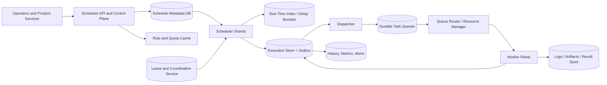

Generated by Codex with gpt-5

Selected problem: Distributed Job Scheduler

Scope: Design a multi-tenant scheduler that supports one-off and recurring jobs, dispatches them reliably to worker fleets, and gives operators clear control over retries, overlap, and execution history.

## Problem framing

This interview problem sits between a cron service and a workload orchestrator. Grokking and Alex Xu repeatedly lean on the same building blocks across crawler, notification, and media-processing systems: stateless control planes, durable metadata, queues, workers, and explicit retry paths. DDIA adds the harder part: lease-based coordination, partition ownership, hot-spot avoidance, and clear delivery semantics.

Functional requirements:

- Create one-off jobs and recurring schedules.
- Support cron-like expressions, time zones, start and end times, and pause or resume.
- Route jobs to named queues or worker pools.
- Support retries with backoff, execution timeouts, cancellation, and dead-letter handling.
- Control overlap for recurring schedules with policies such as allow, forbid, or replace.
- Record execution history, current state, next fire time, and failure reason.
- Support priorities, tenant quotas, and basic backfill of missed schedules.

Non-functional requirements:

- High durability once a schedule is accepted.
- High availability of the control plane and execution path.
- Low trigger lag for due jobs; the system should usually enqueue a due execution within a few seconds.
- Horizontal scalability across millions of schedules and large boundary spikes.
- Bounded duplicate risk with explicit at-least-once semantics.
- Fairness across tenants so one noisy customer does not starve everyone else.
- Strong observability, auditability, and operator controls.

Scale assumptions:

- Assume about 10 million schedules exist overall and roughly 2 million are enabled at a time.
- Assume peak bursts of about 300,000 due executions per minute, or roughly 5,000 per second, concentrated on minute and quarter-hour boundaries.
- Assume 95% of jobs finish within 5 minutes, but a small tail runs for hours and must heartbeat.
- Assume job payloads are small, usually under 64 KB, while logs and artifacts live outside the scheduler in object storage or a logging system.
- Assume recent execution history stays hot for 30 days and older history is archived more cheaply.

Core APIs:

```http
POST /v1/schedules
{
  "name": "daily-billing-close",
  "schedule": "0 2 * * *",
  "timeZone": "America/Los_Angeles",
  "taskType": "billing.close_day",
  "targetQueue": "billing-normal",
  "payloadRef": "s3://jobs/billing/close-day/2026-04-24.json",
  "retryPolicy": {
    "maxAttempts": 5,
    "initialBackoffSeconds": 30,
    "maxBackoffSeconds": 900
  },
  "overlapPolicy": "FORBID"
}
-> 201 Created
{
  "scheduleId": "sch_01JSM7...",
  "nextFireTime": "2026-04-25T09:00:00Z",
  "state": "ACTIVE"
}

POST /v1/jobs
{
  "executeAt": "2026-04-24T18:30:00Z",
  "taskType": "email.send_campaign",
  "targetQueue": "notifications-bulk",
  "payloadRef": "s3://jobs/campaigns/c_998.json",
  "priority": 40
}
-> 202 Accepted
{
  "jobId": "job_01JSM8...",
  "executionId": "exec_01JSM8..."
}

POST /v1/schedules/{scheduleId}/pause
-> 200 OK

GET /v1/executions/{executionId}
-> 200 OK
{
  "executionId": "exec_01JSM8...",
  "scheduleId": "sch_01JSM7...",
  "scheduledFor": "2026-04-24T18:30:00Z",
  "state": "RUNNING",
  "attempt": 2,
  "workerId": "wrk_731",
  "leaseExpiresAt": "2026-04-24T18:31:45Z"
}
```

Internal execution APIs:

```http
POST /internal/executions/{executionId}/claim
POST /internal/executions/{executionId}/heartbeat
POST /internal/executions/{executionId}/complete
POST /internal/executions/{executionId}/fail
```

Core data model:

| Entity | Key | Important fields | Notes |
| --- | --- | --- | --- |
| `Schedule` | `schedule_id` | `tenant_id`, `cron_expr`, `time_zone`, `task_type`, `target_queue`, `payload_ref`, `retry_policy`, `overlap_policy`, `next_fire_time`, `state`, `version` | Durable control-plane definition |
| `Execution` | `execution_id` | `schedule_id`, `scheduled_for`, `state`, `attempt_count`, `priority`, `worker_id`, `lease_expires_at`, `result_ref` | One row per logical run |
| `ExecutionAttempt` | `execution_id + attempt_no` | `started_at`, `ended_at`, `failure_code`, `heartbeat_at` | Useful for debugging and retries |
| `DueBucket` | `bucket_time + virtual_shard + sort_key` | `schedule_id`, `scheduled_for`, `visible_at` | Durable due-time index for schedulers |
| `ShardLease` | `virtual_shard` | `owner_node`, `lease_version`, `lease_expires_at` | Prevents multiple schedulers from actively owning the same shard |
| `DispatchOutbox` | `event_id` | `execution_id`, `target_queue`, `published_at`, `status` | Bridges durable execution creation to queue publish |
| `WorkerRegistration` | `worker_id` | `queues`, `capacity`, `last_heartbeat_at`, `status` | Optional if the scheduler needs placement awareness |

## Architecture



High-level architecture:

- Keep API servers stateless. They validate requests, normalize cron and time-zone input, and persist schedule definitions.
- Store schedule metadata durably in a relational database or strongly consistent key-value store. This is the source of truth for control-plane state.
- Store due work in a separate due-time index optimized for range scans on upcoming fire times.
- Split the scheduler fleet into virtual shards. A coordination system such as ZooKeeper-, etcd-, or Chubby-style leases assigns shard ownership to scheduler nodes.
- Let each scheduler node scan only the due buckets it owns, materialize executions, and advance each schedule to its next fire time.
- Publish executions through an outbox-to-queue step so a crash between "execution row written" and "message published" does not lose work.
- Use durable task queues to decouple trigger time from worker availability.
- Let workers claim executions, heartbeat while running, and mark success or failure explicitly.

Practical data flow:

1. A client creates or updates a schedule through the control-plane API.
2. The API stores the `Schedule` row, computes the next fire time, and writes an entry into the proper `DueBucket`.
3. A scheduler node that currently owns that virtual shard scans for items with `scheduled_for <= now + lookahead`.
4. For each due item, it transactionally:
   - inserts an `Execution` row with a unique key on `(schedule_id, scheduled_for)`
   - appends a `DispatchOutbox` event
   - advances the schedule to its next fire time
5. A dispatcher publishes outbox events to the correct durable queue.
6. A worker pulls the task, claims the execution lease, and starts running it.
7. The worker heartbeats periodically for long jobs; if heartbeats stop, the lease expires and the scheduler can retry.
8. On completion, the worker writes final state and an optional `result_ref`.
9. Observability pipelines consume execution state changes for dashboards, alerting, and audit logs.

Storage choices:

- Schedule metadata:
  - Prefer a relational database if interview time allows. Unique constraints, secondary indexes, and transactional updates are valuable here.
  - A strongly consistent key-value store also works if the team is comfortable implementing more logic in application code.
- Due-time index:
  - Use a durable store optimized for ordered scans by time bucket.
  - An LSM-backed store or a sorted-set style store can work; the key point is durable, ordered retrieval of due items.
- Execution state:
  - Keep hot execution state in the same transactional store as schedule metadata or in a closely coupled operational store.
  - Move bulky logs and artifacts out of the transactional path.
- Durable queues:
  - Use a message broker or log to buffer dispatch, absorb worker imbalance, and support replay after transient failures.

Caching strategy:

- Cache schedule definitions and tenant quotas on scheduler nodes, but never treat cache as the source of truth.
- Keep a small in-memory timing wheel or min-heap for the next few seconds or minutes of work after items are durably claimed. This cuts repeated range scans on the hottest near-term timers.
- Cache worker capacity and queue-depth summaries for placement decisions.
- Keep dashboard aggregates off the critical path; derive them asynchronously from execution events.

Partitioning and sharding:

- Do not partition only by timestamp. DDIA's hot-key warning applies directly because many jobs cluster on exact minute boundaries.
- A practical due-index key is:
  - `bucket_time + virtual_shard + hash(schedule_id) + scheduled_for`
- Use many more virtual shards than physical scheduler nodes. Reassigning virtual shards makes rebalancing and failover much easier.
- Partition task queues by `target_queue + hash(logical_job_key)` so ordering is local to a queue or tenant, not global across the whole system.
- Partition execution history by `tenant_id + schedule_id` or by `execution_id` depending on the read pattern the interviewer prefers.

Consistency tradeoffs:

- Promise at-least-once dispatch, not exactly-once execution. Exactly-once effects belong in idempotent job handlers or downstream transactional logic.
- Use strong consistency for shard leases, unique execution materialization, and pause or resume operations near a due boundary.
- Accept eventual consistency for dashboards, search over historical executions, and aggregate analytics.
- In multi-region deployments, pick a home region per schedule or tenant instead of trying to run the same schedule actively in every region at once.
- Use server time, not client-supplied time, for lease expiry and execution state transitions. Clock skew is otherwise an easy interview trap.

Main bottlenecks to call out:

- Top-of-minute and top-of-hour spikes that create hot due buckets.
- Backfill after an outage, where many missed jobs become due at once.
- Hot tenants or queues that dominate worker capacity.
- Heavy heartbeat traffic from very long-running jobs.
- Large retry storms after a downstream dependency fails.

## Deep dives

### Durable triggering without double-firing

The core correctness problem is "who is allowed to turn a due schedule into an execution?" A good answer uses three layers:

- Lease ownership on a virtual shard so only one scheduler is supposed to scan a shard at a time.
- A uniqueness constraint on `(schedule_id, scheduled_for)` so duplicate materialization races fail safely.
- An outbox record in the same transaction as execution creation so queue publish can be retried independently.

This means a failover can create harmless duplicate attempts to materialize a run, but only one execution becomes authoritative. That is much more realistic than promising zero duplicates everywhere.

### Retries, overlap policies, and long-running work

Retries should create new attempts for the same logical execution, not a brand new execution identity. That keeps audit trails clean and gives downstream systems a stable idempotency key.

- `ALLOW`: materialize the next run even if the previous run is still running.
- `FORBID`: skip or mark missed if a prior execution is still active.
- `REPLACE`: cancel the older run and start a fresh one if product semantics allow it.

Long-running jobs should not hold an infinite invisible lock. Give them renewable leases plus heartbeats. If heartbeats stop, another attempt may be launched after timeout, so the job logic itself must tolerate duplicates or resume from checkpoints.

### Backpressure and fairness

The scheduler should separate "a run is due" from "a worker is available." Durable queues are the buffer between those facts.

- Enforce per-tenant and per-queue concurrency quotas before dispatching too much work downstream.
- Use weighted fair scheduling or at least isolated priority queues so one bulk workload does not starve urgent jobs.
- Rate-limit catch-up after outages. If the system was down for 30 minutes, replaying every missed run immediately can crush the cluster.
- Add optional jitter for non-user-visible schedules so thousands of jobs do not all target the same second.

### Extending the design to DAGs and workflows

If the interviewer pushes from cron toward Airflow- or Temporal-like workflows, keep the base scheduler and add a workflow layer on top instead of rewriting everything:

- A workflow definition stores tasks and dependency edges.
- Materializing a workflow run creates multiple task executions, but only zero-indegree tasks are initially runnable.
- As tasks finish, the scheduler decrements dependency counts and enqueues newly ready tasks.
- Alex Xu's YouTube chapter uses a DAG scheduler plus resource manager for exactly this kind of staged execution pattern.

That extension is powerful, but it should stay optional in the base answer unless the interviewer explicitly asks for dependent jobs.

## Modern considerations

A modern answer should explicitly mention features that older book examples often leave implicit: time-zone-aware schedules, overlap policies, missed-run windows, and HA scheduler replicas. Current platform schedulers expose these tradeoffs directly; for example, Kubernetes CronJobs document concurrency policy and missed-schedule behavior, while modern Airflow supports multiple schedulers backed by a shared metadata database. In interview terms, that means the safe default is a control-plane/data-plane split, durable schedule metadata, leased shard ownership, at-least-once dispatch, and idempotent job handlers rather than hand-waving toward exactly-once execution.

## Interview follow-ups

- Q: How would you stop a recurring job from firing twice during leader failover?
  - A: Use leased shard ownership, a unique constraint on `(schedule_id, scheduled_for)`, and an outbox pattern so only one logical execution survives and queue publication is replayable.

- Q: How would the design change for multi-region scheduling?
  - A: Assign each schedule a home region, replicate metadata to standby regions, and fail over ownership only after lease expiry. Trying to actively trigger the same schedule in multiple regions raises duplicate-fire risk and coordination cost.

- Q: How do you handle millions of jobs due at `00:00`?
  - A: Spread them across many virtual sub-buckets, allow optional jitter for flexible jobs, keep dispatch buffered through queues, and enforce per-tenant quotas so one spike does not flood all workers.

- Q: Why not keep all timers only in memory?
  - A: In-memory wheels are great for near-future efficiency, but the durable source of truth must survive process crashes and restarts. The common pattern is durable due storage plus an in-memory near-term cache.

- Q: What if a worker succeeds but the success acknowledgement is lost?
  - A: Make completion idempotent using the stable execution ID and attempt number. A retried completion call should safely overwrite the same terminal state instead of creating a second success record.

- Q: How would you support very long-running jobs?
  - A: Use execution leases with heartbeats, checkpoint progress externally when possible, and allow retries or resumption after lease expiry. The scheduler should not assume that one RPC equals one complete job lifetime.

- Q: How would you add DAG dependencies?
  - A: Store workflow definitions separately, materialize a workflow run into task nodes, enqueue only tasks whose dependencies are satisfied, and use completion events to unlock downstream tasks.

- Q: Which metrics matter most operationally?
  - A: Track schedule lag, queue lag, execution success rate, retry rate, lease-expiry rate, duplicate-materialization rejects, worker utilization, and backlog growth during catch-up.
