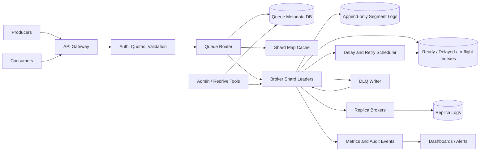

Generated by Codex with gpt-5

Selected problem: Distributed Queue

Scope: Design a durable multi-tenant queue service for asynchronous jobs, service decoupling, retries, and fan-out-style workflows, with at-least-once delivery as the default and per-key ordering where callers explicitly need it.

## Problem framing

This is the classic "design a distributed message queue" interview problem. Grokking's interview process is the right starting point: clarify whether the interviewer wants a task queue, a pub/sub broker, or a retained event log before debating Kafka, SQS, or RabbitMQ. Alex Xu's system design framing treats a message queue as the durability and decoupling layer between producers and consumers, and his notification, news feed, web crawler, chat, and video chapters show the same pattern repeatedly: put slow, unreliable, or bursty work behind a queue so producers and consumers can scale independently. DDIA adds the critical storage lesson: a queue is not just an in-memory list. It is a data system with ordering, replication, durability, retention, acknowledgements, and replay tradeoffs.

Functional requirements:

- Producers can create queues and publish one or many messages.
- Consumers can receive messages, process them, acknowledge success, or let them be retried.
- Support at-least-once delivery by default.
- Support per-queue or per-message delay for scheduled and retry delivery.
- Support visibility timeouts or leases so a message is hidden while one consumer works on it.
- Support dead-letter queues for messages that fail too many times.
- Support long polling to avoid hot loops when queues are empty.
- Support FIFO ordering within a queue partition or message group when requested.
- Support fan-out through multiple subscriptions or consumer groups when a message must be processed by independent downstream systems.
- Expose queue depth, consumer lag, retry counts, DLQ counts, publish latency, receive latency, and oldest visible message age.

Non-functional requirements:

- Durability before producer acknowledgement. Once `SendMessage` returns success, the message should survive common broker failures.
- High availability for enqueue, receive, ack, and lease-extension operations.
- Horizontal scaling across many queues, producers, and consumers.
- Predictable latency for normal queue depths, with explicit behavior when consumers fall behind.
- Isolation between tenants and queues so one hot queue cannot starve unrelated workloads.
- Clear delivery semantics. The system should not imply global ordering or end-to-end exactly-once effects unless it actually provides them.
- Operational simplicity: safe rebalancing, bounded retries, observable backlog, and repair tools.

Scale assumptions:

- Assume the service is an internal platform used by many product teams, not a single-purpose queue for one application.
- Assume 500 million messages per day across all queues, with a normal average around 6,000 messages per second and regional peak bursts around 100,000 messages per second.
- Assume the median message body is under 2 KB, the common case is under 16 KB, and the service caps inline payloads at 256 KB; larger payloads are stored in object storage and the queue carries a pointer.
- Assume most queues are unordered work queues, while a minority require ordering by `messageGroupId`, `accountId`, `userId`, or another application key.
- Assume consumers are less reliable than producers: consumer crashes, slow processing, duplicate deliveries, and poison messages are normal operating conditions.
- Assume interactive APIs should usually respond in tens of milliseconds after the broker commits the message locally, while delayed retries and DLQ redrive can run asynchronously.

Core APIs:

```http
POST /v1/queues
{
  "name": "email-send",
  "mode": "STANDARD",
  "retentionSeconds": 345600,
  "defaultVisibilityTimeoutSeconds": 60,
  "maxReceiveCount": 8,
  "deadLetterQueue": "email-send-dlq"
}
-> 201 Created
{
  "queueId": "q_123"
}

POST /v1/queues/email-send/messages
Idempotency-Key: 6d096e2f-9b96-41d9-a5f8-1a3f8d5427e4
{
  "body": {
    "notificationId": "n_987",
    "template": "receipt"
  },
  "deduplicationKey": "notification:n_987",
  "messageGroupId": "merchant_42",
  "delaySeconds": 0,
  "attributes": {
    "priority": "normal"
  }
}
-> 202 Accepted
{
  "messageId": "msg_001",
  "sequence": 88218377
}

POST /v1/queues/email-send/messages:batch
{
  "messages": [
    {
      "clientMessageId": "m1",
      "body": { "notificationId": "n_988" }
    }
  ]
}
-> per-message success or failure

POST /v1/queues/email-send/messages:receive
{
  "maxMessages": 10,
  "waitSeconds": 20,
  "visibilityTimeoutSeconds": 60
}
-> 200 OK
{
  "messages": [
    {
      "messageId": "msg_001",
      "receiptHandle": "rh_abc",
      "receiveCount": 1,
      "body": {
        "notificationId": "n_987"
      }
    }
  ]
}

POST /v1/queues/email-send/messages/rh_abc:ack
-> 204 No Content

POST /v1/queues/email-send/messages/rh_abc:change-visibility
{
  "visibilityTimeoutSeconds": 120
}
-> 204 No Content

POST /v1/queues/email-send/messages/rh_abc:nack
{
  "delaySeconds": 30,
  "reason": "third_party_timeout"
}
-> 204 No Content

POST /v1/queues/email-send-dlq:redrive
{
  "targetQueue": "email-send",
  "maxMessagesPerSecond": 1000
}
-> redrive job metadata
```

Core data model:

| Entity | Key | Important fields | Notes |
| --- | --- | --- | --- |
| `Queue` | `queue_id` | `tenant_id`, `name`, `mode`, `retention_seconds`, `visibility_timeout`, `max_receive_count`, `dlq_queue_id` | Control-plane definition |
| `QueueShard` | `queue_id + shard_id` | `leader_broker`, `replica_set`, `epoch`, `state` | Routing and ownership unit |
| `Message` | `queue_id + shard_id + sequence` | `message_id`, `body_ref`, `attributes`, `routing_key`, `message_group_id`, `created_at`, `available_at`, `expires_at` | Append-only message record |
| `DeliveryLease` | `receipt_handle` | `message_key`, `consumer_id`, `lease_deadline`, `attempt`, `lease_epoch` | Visibility timeout and ack authority |
| `DedupRecord` | `queue_id + deduplication_key` | `message_id`, `request_hash`, `expires_at` | Suppresses producer retries within a configured window |
| `ConsumerGroup` | `queue_id + group_id` | `subscription_mode`, `checkpoint`, `members`, `rebalance_epoch` | Needed for fan-out or retained-log style reads |
| `DeadLetterRecord` | `dlq_queue_id + sequence` | `original_queue_id`, `original_message_id`, `receive_count`, `last_error`, `moved_at` | Keeps poison messages inspectable |
| `QueueMetrics` | `queue_id + shard_id + time_bucket` | `visible_count`, `inflight_count`, `oldest_visible_age`, `publish_rate`, `ack_rate`, `dlq_rate` | Derived operational view |

## Architecture



High-level design:

- Split the service into a control plane and a data plane.
- The control plane stores queue definitions, tenant quotas, DLQ policy, retention policy, and shard assignments.
- The data plane consists of broker nodes that own queue shards, append messages to durable logs, lease messages to consumers, process acknowledgements, and replicate shard logs.
- Route every publish or receive request through a shard map. The map can be cached at the API layer, but the broker shard leader is the authority for message state.
- Use pull-based consumption with long polling as the default. It handles empty queues, consumer autoscaling, and backpressure more predictably than pushing work to every consumer.
- Store messages in append-only segment logs. Keep small indexes for visible messages, delayed messages, in-flight leases, and tombstoned or acknowledged offsets.
- Replicate each shard to multiple brokers. A producer acknowledgement should normally wait until the leader has appended the message and enough replicas have confirmed it for the queue's durability class.
- Treat retries as state transitions, not as client-side loops. A failed or expired lease makes the message visible again with an incremented attempt count and optional delay.
- Move poison messages to a configured DLQ after `maxReceiveCount` so one bad payload cannot block the hot path forever.

Practical data flow:

1. A producer calls `SendMessage` with a queue name, payload, optional deduplication key, and optional ordering key.
2. The gateway authenticates the producer, checks tenant quota, validates payload size, and asks the router for the target shard.
3. The router chooses a shard by hashing `messageGroupId` or another routing key for ordered queues, and by round-robin or virtual-shard assignment for unordered queues.
4. The broker leader appends the message to a segment log, updates the ready or delayed index, replicates the append, and then returns the message ID and sequence.
5. A consumer calls `ReceiveMessage` using long polling. The broker selects visible messages, creates delivery leases, hides them until `lease_deadline`, and returns receipt handles.
6. The consumer processes the messages and calls `ack` for successful work.
7. The broker validates the receipt handle and lease epoch, writes an ack marker or metadata update, and eventually compacts or deletes old segments after retention rules allow it.
8. If the consumer crashes or the ack is lost, the lease expires and the message becomes visible again. The next consumer may receive the same message.
9. If receive attempts exceed the queue policy, the broker writes the payload and error metadata to the DLQ.
10. Metrics are derived continuously from broker state and segment checkpoints, not by scanning the full message log on every dashboard refresh.

Storage choices:

- Queue metadata:
  - Use a strongly consistent metadata store for queue definitions, shard ownership, tenant policy, and leader epochs.
  - This data is small but correctness-sensitive.
- Message bodies:
  - Store normal payloads in append-only broker segment logs.
  - Store large payloads in object storage and put only a content-addressed pointer plus metadata in the queue.
- Ready, delayed, and in-flight indexes:
  - Keep compact per-shard indexes in an embedded storage engine or broker-local durable state.
  - The append-only message log remains the recovery source.
- Deduplication:
  - Store deduplication keys with TTL. The TTL should match the product's retry window rather than grow forever.
- Metrics:
  - Export queue metrics to a separate observability system. The queue service should not run heavy analytical queries on broker storage.

Caching strategy:

- Cache queue metadata, tenant limits, and shard maps at API gateways and producers.
- Keep leases and ack state durable on the broker. An in-memory lease table is fine as a hot cache only if it can be rebuilt from the shard log after broker restart.
- Cache empty-queue state briefly to avoid hammering quiet shards, but wake long-poll waiters when a new visible message arrives.
- Do not cache "message was processed" as the source of truth. Consumers still need idempotent writes to their own systems.

Partitioning and sharding:

- Partition by `queue_id + shard_id`. A queue can start with a small number of virtual shards and grow by moving virtual shards across brokers.
- For unordered queues, distribute messages across shards to maximize throughput.
- For FIFO queues, hash the ordering key to a shard and process each `messageGroupId` in sequence.
- Preserve order only within the group or shard that owns the key. Global FIFO across a high-throughput distributed queue creates a single serialization point.
- Keep shard leaders balanced by write rate, read rate, stored bytes, and in-flight lease count, not only by number of queues.
- Give very large queues dedicated shard pools or quota partitions so they cannot dominate shared brokers.
- Rebalancing should use epochs and fencing. A stale leader must not accept acks or writes after ownership moves.

Consistency tradeoffs:

- At-least-once delivery is the practical default. It is simpler, more available, and matches the failure model where consumers can crash after doing work but before acknowledging.
- End-to-end exactly-once is achieved by idempotent consumers and dedupe keys at side-effect boundaries, not by assuming the broker can know whether an email, payment, or database write actually happened.
- Strong consistency is useful within one shard for append order, leases, ack authority, and leader fencing.
- Cross-shard operations should be avoided on the hot path. A batch publish can return per-message results instead of requiring one atomic transaction across many shards.
- Ordered queues trade throughput for predictability. A slow or poison message in one message group can block later messages in that group.
- Multi-region active-active queues are difficult if strict ordering and dedupe are required. A simpler design assigns each queue or shard a home region and replicates asynchronously for disaster recovery and reads.

Main bottlenecks to call out in an interview:

- One hot queue or hot message group overloading a single shard.
- Slow consumers causing backlog, rising storage, and retry storms.
- Poison messages being retried forever without DLQ policy.
- Large payloads turning the queue into an inefficient blob store.
- Per-message random database updates instead of append-heavy segment writes.
- Consumer ack loss creating duplicates after side effects have already happened.
- Rebalance churn moving shard leadership too often.
- Overpromising global order or exactly-once processing.

## Deep dives

### Delivery semantics, leases, and idempotency

The central queue lifecycle is `visible -> leased -> acknowledged` or `visible -> leased -> visible again`.

- A message starts visible when `available_at <= now`.
- Receive creates a `DeliveryLease` and returns a receipt handle.
- The message is hidden until the lease expires.
- Ack succeeds only if the receipt handle and lease epoch still match.
- If the consumer needs more time, it extends the lease.
- If the consumer fails, the broker eventually exposes the message again.

This is the same practical reliability shape DDIA describes with acknowledgements and redelivery: a broker cannot assume work completed just because it handed a message to a consumer. A lost ack is especially important. The consumer may have already sent an email or updated a database, but if the ack never reaches the broker, the broker is correct to redeliver. Therefore:

- Consumers must make side effects idempotent by `message_id`, business key, or request ID.
- Producer dedupe helps suppress publish retries, but it does not solve consumer duplicate effects.
- The queue should expose `receiveCount` so consumers can adjust behavior after repeated attempts.
- The system should make duplicates rare and explainable, not impossible by assertion.

### Ordering and parallelism

Ordering is the most common trap in this design.

- A single FIFO queue is easy to reason about but hard to scale because every message waits behind the previous one.
- Partitioned queues scale by splitting work across shards.
- Once a queue is partitioned, the system can only preserve total order within a partition.
- If the caller needs order per user, order, account, or document, ask for a `messageGroupId` and hash that key to a shard.
- If the caller needs global total order, the design should state the cost: one active sequencing path and much lower throughput.

This matches DDIA's log-based model and Kafka's documented partition model: partitions are both the ordering unit and the parallelism unit. Adding partitions increases throughput, but it also changes the shape of ordering guarantees. In an interview, say this explicitly instead of hiding it behind "consistent hashing."

### Broker storage and replication

A durable queue should look more like a small storage engine than a shared list in memory.

Practical broker layout:

- Append incoming messages to segment files.
- Write compact records: message metadata, payload pointer or inline body, availability time, routing key, and sequence.
- Maintain an index of visible messages by queue shard.
- Maintain a delayed index by `available_at`.
- Maintain an in-flight index by `lease_deadline`.
- Append ack, nack, lease-extension, and DLQ movement records.
- Periodically checkpoint indexes and compact old acknowledged records after retention permits.

Append-heavy storage matters because queues are write-heavy and bursty. DDIA's storage-engine discussion and Kafka's design docs both favor sequential writes for this kind of workload. A relational database table with one mutable row per message can work at small scale, but it becomes expensive when every receive, retry, ack, and visibility timeout is a random update on a hot index.

Replication should be per shard:

- Each shard has one leader and several followers.
- Producers write to the leader.
- The leader appends in order and replicates to followers.
- A publish acknowledgement waits for the configured durability quorum.
- Consumers receive only from the current leader or from a follower that is allowed to serve committed data.
- Leader failover uses an epoch so old leaders cannot accept stale acks.

### Retries, delayed delivery, and dead-letter queues

Retries need policy, not hope.

- Let consumers `nack` with an explicit retry delay when the failure is transient.
- Let the broker redeliver automatically after lease expiration when the consumer crashes.
- Use exponential backoff with jitter for repeated transient failures.
- Track `receiveCount` and `lastError`.
- Move messages to a DLQ after a bounded number of attempts.
- Redrive DLQ messages slowly and with filters so a bad deployment does not replay a failure storm into the main queue.

Delayed messages can be implemented with a per-shard timing wheel, heap, or sorted index over `available_at`. The broker does not need to scan all stored messages looking for newly visible work. It advances delayed messages into the ready index as time moves forward.

DLQ design should preserve enough context for repair:

- original queue
- original message ID
- receive count
- first and last failure time
- last consumer error classification
- payload pointer
- trace or correlation ID

### Backpressure and overload handling

A queue absorbs bursts, but it cannot make overload disappear.

Backpressure policies:

- Enforce per-tenant and per-queue publish quotas.
- Return throttling errors when a queue exceeds configured backlog, bytes, or age limits.
- Let consumers scale horizontally for unordered queues.
- For FIFO message groups, tell callers that more consumers will not speed up one hot group.
- Reject or redirect oversized messages to object storage.
- Protect brokers from too many long-poll waiters with connection limits and batching.
- Alert on oldest visible message age, not just queue depth. A small queue with one old poison message can be more serious than a large queue draining normally.

Alex Xu's notification chapter calls out monitoring queued notifications and adding workers when backlog grows. The more complete queue-service answer also asks why the backlog is growing: producer burst, consumer outage, poison data, downstream throttling, or a hot ordering key. Each cause has a different fix.

### Queue versus retained event log

A task queue and a retained event stream overlap, but they are not the same abstraction.

Task queue:

- messages are normally removed after ack
- load balancing happens per message or per lease
- good for work distribution
- retries and DLQs are first-class
- ordering is optional and often limited

Retained log:

- messages stay for a retention period even after consumers read them
- each consumer group tracks offsets independently
- good for replay, derived data, and fan-out
- ordering is per partition
- consumers usually checkpoint offsets rather than ack every message individually

DDIA's comparison is useful in interviews: traditional brokers are often transient and destructive on ack, while log-based brokers keep an append-only history and let consumers reread. For this prompt, the default design is a distributed task queue, but mentioning a retained-log mode is a strong answer when the interviewer asks for replay or many independent subscribers.

### Multi-region strategy

The simplest reliable multi-region strategy is regional ownership:

- Each queue or shard has a home region.
- Producers write to the home region or to the nearest regional ingress that forwards to the home leader.
- Metadata is replicated globally, but writes for one shard are not accepted in multiple regions at once.
- Logs replicate asynchronously to a standby region.
- Failover promotes replicas with a new epoch and fences old leaders.

Active-active global queues are possible only after relaxing something: global ordering, exact dedupe, low latency, or availability during partitions. In most interviews, the better answer is to keep strict semantics region-local and make cross-region recovery explicit.

## Modern considerations

- Current AWS SQS documentation reinforces the default interview stance: standard queues are at-least-once and best-effort ordered, so consumers must be idempotent; visibility timeout hides a received message only temporarily; and DLQs should be used for messages that fail repeatedly. Sources: [SQS queue types](https://docs.aws.amazon.com/AWSSimpleQueueService/latest/SQSDeveloperGuide/sqs-queue-types.html), [SQS visibility timeout](https://docs.aws.amazon.com/AWSSimpleQueueService/latest/SQSDeveloperGuide/sqs-visibility-timeout.html), [SQS at-least-once delivery](https://docs.aws.amazon.com/AWSSimpleQueueService/latest/SQSDeveloperGuide/standard-queues-at-least-once-delivery.html), and [SQS dead-letter queues](https://docs.aws.amazon.com/AWSSimpleQueueService/latest/SQSDeveloperGuide/sqs-dead-letter-queues.html).
- FIFO support should be presented as a scoped guarantee, not a magic global ordering layer. Current SQS FIFO docs use message groups for parallel ordered processing and note throughput limits compared with standard queues, which maps cleanly to the "ordering key equals partitioning key" interview answer. Source: [SQS FIFO queues](https://docs.aws.amazon.com/AWSSimpleQueueService/latest/SQSDeveloperGuide/sqs-fifo-queues.html).
- Current Kafka design docs still make the DDIA point concrete: Kafka is closer to a database log than a traditional queue; partitions are the unit of ordering and parallelism; consumer offsets are cheap checkpoints; and replication uses partition leaders and in-sync replicas. This is useful when the interviewer asks for replay, derived views, or many independent consumers. Source: [Apache Kafka design](https://kafka.apache.org/42/design/design/).
- Recent RabbitMQ quorum queue docs emphasize replicated durable queues built on Raft, poison message handling, delivery limits, and dead-lettering. That is a good modern correction to older "just mirror the queue" answers: durable queues need explicit leader election, quorum availability, and poison-message policy. Source: [RabbitMQ quorum queues](https://www.rabbitmq.com/docs/quorum-queues).
- Older book examples sometimes present a queue as a generic box between services. The stronger modern answer names the semantics: publish durability, visibility timeout or offset checkpoint, redelivery, ordering scope, retention, replication quorum, tenant isolation, and consumer idempotency.

## Interview follow-ups

- Would you promise exactly-once delivery?
  - No for the default queue. The broker can make publish dedupe and ack handling robust, but it cannot know whether a consumer's external side effect completed before a crash or lost ack. Promise at-least-once delivery and require idempotent consumers for exactly-once final effects.

- What happens if a consumer processes a message successfully but crashes before acking it?
  - The visibility timeout expires, the broker makes the message visible again, and another consumer may process it. The consumer's downstream write must dedupe by message ID or business key.

- How do you preserve ordering without killing throughput?
  - Preserve order within a `messageGroupId` or partition key, and process different groups in parallel. Do not promise global FIFO for a high-throughput distributed queue unless the interviewer accepts one serial bottleneck.

- How do you handle a poison message that always crashes consumers?
  - Track receive attempts, apply bounded retries with backoff, move the message to a DLQ after `maxReceiveCount`, and alert with payload metadata and error context. Redrive only after the consumer bug or bad input is fixed.

- How would you scale one very hot queue?
  - Split it into more shards or virtual shards, spread unordered messages across them, move the queue to dedicated broker capacity, and enforce quotas. If one ordering key is hot, sharding cannot parallelize that key without weakening order.

- Why not store every message as a row in a relational database?
  - That works for small systems, but high-throughput queues favor append-heavy segment writes and compact indexes. Receive, ack, retry, and visibility updates create random write pressure on hot database indexes.

- How do delayed messages work efficiently?
  - Store them in a per-shard delayed index ordered by `available_at`. A scheduler promotes due messages into the ready index instead of scanning the entire queue.

- How do you support fan-out to multiple independent consumers?
  - Use separate subscriptions or consumer groups. In task-queue mode, each subscription can have its own queue. In retained-log mode, each consumer group tracks its own offsets over the same partitions.

- How do you prevent one tenant from filling all broker disks?
  - Enforce per-tenant quotas on publish rate, stored bytes, queue count, retention, in-flight messages, and long-poll connections. Alert and throttle before shared broker capacity is exhausted.

- What metrics would you put on the dashboard?
  - Track publish rate, receive rate, ack rate, visible depth, in-flight count, delayed count, oldest visible age, consumer lag, retry rate, DLQ rate, publish latency, receive latency, broker disk usage, replica lag, and leader election count.

- How should multi-region failover work?
  - Keep each shard owned by one home region, replicate logs asynchronously, promote a standby with a new epoch during failover, and fence the old leader. Active-active writes require weaker ordering or more expensive coordination.

- When would you choose a log-based broker instead of a classic task queue?
  - Choose a log when consumers need replay, many independent consumer groups, event history, or derived data pipelines. Choose a task queue when the main requirement is distributing work, hiding messages during processing, retries, and DLQs.
