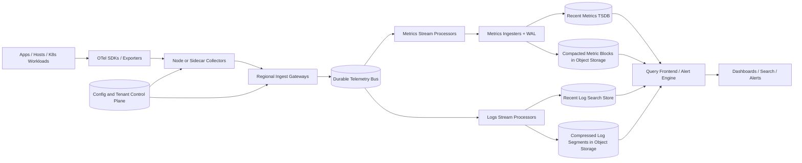

Generated by Codex with gpt-5

Selected problem: Metrics/Logging Pipeline

Scope: Design a centralized telemetry pipeline that ingests high-volume metrics and logs from many services, powers near-real-time dashboards and alerts, and retains searchable history without letting the write path collapse under bursts.

## Problem framing

Grokking and Alex Xu both push the same interview habit first: clarify scope before naming technology. Here the system is not "the dashboard product"; it is the backend write and query path behind centralized observability.

Functional requirements:

- Ingest application logs, infrastructure logs, counters, gauges, histograms, and rate-style metrics from many services and hosts.
- Support multi-tenant routing, authentication, quotas, and per-tenant retention policies.
- Make recent metrics available to dashboards and alerts within a few seconds.
- Support recent log search by time, service, severity, trace ID, and selected structured fields.
- Preserve enough history for debugging, compliance, or trend analysis at lower cost than the hot tier.
- Correlate logs and metrics by shared metadata such as service, cluster, environment, and trace/span identifiers.
- Allow operators to define alert rules, silence rules, and notification destinations without redeploying the data plane.
- Support replay or reprocessing of recent telemetry when downstream processors or indexers fail.

Non-functional requirements:

- Very high write throughput. Observability systems are usually write-heavy.
- High availability with region-local ingestion and no single global choke point.
- Bounded backpressure so one noisy tenant or one failing backend does not stall the entire pipeline.
- Query isolation so expensive search or dashboard traffic does not break ingestion.
- Cost-efficient retention through hot/warm/cold tiers, compression, and downsampling.
- Explicit consistency semantics for dashboards, alerts, and log search freshness.
- Operational simplicity: standard collection protocols, safe rollouts, and strong observability of the observability system itself.

Scale assumptions:

- Assume peak global ingest of about 2 million log records per second.
- Assume average raw log size is around 700 bytes before compression and indexing.
- Assume peak global metric ingest of about 5 million samples per second across application and infrastructure telemetry.
- Assume about 50,000 active alert rules, evaluated every 15 to 60 seconds depending on criticality.
- Assume most interactive queries focus on the last 15 minutes to 24 hours, while historical investigations may scan 7 to 90 days.
- Assume metrics keep 30 days of high-resolution data and longer retention as downsampled blocks; logs keep 1 to 7 days in a hot searchable tier and longer retention in cheaper object storage.
- These assumptions imply one shared ingest/control plane, but different storage paths for metrics and logs.

Core APIs:

```http
# Collector-facing ingest endpoints.
POST /v1/ingest/otlp/logs
X-Tenant-ID: acme-prod
Content-Encoding: gzip
<OTLP payload>

POST /v1/ingest/otlp/metrics
X-Tenant-ID: acme-prod
Content-Encoding: gzip
<OTLP payload>

# Log search.
POST /v1/query/logs/search
{
  "tenant": "acme-prod",
  "from": "2026-04-24T15:00:00Z",
  "to": "2026-04-24T15:15:00Z",
  "query": "service=checkout severity>=ERROR trace_id=4bf9...",
  "limit": 200
}

# Metrics range query.
POST /v1/query/metrics/range
{
  "tenant": "acme-prod",
  "expr": "rate(http_requests_total{service=\"checkout\",status=~\"5..\"}[5m])",
  "start": "2026-04-24T14:00:00Z",
  "end": "2026-04-24T15:00:00Z",
  "stepSeconds": 30
}

# Alert rule control plane.
PUT /v1/alerts/rules/high-checkout-error-rate
{
  "tenant": "acme-prod",
  "expr": "rate(http_requests_total{service=\"checkout\",status=~\"5..\"}[5m]) > 10",
  "for": "10m",
  "labels": {
    "severity": "page"
  },
  "notify": [
    "pagerduty://checkout-primary"
  ]
}
```

In a real system, many application processes do not call these endpoints directly. A local collector or exporter usually sits in front of them.

Core data model:

| Entity | Key | Important fields | Notes |
| --- | --- | --- | --- |
| `MetricSeries` | `tenant + series_fingerprint` | `metric_name`, `labels`, `type`, `unit`, `retention_class` | Logical series metadata |
| `MetricChunk` | `series_id + time_block` | `min_ts`, `max_ts`, `compressed_samples`, `chunk_version` | TSDB-friendly append path |
| `LogStream` | `tenant + stream_fingerprint` | `service`, `env`, `host`, `k8s_pod`, `schema_version` | Stable routing/indexing identity |
| `LogRecord` | `stream_id + event_time + seq` | `severity`, `body`, `attributes`, `trace_id`, `span_id`, `ingest_time` | Append-only event |
| `AlertRule` | `rule_id` | `query`, `window`, `threshold`, `dedupe_key`, `notify_targets`, `version` | Control-plane object |
| `RetentionPolicy` | `tenant + signal_type` | `hot_days`, `warm_days`, `cold_days`, `downsample_resolution` | Cost and storage policy |

## Architecture



High-level design:

- Put lightweight collectors close to workloads. This reduces connection fanout, enables batching and enrichment, and gives a place for local retry or disk spooling.
- Use regional ingest gateways only for authentication, tenancy, validation, quota checks, and appending to a durable bus. Do not do expensive indexing there.
- Insert a durable stream between ingest and storage. This is the main decoupling point for burst absorption, replay, and failure isolation.
- Split the serving path by signal after normalization:
  - metrics go to a TSDB-style storage path
  - logs go to a search and archival path
- Keep recent data in hot stores for low-latency dashboards and incident response.
- Move older data into compacted object-storage-backed tiers to control cost.
- Run alert evaluation near recent metrics, not by repeatedly scanning full historical datasets.

Practical data flow:

1. Applications and hosts emit telemetry to a local collector or exporter.
2. The collector batches data, enriches it with resource metadata, applies sampling or filtering where policy allows, and forwards it to a regional gateway.
3. The gateway authenticates the tenant, validates payload size and schema, enforces quotas, and appends records to the durable bus.
4. Stream processors normalize records and route them to the metrics or logs pipeline.
5. Metrics ingesters write a WAL, keep recent chunks in memory or local disk, and periodically compact immutable blocks to object storage.
6. Log processors parse structured fields, build recent searchable indexes, and write compressed raw segments to object storage for cheaper long retention.
7. Alert evaluators read recent metrics state and derived log counters to trigger notifications.
8. Queries hit the hot tier first and fan out to colder storage only when the time range requires it.

Storage choices:

- Metrics:
  - Use a TSDB-oriented engine with write-ahead logging, append-friendly chunks, label indexes, and background compaction.
  - Keep recent data hot for alerting and short-range dashboards.
  - Compact older blocks into object storage and optionally downsample long ranges.
- Logs:
  - Store raw records in compressed immutable segments.
  - Keep a recent searchable tier with indexes for timestamp, severity, service, environment, trace ID, and selected structured fields.
  - Avoid indexing every field in every log line. That becomes a cost trap.
- Control plane:
  - Store tenant config, alert rules, silence state, schemas, and retention policy in a durable metadata store.
- Stream/buffer layer:
  - Treat the durable bus as a replay and decoupling mechanism, not as the long-term analytical store.

Caching strategy:

- Cache popular dashboard query results for short TTLs because many users request the same recent panels repeatedly.
- Cache metric metadata, label dictionaries, and tenant policy in the query and ingest layers.
- Cache recent alert evaluation state in memory, but persist dedupe/silence state durably.
- Do not rely on cache for correctness in the write path; collectors and gateways still need durable buffering semantics.

Partitioning and sharding:

- Partition metric ingestion by `tenant + series_fingerprint` so all samples for one series preserve order through one shard or ingest owner.
- Partition log ingestion by `tenant + stable_stream_hash`, where the stream hash is built from stable source attributes such as service, namespace, and instance group.
- Use time as a storage layout dimension, not the only top-level partition key. Pure timestamp partitioning hot-spots the current bucket.
- Give very large tenants dedicated partitions or quotas instead of pretending every tenant has similar load.
- Rebalance with consistent hashing or explicit partition assignment epochs so clients and workers can migrate safely during scaling events.

Consistency tradeoffs:

- End-to-end exactly-once ingestion is usually not worth the cost. A practical design is at-least-once delivery with dedupe where duplicates are cheap to identify.
- Metrics queries and dashboards can tolerate slight delay while blocks compact or replicas catch up.
- Recent log search is typically eventually consistent across replicas and index refresh boundaries.
- Alerting should evaluate on a watermark-aware recent window, not assume perfect clock sync or zero late data.
- Config propagation should use versioned caches and last-known-good behavior, not synchronous metadata lookups on every ingest request.

Main bottlenecks to call out in an interview:

- Cardinality explosions in metrics labels such as `user_id`, `session_id`, or raw URL path.
- Full-text indexing every log field, which makes storage and query cost blow up.
- Query fanout over too many shards or too many days of high-resolution data.
- One noisy tenant overwhelming shared ingestion queues.
- Alert storms causing notification fanout and repeated evaluation churn.
- Clock skew and late events producing misleading short windows if event time is ignored.

## Deep dives

### Shared ingest, specialized storage

DDIA's "combine specialized tools by deriving data" is the right mental model here.

- Keep one shared collection and routing layer so applications do not need different agents for every backend.
- Split after normalization because the access patterns diverge sharply:
  - metrics are compact, numeric, append-heavy, and queried over time windows
  - logs are verbose, higher-cardinality, semi-structured, and often searched by fields or full text
- A single general-purpose datastore is almost never the best answer for both signals at scale.
- In interview terms, this is a strong tradeoff story:
  - one unified control plane for producers
  - specialized write/query engines for consumers

### Ingest, buffering, and backpressure

The write path must survive both bursts and downstream failures.

- A local collector is the first shock absorber:
  - batch small events into larger payloads
  - compress traffic
  - enrich with host, pod, cluster, and tenant metadata
  - spill briefly to disk if the network or gateway is unavailable
- Regional gateways should stay thin:
  - authn/authz
  - schema validation
  - rate limits and quotas
  - append to the durable bus
- The durable bus gives three important properties:
  - decoupling between ingest and storage
  - replay after indexer or ingester failure
  - a place to apply consumer-specific backpressure without dropping all traffic immediately
- Backpressure policy should be explicit:
  - drop or sample low-priority debug logs before dropping errors
  - cap per-tenant ingest when a single team misconfigures a collector
  - preserve critical metrics and alerting signals longer than verbose logs

This is where Grokking's queue-based decoupling and DDIA's stream-processing model meet cleanly.

### Metrics storage path

Metrics need a storage engine that is optimized for append, compression, and range scans.

- Model each series as `metric_name + label set`.
- Hash the label set into a stable fingerprint for routing.
- An ingester writes incoming samples to a WAL first, then to in-memory or local-disk head chunks.
- Periodically compact head chunks into immutable blocks and upload them to object storage.
- Query frontends read recent data from live ingesters or hot blocks and older data from object storage backed blocks.
- Downsample older data to reduce cost and query fanout for 30-day or 90-day charts.

Important interview points:

- Preserve per-series ordering, not global ordering across all metrics.
- Reject or rewrite pathological labels such as request IDs or user IDs. High cardinality is the classic failure mode.
- Separate write scaling from read scaling. If query load spikes, a durable bus plus immutable blocks prevents the read path from directly stalling ingestion.

DDIA's storage-engine discussion is relevant here: append-heavy writes look more like log-structured storage than random in-place updates.

### Logs storage path

Logs need a different optimization target: cheap append, selective indexing, and reasonable search.

- Prefer structured logs over raw human prose when possible.
- Preserve the original body, but extract a stable set of indexed fields:
  - timestamp
  - severity
  - service
  - environment
  - host or pod
  - trace ID / span ID
  - selected business or error code fields
- Store recent logs in a hot searchable tier.
- Store longer-retained raw segments in compressed immutable files in object storage.
- Keep segment metadata such as time range, tenant, service, and coarse Bloom-filter-style hints so cold queries do not need to scan every file.

Practical tradeoffs:

- Full-text indexing is powerful, but expensive. Reserve it for the recent tier or a subset of fields.
- Fielded search on structured attributes should be the default interview answer.
- If the interviewer pushes on "Google-like log search everywhere forever," respond with tiered retention and slower cold-path scans rather than pretending hot index storage is free.

### Time, ordering, and alert correctness

DDIA's stream-processing chapter matters a lot here because telemetry is inherently time-sensitive.

- Keep both `event_time` and `ingest_time`.
- Use `event_time` for charts and alert windows when possible.
- Use watermarks or lateness bounds so late data can still land correctly without endlessly rewriting recent windows.
- Do not assume clocks are perfect across all nodes.

Alert design:

- Evaluate metric rules from recent hot data at a regular cadence.
- Keep rule definitions in a control plane, but keep execution state close to the evaluator.
- Persist dedupe and silence state so failover does not spam operators.
- For log-based alerts, derive counters or pattern matches from the stream first. Re-running broad text queries for every alert evaluation interval is too expensive.

Exactly-once is not the main goal:

- at-least-once ingest plus dedupe is usually enough
- alerts should be idempotent on notification keys
- dashboards should be correct after convergence, not necessarily instantaneously perfect under failure

### Multi-region strategy

A practical large-scale design ingests locally and federates globally.

- Each region has its own collectors, gateways, durable bus, and hot stores.
- Query federation combines regional results for global dashboards when needed.
- Critical configuration is replicated across regions, but data ingestion should not depend on one global control-plane round trip.
- Cross-region replication policy depends on the signal:
  - metrics blocks and critical metadata are worth replicating or rebuilding from durable storage
  - verbose logs are often retained region-locally plus archived centrally in object storage
- During a regional failure, it is usually better to lose some local freshness than to route all telemetry synchronously to one distant region and melt it down.

## Modern considerations

- OpenTelemetry Collector is now the default vendor-neutral collection tier in many modern designs; its official docs position it as the place to receive, process, and export telemetry without every workload talking to every backend directly. Source: [OpenTelemetry Collector](https://opentelemetry.io/docs/collector/).
- Current OpenTelemetry logging guidance emphasizes shared resource metadata and trace/span correlation across logs, metrics, and traces. That makes structured logs with correlation IDs a much better default than plain unstructured text. Sources: [OpenTelemetry Logging specification](https://opentelemetry.io/docs/reference/specification/logs/) and [OpenTelemetry Logs concepts](https://opentelemetry.io/docs/concepts/signals/logs/).
- Prometheus still assumes a scrape model for many metrics pipelines, and its docs explicitly describe collecting metrics by scraping HTTP endpoints. Its remote-write spec is for Prometheus-compatible senders and receivers, not a reason to make every application push raw metrics straight into a central store. Sources: [Prometheus getting started](https://prometheus.io/docs/prometheus/latest/getting_started/) and [Prometheus Remote-Write 1.0 specification](https://prometheus.io/docs/specs/prw/remote_write_spec/).
- Recent Grafana Mimir docs make the Kafka-backed ingest-storage architecture the preferred large-scale deployment mode and explicitly separate write and read paths while storing TSDB blocks in object storage. That reinforces the interview answer of using a durable bus plus decoupled hot and long-term metrics storage. Sources: [Grafana Mimir architecture](https://grafana.com/docs/mimir/latest/get-started/about-grafana-mimir-architecture/) and [About ingest storage architecture](https://grafana.com/docs/mimir/latest/get-started/about-grafana-mimir-architecture/about-ingest-storage-architecture/).
- Current Prometheus remote-write tuning docs make the overload story very concrete: queues read from the WAL, shards scale up, and prolonged backlog can eventually block progress. In an interview, it is better to describe quota enforcement, sampling, disk buffering, and low-priority shedding explicitly than to wave away overload. Source: [Prometheus remote write tuning](https://prometheus.io/docs/practices/remote_write/).
- Older book examples sometimes imply that "monitoring" can sit beside the main system as one more service. The more realistic modern answer is one shared ingest and policy layer feeding specialized storage engines, with retention tiers and correlation metadata designed in from the start.

## Interview follow-ups

- How would you stop one team from exploding metrics cardinality with labels like `user_id` or raw URLs?
  - Enforce cardinality budgets at the collector and gateway, reject or rewrite dangerous labels, normalize high-cardinality paths into templates, and expose per-tenant series-growth alerts before the TSDB runs out of memory.
- Would you promise exactly-once ingestion?
  - Usually no. At-least-once delivery with idempotent writes or dedupe keys is the better tradeoff. Exactly-once across collectors, brokers, processors, and multiple storage backends costs a lot and is rarely worth it for observability data.
- How would you query 90 days of logs without keeping 90 days of hot search index?
  - Keep only recent logs in a hot indexed tier, archive compressed raw segments in object storage, and use segment metadata plus slower cold-path scans for older investigations. The latency is worse, but the cost is far better.
- How would you support both pull-based metrics and push-based logs in one platform?
  - Use collectors as the unifying edge. They can scrape Prometheus-style endpoints for metrics, receive pushed OTLP signals, normalize the metadata, and forward both into the same regional ingest and policy layer.
- What happens if the log index backend is unhealthy but the durable bus is still healthy?
  - Keep accepting ingest up to the buffering budget, let consumers lag, replay when the index recovers, and shed only low-priority log classes if the backlog exceeds safe limits. The design goal is delayed search freshness, not immediate data loss.
- How would you make log lines correlate with metrics and traces during an incident?
  - Standardize resource attributes and inject trace/span IDs into structured logs at emission time. Then store those fields as first-class searchable attributes and expose jump links between traces, logs, and related metric panels.
- How would you prevent alert storms from waking everyone repeatedly?
  - Group notifications by dedupe key, persist silence and inhibition rules, add `for` durations so short spikes do not page, and rate-limit notification fanout separately from rule evaluation.
- How would multi-region querying work if each region ingests locally?
  - Query each region in parallel, merge the results in a federation layer, and prefer region-local dashboards when possible. Global views are more expensive, so cache them aggressively and avoid routing all writes through one worldwide control point.
