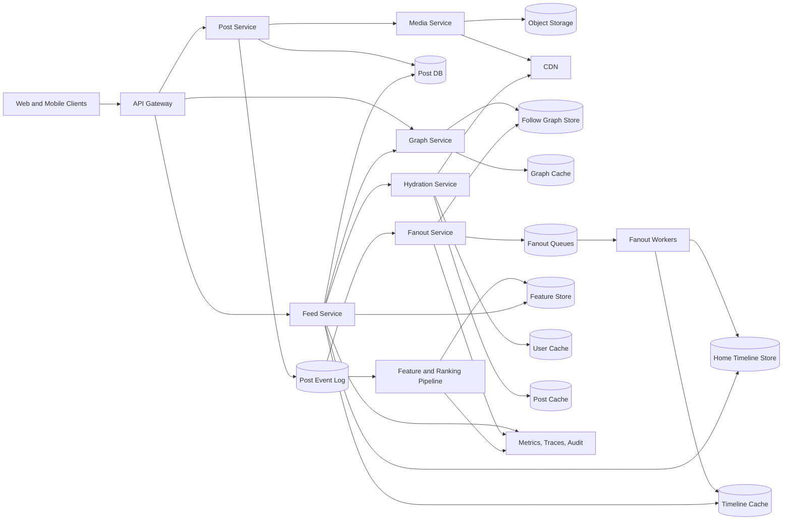

Generated by Codex with gpt-5

Selected problem: News Feed

Scope: Design a personalized feed service that lets users publish posts, reads recent and ranked posts from accounts they follow, and keeps feed retrieval fast while handling fanout skew, stale caches, media, and eventual consistency.

Also see <https://wiki.derricklin.net/software-development/System%20Design%20Interview/#news-feed>

## Problem framing

This is the classic "design a Facebook News Feed / Twitter timeline / Instagram home feed" interview problem. Grokking and Alex Xu frame it as two linked flows: feed publishing, where a new post enters storage and is propagated to followers, and feed retrieval, where a user gets a fast, paginated, hydrated list of feed items. DDIA's Twitter home-timeline example explains the central tradeoff: doing more work at write time makes reads fast, but high-follower authors create fanout storms; doing more work at read time avoids write amplification, but every feed read becomes an expensive merge.

Functional requirements:

- A user can create, edit, delete, and view posts.
- A user can follow or unfollow other users, pages, or topics.
- A user can fetch a personalized home feed with cursor pagination.
- Feed items can include text, links, images, videos, counters, and lightweight social context.
- The feed should support reverse-chronological ordering first, with a path to ranked ordering.
- New posts from normal authors should appear in active followers' feeds quickly.
- Posts from high-follower authors should be available without blocking the publish path.
- Muting, blocking, privacy settings, deleted posts, and audience rules must be enforced.
- The client should be able to ask whether newer feed items exist without reloading the full page.
- The system should expose moderation, audit, observability, and rebuild tooling for operators.

Non-functional requirements:

- Low read latency for the first feed page because feed retrieval is the dominant user-facing path.
- High write availability: publishing a post should not fail just because fanout workers are slow.
- At-least-once background processing with idempotent fanout, not a false exactly-once guarantee.
- Bounded staleness is acceptable for other people's posts; read-your-writes is expected for the author's own post.
- Horizontal scalability across users, authors, feed shards, and fanout workers.
- Backpressure so one celebrity post or hot topic cannot starve normal fanout work.
- Graceful degradation: if ranking, feature hydration, or media metadata is degraded, the feed can fall back to recent IDs.
- Privacy correctness must outrank freshness. A blocked, deleted, or audience-restricted post should not be returned.

Scale assumptions:

- Assume 100 million registered users and 25 million daily active users.
- Assume each active user opens or refreshes the feed 5 times per day on average, with higher bursts around events.
- Assume 10 million posts per day, plus a much larger volume of likes, comments, shares, impressions, and ranking signals.
- Assume a typical user follows hundreds of authors, while a small number of authors have millions of followers.
- Assume the first page returns 20 to 30 items and most sessions do not scroll past a few pages.
- Target P95 first-page feed latency under 500 ms from the feed API, excluding client media downloads.
- Target visibility for normal-author posts within a few seconds for active followers; high-follower authors may be merged on read.
- These values are interview sizing assumptions, not claims about any real platform's current traffic.

## Core APIs

```http
POST /v1/posts
Idempotency-Key: post_u123_01K0S8QG7EX6
{
  "authorId": "u_123",
  "body": "launch notes are live",
  "mediaIds": ["m_456"],
  "visibility": "followers",
  "clientCreatedAt": "2026-04-23T15:30:00Z"
}
-> 201 Created
{
  "postId": "p_01K0S8T3K2M7W4PK2NTTQ4Q9YK",
  "status": "published"
}

GET /v1/me/feed?limit=20&cursor=opaque_cursor
-> 200 OK
{
  "items": [
    {
      "feedItemId": "fi_01K0S8Y9F1",
      "postId": "p_01K0S8T3K2M7W4PK2NTTQ4Q9YK",
      "authorId": "u_123",
      "rankReason": "recent_from_followed_author",
      "cursor": "opaque_cursor_2"
    }
  ],
  "nextCursor": "opaque_cursor_2",
  "hasNextPage": true
}

GET /v1/me/feed/updates?after=opaque_cursor
-> 200 OK
{
  "newItemCount": 8,
  "latestCursor": "opaque_cursor_latest"
}

POST /v1/posts/{postId}/reactions
{
  "reactionType": "like",
  "clientEventId": "evt_01K0S90VGE"
}
-> 202 Accepted

DELETE /v1/posts/{postId}
-> 202 Accepted
```

API notes:

- Use opaque cursors rather than offset pagination. A cursor can encode the user's feed generation, rank boundary, timestamp, and tie-breaker without exposing storage internals.
- Use idempotency keys for publishing and reaction writes because clients retry on mobile networks.
- Keep feed reads separate from media downloads. The feed returns post and media metadata; images and videos are served through a media service and CDN.
- Enforce authentication, rate limits, and audience rules at the API and service layer. Do not rely on the client to hide restricted content.

## Core data model

| Entity | Key | Important fields | Notes |
| --- | --- | --- | --- |
| `User` | `user_id` | `handle`, `profile_ref`, `state`, `created_at` | User profile metadata should be cached separately from feed entries |
| `FollowEdge` | `follower_id + followee_id` | `edge_state`, `created_at`, `mute_state`, `close_friend_score` | Query by follower for feed reads and by followee for fanout |
| `Post` | `post_id` | `author_id`, `body_ref`, `visibility`, `created_at`, `updated_at`, `delete_state` | System of record for post metadata and content references |
| `MediaAsset` | `media_id` | `owner_id`, `object_uri`, `cdn_url`, `transcode_state`, `dimensions` | Blob bytes live outside the post DB |
| `AuthorOutbox` | `author_id + created_at + post_id` | `visibility`, `rank_seed`, `fanout_state` | Source timeline for read-time merge and backfill |
| `HomeTimelineEntry` | `viewer_id + rank_key + post_id` | `author_id`, `created_at`, `fanout_generation`, `visibility_snapshot` | Precomputed feed IDs, not full post objects |
| `FeedCursor` | `cursor_id` or encoded token | `viewer_id`, `rank_boundary`, `generation`, `expires_at` | Enables stable pagination across refreshes |
| `FeedAction` | `event_id` | `viewer_id`, `post_id`, `action_type`, `created_at` | Likes, hides, impressions, dwell time, reports |
| `RankingFeatureSnapshot` | `post_id + feature_version` | `engagement_counts`, `author_affinity`, `freshness`, `quality_score` | Can be rebuilt asynchronously |
| `FanoutTask` | `post_id + shard_id` | `author_id`, `recipient_range`, `attempt`, `status` | Makes fanout retryable and observable |

The key modeling decision is that `Post` is the source of truth, while `HomeTimelineEntry` is a derived read model. This follows DDIA's derived-data guidance: the feed cache can be rebuilt from the post log, follow graph, ranking inputs, and fanout events if it becomes corrupt or stale.

## Architecture



High-level design:

- The Post Service writes the post to the system of record, emits a durable post-created event, and returns after the durable write succeeds.
- The Fanout Service consumes post events and decides whether to use fanout-on-write, fanout-on-read, or a hybrid path.
- Normal-author posts are pushed into followers' `HomeTimelineEntry` lists asynchronously.
- High-follower-author posts are written to the author's outbox and merged into follower feeds during reads, avoiding a huge publish-time write spike.
- The Feed Service reads a short list of feed IDs from cache or the timeline store, merges in high-follower-author outboxes, optionally reranks, then hydrates post, author, media, and counter metadata.
- The Ranking Pipeline consumes post, reaction, follow, impression, hide, and moderation events to update features and precompute candidate scores.
- The media path is separate. The feed should return metadata and URLs; image and video bytes should be fetched from a CDN or media service.

Main components:

- API Gateway: authenticates users, applies rate limits, validates request shape, and routes writes and reads.
- Post Service: owns post creation, edit, delete, visibility metadata, and durable post events.
- Graph Service: owns follow edges, mute/block state, privacy edges, and graph lookups for fanout and reads.
- Fanout Service: chooses fanout strategy, shards fanout tasks, retries failed batches, and records progress.
- Home Timeline Store: persistent, sharded feed ID store used when the memory cache misses or must be rebuilt.
- Timeline Cache: hot per-user list of recent feed IDs, usually capped to the top few hundred or thousand entries.
- Feed Service: assembles the personalized response by reading IDs, merging outboxes, reranking, filtering, and hydrating.
- Hydration Service: batch fetches post, user, media, counters, and viewer-specific action state.
- Ranking Pipeline: maintains features and scores; it should not be a hard dependency for the fallback feed.
- Observability and Audit: tracks feed latency, fanout lag, cache hit rate, stale reads, filtering decisions, and privacy enforcement.

## Data flow

Feed publishing flow:

1. The client calls `POST /v1/posts` with an idempotency key.
2. The gateway authenticates the user and forwards the request to Post Service.
3. Post Service writes the post and media references to the Post DB.
4. Post Service appends a `PostCreated` event to a durable log or transactional outbox.
5. Fanout Service consumes the event and reads the author's follower distribution from Graph Service.
6. For normal authors, Fanout Service creates shardable fanout tasks and enqueues them.
7. Fanout workers append `(viewer_id, rank_key, post_id)` entries to the Home Timeline Store and Timeline Cache.
8. For high-follower authors, the system skips full fanout and relies on AuthorOutbox plus read-time merge.
9. Ranking and notification pipelines consume the same event stream independently.
10. The author sees their own post immediately through read-your-writes logic even if fanout is still running.

Feed retrieval flow:

1. The client calls `GET /v1/me/feed` with a limit and cursor.
2. Feed Service reads precomputed candidate IDs from Timeline Cache; on miss, it reads Home Timeline Store.
3. Feed Service fetches recent posts from followed high-follower authors' outboxes and merges them into the candidate set.
4. Feed Service filters candidates by block, mute, privacy, deletion, moderation, and already-seen rules.
5. Feed Service reranks candidates if ranking features are available; otherwise it falls back to reverse chronological order.
6. Hydration Service batch loads post, author, media, counters, and viewer action state from caches and stores.
7. Feed Service returns a stable page with an opaque cursor and `hasNextPage`.
8. Impression events are emitted asynchronously for ranking, analytics, ads, and abuse detection.

## Storage, caching, and partitioning

Storage choices:

- Post DB: use a durable database partitioned by `post_id` or `author_id + created_at`. It must support point reads by `post_id` and author timeline queries.
- Follow Graph Store: optimize for both `follower -> followees` and `followee -> followers`. The first supports read-time merge; the second supports fanout-on-write.
- Home Timeline Store: store feed IDs, rank keys, author IDs, and timestamps. Do not store full post payloads in every follower feed.
- Event Log: store post-created, post-deleted, follow-changed, reaction, impression, and moderation events. This is the durable source for fanout, feature updates, and rebuilds.
- Object Storage and CDN: store media bytes separately from post metadata because feed reads should not pull large blobs from the main database.
- Feature Store: stores ranking features and counters that can tolerate bounded staleness.

Caching strategy:

- Cache hot user profiles, post metadata, media metadata, and social graph slices separately; each has different invalidation and TTL behavior.
- Cache each active user's recent feed ID list, capped to the range users realistically scroll through.
- Use write-through or write-behind cache updates for fanout entries, but keep the persistent Home Timeline Store as the recovery path.
- Cache only IDs and small metadata in timeline entries. Hydrate full objects in batches to avoid memory blowup.
- Use negative or tombstone cache entries for deleted and moderated posts so stale timeline entries can be filtered cheaply.
- Protect the feed cache from stampedes with request coalescing, short TTL jitter, and stale-while-revalidate behavior when acceptable.

Partitioning and sharding:

- Partition `HomeTimelineEntry` by `viewer_id` so a feed read usually hits one timeline shard.
- Partition `AuthorOutbox` by `author_id` plus time so author timeline reads are efficient and append-friendly.
- Partition fanout tasks by `(post_id, recipient_shard)` so one post can be processed in parallel without duplicate writes.
- Keep all writes for one viewer's timeline ordered by a deterministic rank key where possible; global ordering across every user is unnecessary.
- Avoid naive timestamp-first keys for write-heavy tables because they concentrate new writes into hot ranges.
- Avoid simple `hash(key) % N` shard movement assumptions in the design discussion; plan for virtual shards, routing metadata, and online rebalancing.
- Use salting or shard splitting for known hot authors, hot posts, and hot counters, then merge at read time.

## Consistency tradeoffs

- Feed entries are derived data. The source of truth is post storage plus event logs plus graph state.
- A user should read their own new post immediately, even if follower fanout is lagging. This can be implemented by merging the author's latest outbox into their own feed or reading from the primary write path after publish.
- Other users can see bounded staleness. A post may appear a few seconds later if fanout queues are busy.
- Deletes, blocks, and privacy changes require stronger filtering than normal freshness. Even if old timeline entries remain, the Feed Service must recheck visibility before returning them.
- Fanout workers should be idempotent: reprocessing the same `(viewer_id, post_id, fanout_generation)` should upsert or dedupe, not create duplicate feed items.
- Reaction counters and ranking features can be eventually consistent; user-visible action state such as "I liked this" should use read-your-writes semantics for that viewer.
- Multi-region active-active publishing introduces ordering and conflict complexity. A simpler interview answer is single-writer per user or per region with asynchronous replication and explicit failover behavior.

## Bottlenecks and mitigations

Fanout storm:

- Problem: one high-follower author creates millions of timeline writes.
- Mitigation: hybrid fanout. Push normal-author posts to followers, but pull high-follower-author posts from AuthorOutbox at read time.

Hot timeline reads:

- Problem: feed reads dominate traffic and active users repeatedly request the first page.
- Mitigation: keep a capped timeline ID cache, hydrate in batches, and isolate media through CDN.

Graph lookup pressure:

- Problem: fanout needs follower lists and feed reads need followee lists.
- Mitigation: maintain graph indexes in both directions, cache hot graph slices, and stream graph changes to update derived timelines.

Cache invalidation:

- Problem: edited, deleted, blocked, or moderated posts may remain in derived feed entries.
- Mitigation: treat timeline entries as candidates, recheck visibility during feed assembly, and propagate tombstones quickly.

Ranking latency:

- Problem: expensive ranking can slow the feed request path.
- Mitigation: precompute candidate scores, use lightweight online reranking for the first page, and fall back to recency when ranking dependencies degrade.

Counter hotspots:

- Problem: likes, comments, shares, and impressions for viral posts produce hot keys.
- Mitigation: shard counters, aggregate asynchronously, and separate exact owner-visible state from approximate public counters.

Large media:

- Problem: storing media in the feed path increases latency and storage duplication.
- Mitigation: store media in object storage, transcode asynchronously, serve through CDN, and keep feed entries as metadata.

## Deep dives

Hybrid fanout:

- Fanout-on-write precomputes each follower's home timeline when a post is created. This makes reads fast, which is valuable because feed reads usually outnumber post writes.
- Fanout-on-read stores posts in the author's outbox and merges followed authors' recent posts when a user reads the feed. This avoids write amplification but makes reads more expensive.
- A practical design combines both. Normal authors are fanned out on write. High-follower authors, pages, and topics are pulled on read. The threshold should be dynamic, based on follower count, active follower count, post rate, queue lag, and cost.
- The read path should merge precomputed timeline entries with outbox entries using a rank key, then dedupe by `post_id`.
- The write path should record fanout progress by shard so failed batches can resume without reprocessing the whole follower set.

Ranking:

- Start the interview with reverse chronological order unless the interviewer asks for ML ranking. It is simpler and exposes the core storage and fanout tradeoffs.
- A ranked feed still needs candidate generation. The usual candidates are precomputed home timeline IDs, recent posts from high-follower authors, fresh posts from close connections, and exploration items.
- Basic ranking features include freshness, author affinity, engagement velocity, media type, hide/report history, language, topic match, and whether the viewer already saw the item.
- Ranking should be bounded by latency. Fetch more candidates than the page size, score them, filter them, return the top page, and record impressions.
- Keep ranking explainability and safety hooks. Moderation, privacy, and blocks must be hard filters, not soft ranking features.

Timeline rebuilds:

- Because `HomeTimelineEntry` is derived, the system needs rebuild tooling for cache loss, ranking model changes, graph repair, and schema migration.
- A rebuild job can replay post events and graph snapshots into a new timeline generation while old reads continue using the previous generation.
- Once the new generation is warm, route a small percentage of reads to it, compare metrics, then gradually switch traffic.
- This is DDIA's derived-data pattern applied to feeds: keep immutable events and rebuild read-optimized views instead of relying on distributed transactions across every cache and store.

Privacy and deletion:

- Follow edges are not enough. The final feed response must account for blocks, mutes, post audience, account state, moderation state, regional restrictions, and deletion.
- If a user unfollows someone, older precomputed entries from that author may remain in the timeline store. The read path should filter them, and background cleanup can remove them later.
- Deletion should write a tombstone event and update caches quickly. The design should prefer an occasional missing item over showing restricted content.

Observability:

- Track feed API latency, hydration latency, timeline cache hit rate, post publish latency, fanout queue lag, fanout errors, dropped fanout tasks, ranker latency, filtering rates, and stale visibility violations.
- Add per-post fanout progress and per-user feed debug endpoints for support. "Why did this user see this post?" and "why did they not see it?" are essential operational questions.
- Alert separately for read-path degradation, write-path degradation, and derived-data lag because each failure mode needs a different response.

## Modern considerations

Cursor pagination should be the default API shape for feed reads. The [GraphQL Cursor Connections Specification](https://relay.dev/graphql/connections.htm) is a useful current reference because it standardizes opaque cursors, page metadata, and stable ordering expectations; REST APIs can use the same ideas without adopting GraphQL. Redis-like sorted sets remain a reasonable mental model for a capped timeline cache because current [Redis sorted set documentation](https://redis.io/docs/latest/develop/data-types/sorted-sets/) supports score-ordered range access, but an interview answer should describe the data structure and contract rather than require Redis specifically. Managed key-value stores still document hot-partition behavior, so DDIA's skew warning is not dated: current AWS DynamoDB guidance recommends uniform partition-key activity and documents hot partitions when concentrated traffic overloads one key range ([partition key guidance](https://docs.aws.amazon.com/amazondynamodb/latest/developerguide/bp-partition-key-design.html), [hot partition mitigation](https://docs.aws.amazon.com/amazondynamodb/latest/developerguide/throttling-key-range-limit-exceeded-mitigation.html)). For durable fanout and rebuild pipelines, log-based brokers remain a practical fit because current [Kafka consumer APIs](https://kafka.apache.org/42/javadoc/org/apache/kafka/clients/consumer/KafkaConsumer.html) still expose offsets, partitions, consumer groups, and lag as core operating concepts; use them to reason about replay, backpressure, and idempotent consumers, not to claim Kafka is the only valid choice.

## Interview follow-ups

- How would you decide between fanout-on-write and fanout-on-read?
  - Use fanout-on-write for normal authors because it makes reads cheap. Use fanout-on-read for high-follower authors because pushing one post to millions of timelines can overload the write path. A hybrid design is the expected strong answer.

- How do you prevent duplicate feed items if a fanout worker retries?
  - Make the timeline write idempotent with a uniqueness key such as `(viewer_id, post_id, fanout_generation)`. A retry should upsert or no-op, and the read path should also dedupe by `post_id`.

- How do you make a newly published post visible to the author immediately?
  - Read the author's latest outbox or primary post record during feed assembly for that user, even if follower fanout has not completed. This gives read-your-writes without forcing synchronous fanout.

- What happens if the ranking service is down?
  - The feed should fall back to recent precomputed candidates, apply hard filters, and return a usable reverse-chronological feed. Ranking improves quality, but it should not be required for basic feed availability.

- How do you handle a user unfollowing or blocking another user after old entries were already fanned out?
  - Treat timeline entries as candidates and recheck graph/privacy state before returning them. Background cleanup can remove stale entries, but the read path must enforce the rule immediately.

- How do you support very large media posts?
  - Store media bytes in object storage, process thumbnails/transcodes asynchronously, serve through CDN, and keep feed entries to post IDs plus metadata. The feed service should not move video bytes.

- How would you rebuild all feeds after changing the ranking model?
  - Replay post, graph, and interaction events into a new feed generation or recompute scores in a shadow store. Validate metrics, gradually shift traffic, and keep the old generation available for rollback.

- What metrics would you monitor?
  - Monitor feed read latency, hydration latency, timeline cache hit rate, fanout queue lag, post-to-feed visibility delay, fanout retry rate, ranker latency, stale-filter drops, and privacy violation alerts.

- How would you paginate if new posts arrive while the user is scrolling?
  - Use opaque cursors that encode a stable rank boundary or feed generation. Show a "new posts available" indicator for fresher items rather than inserting them into the current page and causing duplicates or jumps.

- What is the core tradeoff DDIA highlights for this problem?
  - The system chooses where to pay fanout cost. Precomputing timelines shifts work to writes and storage; merging on read shifts work to reads. Skewed follower distributions make a hybrid approach necessary.

The strongest interview answer is not "store posts in a database and cache the feed." It is: separate source-of-truth posts from derived timeline entries, use hybrid fanout to control skew, cache IDs rather than payloads, enforce privacy at read time, make background processing idempotent, and design rebuild paths because the feed is a materialized view that will eventually need repair or evolution.
