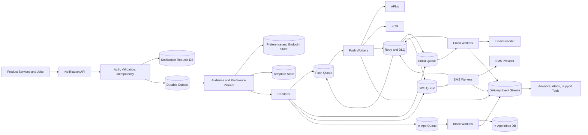

Generated by Codex with gpt-5

Selected problem: Notification System

Scope: Design a soft real-time notification platform that accepts events from internal services, renders user-facing messages, respects user preferences, and dispatches push, email, SMS, and in-app notifications reliably at large scale.

Also see <https://wiki.derricklin.net/software-development/System%20Design%20Interview/#notification-system>

## Problem framing

This is the classic "design a notification system" interview problem: build the shared infrastructure that product teams use whenever they need to notify users about security alerts, messages, payments, delivery updates, marketing campaigns, or feed changes. The core challenge is not just calling APNs, FCM, an SMS gateway, or an email provider. The harder parts are durable intake, preference filtering, fanout, queue isolation, retries, deduplication, rate limiting, observability, and honest delivery semantics.

Functional requirements:

- Accept notification requests from trusted internal services and scheduled jobs.
- Support at least mobile push, email, SMS, and in-app notification channels.
- Send one notification to one user, many users, or a precomputed audience segment.
- Store and update contact endpoints such as device tokens, email addresses, and phone numbers.
- Respect user preferences, opt-outs, quiet hours, channel eligibility, and legal unsubscribe rules.
- Render notifications from templates with localized variables and safe fallback content.
- Support priority, TTL, scheduling, collapse keys, and cancellation before dispatch.
- Retry transient failures and route permanently failed attempts to a dead-letter workflow.
- Track accepted, queued, sent, failed, provider-accepted, opened, clicked, and dismissed events.
- Provide internal dashboards and APIs for status lookup, campaign audit, and delivery debugging.

Non-functional requirements:

- Soft real-time delivery: transactional notifications should usually be dispatched within seconds, while bulk campaigns can tolerate minutes of delay.
- High availability for ingestion, because product services should not fail just because one channel provider is slow.
- No silent data loss after the notification API accepts a request.
- At-least-once processing with idempotent sends and dedupe, not a false promise of exactly-once delivery.
- Horizontal scalability across tenants, channels, regions, and priority classes.
- Backpressure so one campaign, channel outage, or provider throttle does not starve urgent notifications.
- Clear privacy and security boundaries, especially for device tokens, phone numbers, email addresses, and sensitive payloads.
- Observable enough to explain queue lag, provider errors, suppression reasons, and user-level delivery history.

Scale assumptions:

- Assume 50 million registered users and 15 million daily active users.
- Assume an interview load of 200 million notification requests per day, with bursts up to 100,000 dispatch attempts per second during campaigns or breaking events.
- Assume 70% push, 25% email, 4% in-app-only, and 1% SMS by volume. SMS is intentionally small because it is expensive and compliance-sensitive.
- Assume each user may have 0 to 10 active push endpoints across phones, tablets, browsers, and desktop apps.
- Assume notification payloads are small metadata envelopes; full message state lives in the notification service or product service.
- These are sizing assumptions for the interview, not claims about any provider's current production traffic.

Core APIs:

```http
POST /v1/notifications
Idempotency-Key: order_987:payment_failed:v3
{
  "tenantId": "payments",
  "eventId": "evt_01JZ8Z6J8BM2N4B4W5Z0KQ7E9P",
  "audience": {
    "type": "users",
    "userIds": ["u_123", "u_456"]
  },
  "channels": ["push", "email"],
  "templateId": "payment_failed_v3",
  "templateData": {
    "merchantName": "Example Market",
    "last4": "4242"
  },
  "priority": "high",
  "ttlSeconds": 3600,
  "collapseKey": "payment_failed:u_123",
  "sendAfter": null,
  "traceId": "trace_abc"
}
-> 202 Accepted
{
  "notificationId": "ntf_01JZ8Z7G2R4V7G44C0HBXAJ4SX",
  "status": "accepted"
}

PUT /v1/users/{userId}/notification-endpoints/{endpointId}
{
  "channel": "push",
  "provider": "apns",
  "token": "opaque-device-token",
  "platform": "ios",
  "appVersion": "9.4.1",
  "locale": "en-US",
  "timezone": "America/Los_Angeles",
  "enabled": true
}

PUT /v1/users/{userId}/notification-preferences
{
  "channels": {
    "push": true,
    "email": true,
    "sms": false
  },
  "topics": {
    "security": true,
    "marketing": false,
    "social": true
  },
  "quietHours": {
    "start": "22:00",
    "end": "07:00",
    "timezone": "America/Los_Angeles"
  }
}

GET /v1/notifications/{notificationId}
-> 200 OK
{
  "status": "partially_sent",
  "attempts": [
    {
      "channel": "push",
      "provider": "apns",
      "status": "accepted_by_provider"
    },
    {
      "channel": "email",
      "provider": "email_vendor_a",
      "status": "queued"
    }
  ]
}

POST /v1/notifications/{notificationId}/events
{
  "eventType": "opened",
  "endpointId": "ep_123",
  "occurredAt": "2026-04-22T20:15:30Z"
}
```

Core data model:

| Entity | Key | Important fields | Notes |
| --- | --- | --- | --- |
| `NotificationRequest` | `notification_id` | `tenant_id`, `event_id`, `audience_ref`, `template_id`, `priority`, `ttl`, `collapse_key`, `status` | Durable record created before enqueue |
| `RecipientNotification` | `notification_id + user_id` | `channels`, `suppression_reason`, `render_state`, `created_at` | One row per resolved recipient when fanout is materialized |
| `Endpoint` | `user_id + endpoint_id` | `channel`, `provider`, `token_hash`, `encrypted_token`, `platform`, `locale`, `last_seen_at`, `state` | Device tokens and contact addresses; encrypted where needed |
| `Preference` | `user_id + topic` | `channel_overrides`, `quiet_hours`, `marketing_opt_in`, `updated_at` | Checked before enqueueing channel attempts |
| `Template` | `template_id + version` | `channel`, `locale`, `subject`, `body`, `schema`, `approved_at` | Versioned so old events render consistently |
| `DeliveryAttempt` | `attempt_id` | `notification_id`, `user_id`, `endpoint_id`, `channel`, `provider`, `attempt_no`, `status`, `provider_message_id` | Drives retries, dedupe, and support lookups |
| `DeliveryEvent` | `event_id` | `attempt_id`, `event_type`, `provider_reason`, `occurred_at` | Append-only telemetry stream |
| `RateLimitBucket` | `tenant + user + channel + window` | `count`, `reset_at`, `policy_id` | Frequency caps and abuse protection |
| `InAppNotification` | `user_id + created_at` | `notification_id`, `title`, `body_ref`, `read_at`, `expires_at` | Durable inbox for important messages |

## Architecture



High-level design:

- Treat notification ingestion as a durable write first and a provider call second. The API should not acknowledge a request unless the request is stored in a database, durable stream, or transactional outbox.
- Use a Notification API rather than letting every product service integrate directly with APNs, FCM, SMS vendors, and email providers.
- Split the system into intake, planning, rendering, channel queues, channel workers, retry handling, and event tracking.
- Partition work by tenant, channel, priority, and recipient key so urgent transactional traffic can be isolated from bulk campaigns.
- Use separate queues per channel. Alex Xu's notification chapter uses this separation to prevent an outage in one provider path from blocking unrelated notification types.
- Use message brokers or log-based streams as the core buffer. DDIA's framing is directly relevant: queues decouple producers from consumers, absorb overload, redeliver after worker crashes, and move durability questions into the broker.
- Keep provider adapters thin and replaceable. Push, email, and SMS vendors differ in APIs, quotas, regions, response codes, and compliance requirements.
- Store a durable in-app notification for important messages when user-visible history matters, because external push providers are not a durable inbox.

Practical request flow:

1. A product service sends a notification request with an idempotency key and event ID.
2. The Notification API authenticates the caller, validates template data, applies tenant-level send limits, and writes `NotificationRequest`.
3. The API writes to a durable outbox or stream in the same logical commit path, then returns `202 Accepted`.
4. A planner resolves the audience into users or endpoint batches.
5. The planner checks user preferences, suppression lists, quiet hours, topic eligibility, and per-user rate limits.
6. The renderer loads the approved template version and creates channel-specific payloads.
7. The renderer writes `DeliveryAttempt` rows and publishes work to channel-specific queues.
8. Workers consume queue messages, call the correct provider adapter, and update attempt status.
9. Transient failures are retried with exponential backoff and jitter; permanent failures mark attempts failed and may update endpoint state.
10. Provider callbacks and client events are appended to the delivery event stream for analytics and support.

Storage choices:

- Request DB:
  - Stores accepted requests, recipient materialization, attempt state, and status lookup data.
  - A relational database works well for transactional notifications and support queries because the data has clear entities and indexes.
- Durable outbox or log:
  - Bridges the database write and asynchronous processing path.
  - Prevents the classic race where the API writes to the DB but crashes before publishing to the queue, or publishes to the queue but fails the DB write.
- Message queues:
  - Good for channel workers because most work is short-lived, retryable, and naturally asynchronous.
  - Use queue retention and dead-letter queues deliberately; a notification queue is not the long-term source of truth.
- Log-based streams:
  - Useful for delivery events, analytics, and replayable pipelines because consumers can read independently without deleting each other's input.
- Endpoint and preference store:
  - Can be relational, key-value, or document-oriented. The interview answer should optimize for lookup by `user_id`, with secondary access paths for endpoint cleanup and compliance workflows.
- In-app inbox store:
  - Partition by `user_id` and time so a user's notification center can be read efficiently.

Caching strategy:

- Cache templates by `template_id + version` because they are read frequently and change rarely.
- Cache user preferences and endpoints with short TTLs, but preserve correctness for opt-outs by using version checks or invalidation events.
- Cache provider configuration and tenant policies in workers to avoid a database read on every attempt.
- Avoid caching rendered sensitive content unless there is a clear retention and encryption policy.
- Do not use cache state as the only evidence that a notification was accepted or sent.

Partitioning and sharding:

- Partition notification requests by `tenant_id` and time for write throughput and operational isolation.
- Partition recipient and attempt tables by `user_id` or a hash of `user_id` for user-level lookups and dedupe.
- Partition queues by `channel + priority + shard_key`. A good shard key is usually `user_id` for per-user ordering, or `tenant_id + campaign_id` for bulk throughput.
- Keep transactional and marketing traffic in separate lanes so a marketing blast cannot delay password-reset or fraud alerts.
- For huge campaigns, do not enqueue every recipient synchronously in the API request. Store an audience reference, expand it asynchronously in batches, and checkpoint progress.

Consistency tradeoffs:

- The system should provide at-least-once processing internally. Duplicates can happen after timeouts, worker crashes, provider retries, or lost acknowledgments.
- Use idempotency at multiple layers: request `event_id`, recipient-level uniqueness, attempt IDs, provider collapse keys where appropriate, and dedupe windows.
- Do not promise exactly-once delivery to the user. Alex Xu explicitly calls out duplicate notifications as possible, and DDIA explains why redelivery after crashes and lost acknowledgments naturally produce duplicates.
- Preference changes need stronger semantics than normal metadata. If a user opts out, future sends should stop quickly even if some already-queued work still exists.
- Ordering is usually best-effort. If strict per-user ordering matters for a narrow class, route those events through a per-user partition and accept lower parallelism.
- Cross-region active-active sending can duplicate messages during failover unless there is a global idempotency record or deterministic home region per user.

Bottlenecks to call out in an interview:

- Provider throttling or regional outages.
- Queue backlog during campaigns or breaking-news fanout.
- Slow template rendering or personalization queries.
- Hot tenants monopolizing worker pools.
- High-cardinality preference checks for very large audiences.
- Retry storms after provider recovery.
- Duplicates caused by timeouts and redelivery.
- Endpoint churn from app reinstalls, token rotation, and inactive devices.
- Compliance flows for unsubscribe, SMS consent, and data deletion.

## Deep dives

### Durable intake and outbox

The first reliability question is: what happens after the API says "accepted"? If the service acknowledges before a durable write, a crash loses the notification. If it writes only to the database but fails to publish to the queue, the request gets stuck. If it publishes first and the database write fails, workers may send a notification that support tools cannot explain.

A practical design is a transactional outbox:

- Write `NotificationRequest` and an `OutboxEvent` in the same database transaction.
- A relay process reads unsent outbox rows and publishes them to the planner stream.
- The relay marks the outbox row published only after the broker acknowledges.
- The planner and workers are idempotent, so duplicate outbox publication is safe.

For very high volume, the durable stream itself can be the intake log, but the same principle remains: an accepted request must have a replayable record before downstream workers touch provider APIs.

### Fanout, planning, and preference filtering

Notification fanout has two different shapes:

- Transactional fanout:
  - A product service targets one user or a small set of users.
  - The system should resolve endpoints and enqueue attempts immediately.
- Bulk fanout:
  - A campaign or breaking event targets millions of users.
  - The system should store the audience definition, expand it asynchronously, checkpoint progress, and throttle per tenant and channel.

Preference filtering should happen before provider attempts are created. The planner should evaluate:

- Whether the user opted into the topic and channel.
- Whether quiet hours require delaying the notification.
- Whether the notification is transactional enough to bypass quiet hours.
- Whether legal consent is present for SMS or marketing email.
- Whether a frequency cap or abuse policy suppresses the send.
- Whether the channel is available for the user.

The result should be explicit. A suppressed notification is still useful support data if the user asks why they did not receive something.

### Channel queues and backpressure

Message queues are the system's shock absorbers. They let product services submit work without waiting for external providers, and they let channel workers scale independently.

Use separate lanes:

- `push.high`, `push.normal`, `push.bulk`
- `email.transactional`, `email.marketing`
- `sms.high`, `sms.bulk`
- `inapp.default`

Each lane should have queue-depth metrics, age-of-oldest-message metrics, worker concurrency limits, and provider-specific rate controls. When a provider slows down, the affected lane backs up without blocking unrelated channels. This follows the book pattern of assigning each notification type to its own queue and the DDIA pattern of using brokers to buffer overloaded or temporarily unavailable consumers.

Backpressure policy matters:

- For transactional notifications, delay and retry within TTL.
- For stale feed badges or location updates, collapse or drop older work.
- For marketing campaigns, slow the campaign scheduler rather than flooding queues.
- For SMS, enforce strict quotas and consent checks before spending money.

### Delivery semantics, retries, and dedupe

The honest answer is at-least-once processing with best-effort user delivery.

Workers can fail after sending but before recording success. Providers can accept a request and later fail delivery. A worker can time out waiting for a provider that actually accepted the message. A broker can redeliver an unacknowledged message. All of these lead to duplicates unless the design treats idempotency as a core feature.

Practical dedupe tools:

- Require `event_id` or an idempotency key from producers.
- Enforce a unique constraint on `tenant_id + event_id`.
- Enforce recipient-level uniqueness on `notification_id + user_id + channel`.
- Store provider request IDs or attempt IDs for audit.
- Use provider collapse identifiers only when the newer notification makes older ones obsolete.
- Make client event ingestion idempotent as well, because clients can retry open or click events.

Retry policy:

- Retry transient provider errors with exponential backoff and jitter.
- Honor TTL; do not deliver "your driver is nearby" after the ride is over.
- Move repeatedly failing attempts to a dead-letter queue with enough context for replay or manual investigation.
- Treat invalid endpoints as permanent failures and mark them inactive.
- Cap retries to prevent provider recovery from creating a retry storm.

### Templates, personalization, and payload boundaries

Templates prevent every producer from building one-off message bodies. They also provide approval, localization, safe fallback text, and consistent branding.

The renderer should:

- Load an immutable template version.
- Validate `templateData` against a schema.
- Render per channel because push, email, SMS, and in-app messages have different constraints.
- Keep sensitive data out of push payloads when possible.
- Include a server-side reference such as `notification_id` so the app can fetch fresh content after the user opens the notification.

Avoid calling many product databases during rendering. If a notification needs personalized fields, the producer should provide the stable data at request time or the planner should use a precomputed audience/personalization snapshot. Otherwise rendering becomes a distributed join system under peak load.

### Provider adapters and endpoint lifecycle

Provider adapters isolate vendor-specific behavior:

- APNs and FCM for push.
- One or more email service providers.
- One or more SMS providers.
- Optional web push providers or browser-specific paths.

Adapters should normalize response classes:

- Accepted by provider.
- Transient retryable failure.
- Rate limited.
- Invalid endpoint.
- Payload invalid.
- Authentication or configuration error.

Endpoint lifecycle is a major operational detail. Device tokens and contact addresses become stale. Users reinstall apps, change phones, revoke permissions, unsubscribe, or delete accounts. The system should process provider feedback, client registration updates, and account-deletion events to disable endpoints quickly.

### Observability and operations

A notification system is hard to operate without good visibility because "sent" can mean many different things.

Track these separately:

- Accepted by Notification API.
- Suppressed by preferences or policy.
- Queued for channel.
- Sent to provider.
- Accepted by provider.
- Rejected by provider.
- Delivered callback, if the provider supplies one.
- Opened, clicked, dismissed, or read.

Core metrics:

- Queue depth and oldest message age by lane.
- Send attempts, success rate, retry rate, and permanent failure rate by provider.
- Suppression counts by reason.
- Template rendering errors by template version.
- Per-tenant throughput and throttling.
- Provider latency and error codes.
- Duplicate detection counts.

Support tooling should be able to answer: "Was the request accepted?", "Was the user eligible?", "Which endpoint was used?", "What did the provider return?", and "Was it retried or suppressed?"

## Modern considerations

Current push providers should be treated as best-effort delivery paths, not durable user inboxes. Apple's [APNs request documentation](https://developer.apple.com/documentation/UserNotifications/sending-notification-requests-to-apns?changes=_1_6) says remote notifications can be delayed, throttled, reordered, stored only within an expiration window, or not delivered, and APNs rejects oversized payloads; [Firebase Cloud Messaging documentation](https://firebase.google.com/docs/cloud-messaging/customize-messages/set-message-type) similarly exposes TTL, priority, collapsible messages, and a small payload limit. As of the current official docs, regular APNs and FCM message payloads are capped at 4096 bytes, while APNs VoIP payloads are capped at 5120 bytes, so the modern design should send compact envelopes and fetch sensitive or large content after app open. Use collapse identifiers for superseded updates, set TTL per notification type, avoid abusing high priority, and process provider feedback such as inactive APNs tokens or invalid FCM registration tokens. For important user-visible history, store an in-app inbox record under your control; for compliance-sensitive channels such as SMS and marketing email, model consent, unsubscribe, audit, and regional provider failover as first-class requirements rather than afterthoughts.

## Interview follow-ups

- How would you prevent duplicate notifications if a worker times out after calling APNs or FCM?
  - Use at-least-once processing with idempotency, not exactly-once promises. Give each request an event ID, enforce unique recipient-channel attempts, record attempt state durably, retry with the same logical notification ID, and use collapse keys only when older messages are safely replaceable.

- How would you keep a marketing campaign from delaying password reset notifications?
  - Separate queues, workers, rate limits, and provider quotas by channel and priority. Transactional high-priority lanes get reserved capacity, while bulk campaign expansion is throttled by the scheduler and can pause when queue age or provider errors rise.

- How would you handle user opt-out after millions of notifications are already queued?
  - Check preferences as late as practical before provider dispatch, version preference records, and cancel or suppress queued attempts whose preference version is stale. Some already-sent attempts may still arrive, so the product should define the expected propagation delay.

- Should the design use one global queue or separate queues per notification type?
  - Separate queues are better for interview-grade isolation. Push, email, SMS, and in-app work have different providers, quotas, payload rules, costs, retry policies, and failure modes, so one global queue makes backpressure and incident response harder.

- How would you support a notification center inside the app?
  - Write an `InAppNotification` row keyed by `user_id + created_at`, store read and expiry state, and expose paginated APIs for the client. Push can then become an attention mechanism that points to durable in-app content instead of carrying all content itself.

- How would you design ordering?
  - Most notifications only need best-effort ordering. If strict ordering matters for a subset, partition those events by `user_id` and process them sequentially within that user's shard, accepting lower throughput and more head-of-line blocking.

- What happens when a third-party provider is down?
  - Workers classify failures, pause or reduce concurrency for that provider, retry within TTL using backoff and jitter, and fail over to another provider only when the channel and compliance rules allow it. The affected queue should back up without blocking unrelated channels.

- How would you clean up stale device tokens?
  - Update endpoint state from app registration events, provider permanent-failure responses, account deletion events, and inactivity sweeps. Do not keep sending to tokens that providers report as invalid or inactive.

- How would you shard the system?
  - Shard request and attempt storage by tenant, time, and user hash. Shard queues by channel, priority, and recipient key. Use a deterministic home region per user if multi-region duplicate prevention matters.

- What are the most important metrics?
  - Queue age, provider success and error rates, retry rate, permanent failure rate, suppression counts, template rendering failures, per-tenant throughput, provider latency, and duplicate detections. Queue depth alone is insufficient because an old high-priority message is more serious than many fresh bulk messages.

The key interview takeaway: a notification system is a durable, policy-aware, asynchronous workflow engine. The winning design separates intake from dispatch, isolates channels with queues, models user preferences explicitly, and explains delivery guarantees honestly.
