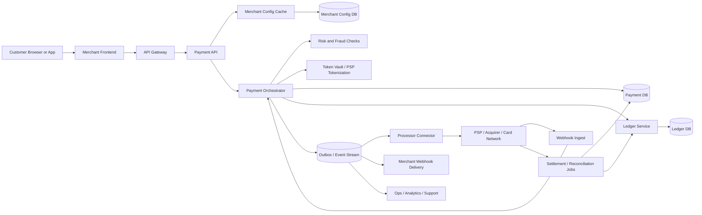

Generated by Codex with gpt-5

Selected problem: Payment System

Scope: Design a card-first online payment platform that creates payment intents, authorizes and captures funds, issues refunds, maintains an auditable ledger, and reconciles asynchronous processor outcomes without double-charging customers.

## Problem framing

This is the classic "design a Stripe / Adyen / PSP-style payment platform for merchant checkout" interview problem. Grokking's interview flow still applies directly: define the API contract early, size the system before arguing about storage, and then walk through the write path, read path, partitioning, caching, and failure handling. Alex Xu's usual system design patterns also fit well here: stateless API servers on the edge, durable primary storage for transactional state, caches for read-heavy metadata, and queues or streams for slow or retryable side effects. DDIA adds the most important payment-specific lesson: integrity matters more than timeliness. A payment status can be briefly stale, but money must not be created, lost, or charged twice.

Functional requirements:

- Create a payment intent for an order or checkout session.
- Confirm a payment using a tokenized payment method and handle step-up authentication when required.
- Support authorization-only and authorize-then-capture flows.
- Support partial capture, cancellation before capture, and full or partial refunds.
- Prevent duplicate charges when clients or servers retry.
- Expose current status to merchants and customers.
- Deliver asynchronous events to downstream systems such as order fulfillment, notifications, support tools, and merchant webhooks.
- Reconcile internal state with external processor, acquirer, and settlement outcomes.

Non-functional requirements:

- Correctness first on the money path. A retry must not create a second charge or inconsistent ledger state.
- Strong auditability. Every externally visible state change should be traceable to immutable records.
- High availability for intent creation and status reads.
- Low enough latency for checkout requests to feel interactive, while allowing final settlement to be asynchronous.
- Secure handling of sensitive payment data with minimal PCI scope.
- Horizontal scalability across many merchants, regions, and payment attempts.
- Graceful degradation when a processor, risk engine, or webhook consumer is slow or unavailable.

Scale assumptions:

- Assume about 50 million payment attempts per day across all merchants, around 600 requests per second on average and 5 to 10 times that at peak.
- Assume status reads outnumber successful writes because checkout pages, merchant dashboards, customer support tools, and webhook consumers all re-read payment state.
- Assume one order maps to one `PaymentIntent`, but one intent may have multiple `PaymentAttempt` records because authentication, network failures, or customer retries can require another try.
- Assume p95 synchronous checkout latency should usually stay under about 1 second when the external processor is healthy, while capture, settlement, and reconciliation can complete later.
- Assume immutable audit and ledger data must be retained for years, while hot caches can be short-lived.

API surface:

The client-facing API should model a payment as a long-lived state machine, not as a single blind "charge card" call. A practical interview answer is:

```http
POST /v1/payment-intents
Idempotency-Key: 7d2fe7bb-1fd4-49d2-a50b-7be1b3052d70
{
  "merchantId": "m_123",
  "orderId": "order_987",
  "amount": 2599,
  "currency": "USD",
  "captureMethod": "manual",
  "customerId": "cust_42"
}
-> 201 Created
{
  "paymentIntentId": "pi_001",
  "status": "REQUIRES_PAYMENT_METHOD"
}

POST /v1/payment-intents/pi_001/confirm
Idempotency-Key: 0ccac703-b8d0-4cd5-89b7-090f8d01152c
{
  "paymentMethodToken": "pm_tok_abc",
  "returnUrl": "https://merchant.example/return"
}
-> 200 OK
{
  "paymentIntentId": "pi_001",
  "status": "REQUIRES_ACTION",
  "nextAction": {
    "type": "REDIRECT_3DS",
    "url": "https://acs.example/challenge/..."
  }
}

POST /v1/payment-intents/pi_001/capture
Idempotency-Key: 8d6f1bb9-9f67-47b8-a90a-76080860f58c
{
  "amount": 2599
}
-> 200 OK
{
  "paymentIntentId": "pi_001",
  "status": "CAPTURED"
}

POST /v1/refunds
Idempotency-Key: 7c7e814f-2f22-49bc-8897-0f9ea01f33e4
{
  "paymentIntentId": "pi_001",
  "amount": 2599,
  "reason": "requested_by_customer"
}
-> 200 OK
{
  "refundId": "re_001",
  "status": "PENDING"
}

GET /v1/payment-intents/pi_001
-> current status, attempt history, amounts, merchant-visible references

POST /internal/processors/webhooks/{processor}
-> signed asynchronous status updates from the external processor
```

Core data model:

| Entity | Key | Important fields | Notes |
| --- | --- | --- | --- |
| `Merchant` | `merchant_id` | `routing_policy`, `webhook_url`, `risk_profile`, `home_region` | Mostly configuration and routing metadata |
| `PaymentIntent` | `payment_intent_id` | `merchant_id`, `order_id`, `amount`, `currency`, `status`, `capture_method`, `customer_id`, `current_attempt_id` | Stable business object for one checkout session |
| `PaymentAttempt` | `attempt_id` | `payment_intent_id`, `processor`, `processor_reference`, `status`, `authorization_expires_at`, `failure_code`, `three_ds_state` | Each network try or authentication cycle |
| `IdempotencyRecord` | `merchant_id + idempotency_key` | `request_hash`, `response_snapshot`, `operation_type`, `expires_at` | Durable duplicate suppression for client and server retries |
| `LedgerEntry` | `ledger_txn_id + line_no` | `payment_intent_id`, `account_id`, `direction`, `amount`, `currency`, `entry_type`, `created_at` | Immutable double-entry or balanced accounting lines |
| `Refund` | `refund_id` | `payment_intent_id`, `amount`, `status`, `processor_reference`, `reason` | Separate lifecycle from original payment |
| `ReconciliationItem` | `source + external_ref` | `payment_intent_id`, `expected_amount`, `observed_amount`, `observed_status`, `matched_at`, `discrepancy_code` | Ties internal state to settlement or webhook truth |
| `OutboxEvent` | `event_id` | `aggregate_type`, `aggregate_id`, `event_type`, `payload`, `published_at` | Safely bridges transactional writes to async delivery |

## Architecture



High-level design:

- Put stateless APIs at the edge for merchant authentication, rate limiting, and request validation.
- Treat `PaymentIntent` as the core business object. It gives the system one durable anchor for retries, status checks, and downstream references.
- Let a payment orchestrator own the state machine for `REQUIRES_PAYMENT_METHOD`, `REQUIRES_ACTION`, `PROCESSING`, `AUTHORIZED`, `CAPTURED`, `SETTLED`, `FAILED`, `CANCELED`, and `REFUNDED`.
- Keep merchant config, routing rules, risk policies, and processor credentials out of the hot data path by caching them near the API layer.
- Use a processor connector layer so the core payment state machine is not tightly coupled to any one PSP or acquirer.
- Keep ledger writes separate from dashboard analytics. Money movement and audit data need stricter guarantees than reporting.
- Publish downstream events from an outbox or stream after the transactional state is committed, not by firing webhooks directly inside the request transaction.

Practical request flow:

1. The merchant creates a `PaymentIntent` with an `Idempotency-Key`.
2. The API validates the merchant, stores an `IdempotencyRecord`, creates the `PaymentIntent`, and returns its identifier.
3. The merchant confirms the intent with a tokenized payment method.
4. The orchestrator creates a `PaymentAttempt`, optionally runs risk checks, chooses a processor route, and sends an authorization request with a connector-level idempotency token.
5. If the processor requires 3DS or another customer action, the intent moves to `REQUIRES_ACTION` and the client receives the next step.
6. If authorization succeeds, the system records the attempt outcome, updates the intent state, and, when appropriate, writes ledger entries or a pending authorization record.
7. Capture may happen immediately or later. A capture call updates internal state, calls the processor if needed, and posts the corresponding immutable ledger entries.
8. Processor webhooks and settlement files later confirm success, failure, chargeback, or refund outcomes; reconciliation jobs repair or escalate mismatches.
9. Outbox events drive merchant webhooks, fulfillment, notifications, support timelines, and analytics.

Storage choices:

- `PaymentIntent`, `PaymentAttempt`, `Refund`, `IdempotencyRecord`:
  - Use a relational database with strong uniqueness constraints and transactional updates.
  - Payment status transitions are structured, index-heavy, and easy to model relationally.
- Ledger:
  - Use an append-only accounting store with balanced entries, usually implemented in a relational system or a dedicated ledger service on top of one.
  - Do not treat a mutable balance column as the primary source of truth.
- Token storage:
  - Prefer PSP-managed tokens or a vault so the platform rarely handles raw PAN data.
  - That keeps the design practical and reduces PCI scope.
- Outbox and derived events:
  - Use an append-only outbox table plus a queue or stream for async delivery.
  - Merchant webhooks, analytics, and support feeds are derived views, not the money source of truth.
- Reconciliation and historical analytics:
  - Land settlement files, dispute events, and audit exports in object storage or a warehouse for long-term analysis.

Caching strategy:

- Cache merchant config, routing rules, public keys, and fraud-policy metadata aggressively because they are read-heavy and change relatively slowly.
- Avoid using cache as the authoritative source for idempotency or ledger state. Those decisions need durable writes.
- Cache `GET /payment-intents/{id}` responses briefly for dashboards or polling clients, but keep TTLs short for in-flight statuses.
- Use read-model caches for support tooling and analytics, not for the source-of-truth payment mutation path.

Partitioning and sharding:

- Partition payment metadata by a stable `payment_intent_id` hash or by `merchant_id + payment_intent_id`.
- Route all writes for a single payment to one home shard so status transitions, uniqueness checks, and ledger posting for that payment stay local.
- Keep `merchant_id + idempotency_key` unique within one shard or a deterministically routed keyspace.
- Partition immutable events and reconciliation data primarily by time and secondarily by merchant or processor for batch efficiency.
- If a merchant is predictably huge, give that merchant dedicated shards or a home region instead of letting it dominate a shared partition.

Consistency tradeoffs:

- Strong consistency is worth paying for inside one payment's home shard because idempotency, status transitions, and ledger posting must not race.
- Cross-region global consensus on every payment attempt is usually the wrong interview answer. It adds latency and hurts availability.
- A practical default is region-local writes with deterministic routing to a payment's home region, plus asynchronous replication for reads and recovery.
- Derived views can be eventually consistent. Merchant dashboards and analytics can lag behind the source of truth by seconds or minutes.
- External processor state is inherently asynchronous. The platform must tolerate "authorized here, settlement file later" as normal, not as an exception.

Main bottlenecks to call out in an interview:

- Processor latency or outage on the synchronous checkout path.
- Contention on hot merchant shards during a flash sale.
- Duplicate or out-of-order webhooks from processors.
- Reconciliation backlog if settlement files are delayed or malformed.
- Overly broad serializable transactions that lock too much state.
- Risk checks or fraud models adding tail latency to a checkout request.

## Deep dives

### Ledger design and immutable accounting

The strongest payment answer usually introduces a ledger explicitly. DDIA's atomicity and integrity chapters fit this well: it is safer to represent money movement as immutable records than to mutate a single "current balance" value and hope every caller updates it correctly.

- Keep the business state machine and the accounting model separate but linked.
- A `PaymentIntent` tells the product what happened to the checkout.
- The ledger records the financial effect of that outcome in balanced entries.
- Refunds and chargebacks should be compensating entries, not destructive edits to old rows.
- If the business needs both authorization and final settlement views, store them as different event or entry types instead of overloading one mutable status field.

Practical modeling:

- Authorization:
  - Record processor authorization data and hold expiration.
  - Some systems treat this as operational state, not yet merchant-settleable cash.
- Capture:
  - Post a balanced ledger transaction that recognizes the processor receivable and merchant payable, along with fees where appropriate.
- Settlement:
  - Reconcile the receivable against processor payout or bank movement.
- Refund:
  - Reverse the relevant balances with a new immutable transaction.

The key interview point is simple: payment correctness depends more on replayable, immutable records than on clever caching.

### Idempotency and duplicate suppression

DDIA is explicit that "exactly once" is really about making the final effect equivalent to one successful execution. For payments, that means duplicate suppression at every boundary:

- Client to payment API:
  - Require an `Idempotency-Key` on every create, confirm, capture, and refund mutation.
  - Persist the key, request hash, and response snapshot durably.
- Payment API to processor:
  - Send a connector operation ID so the processor can dedupe retries on its side too.
- Webhook ingest:
  - Store processor event IDs and ignore duplicates.
- Internal event delivery:
  - Make downstream handlers idempotent by event ID and aggregate version.

The dangerous sequence is:

1. create charge request
2. time out waiting for response
3. issue a second charge request with a new operation ID

That is how double charging happens. The system should keep one logical payment object and make retries re-enter the same workflow, not create a new one.

### Authorization, capture, and reconciliation

One of the biggest differences between interview-grade payment systems and toy "charge card" designs is acknowledging that external truth arrives in stages.

- Authorization means funds are reserved, not necessarily settled.
- Capture may be immediate or delayed, and may be partial.
- Settlement and payout often arrive later through processor events or files.
- Refunds, disputes, and chargebacks are separate lifecycles after the original capture.

That implies three design rules:

- The internal state machine must represent intermediate states such as `PROCESSING`, `AUTHORIZED`, and `SETTLEMENT_PENDING`.
- Order fulfillment should usually trigger from durable asynchronous completion signals, not from a browser return URL alone.
- Reconciliation is a first-class subsystem, not an afterthought. It should continuously compare internal expectations with processor-observed events and settlement amounts.

Practical reconciliation loop:

1. Import processor webhooks and settlement files.
2. Match by processor reference, merchant reference, amount, and currency.
3. Mark exact matches as reconciled.
4. Emit discrepancy tasks for missing capture, amount mismatch, duplicate processor event, or unexpected refund.
5. Keep manual repair and audit trails outside the hot checkout path.

### Multi-region design and failure handling

Payments are global, but a globally serializable design on every request is usually too expensive.

- Assign each merchant or payment to a home region.
- Route write operations for that payment to its home region.
- Replicate data asynchronously to secondary regions for reads, analytics, and disaster recovery.
- If a processor is region-specific, let routing policy choose the connector nearest the merchant or customer while preserving internal home-shard ownership.
- On failover, use fencing or leader epochs so an old writer cannot continue posting state transitions or ledger entries after leadership changes.

This matches DDIA's warning that strong global correctness mechanisms often trade away latency and availability. In most payment platforms, local correctness plus end-to-end reconciliation is the practical balance.

## Modern considerations

- Current PSP APIs model one payment as a long-lived state machine rather than one blind charge call. Stripe's current Payment Intents docs recommend exactly one `PaymentIntent` per order or customer session, and their status docs recommend server-side webhook handling for completion rather than relying on client-side redirects or polling alone. Sources: [Stripe Payment Intents API](https://docs.stripe.com/payments/payment-intents), [Payment status updates](https://docs.stripe.com/payments/payment-intents/verifying-status).
- Durable idempotency is a core design feature, not a nice-to-have. Stripe's current API reference still documents idempotent create and update requests explicitly, which reinforces the interview answer of persisting a merchant-scoped idempotency key and replaying the original response on safe retries. Source: [Stripe idempotent requests](https://docs.stripe.com/api/idempotent_requests?lang=php).
- Minimize PCI scope and expect step-up authentication in card-not-present flows. PCI SSC currently lists PCI DSS v4.0.1 as the active standard, and EMVCo continues to position EMV 3-D Secure as the standard protocol for e-commerce cardholder authentication and fraud reduction. Sources: [PCI DSS](https://www.pcisecuritystandards.org/standards/pci-dss), [PCI SSC document library](https://www.pcisecuritystandards.org/document_library?category=educational_resources&document=pc), [EMV 3-D Secure](https://www.emvco.com/emv-technologies/3d-secure/).

## Interview follow-ups

- How do you prevent double charges if the client retries after a timeout?
  - Persist a merchant-scoped `IdempotencyRecord` before the external processor call, reuse the same logical `PaymentIntent`, send the same connector operation ID on retry, and return the first durable result instead of creating a second attempt blindly.

- Why not store payment state only in Redis for speed?
  - Redis can help with ephemeral caches, locks, or throttling, but payment correctness needs durable transactional writes, uniqueness constraints, and immutable audit history. The hot path is write-heavy and correctness-sensitive, so the source of truth should be a durable transactional store.

- What should trigger order fulfillment?
  - Trigger fulfillment from a durable server-side completion event such as `CAPTURED` or `SUCCEEDED` after webhook or processor confirmation, not from a browser redirect alone. The customer can close the tab or lose connectivity after the processor succeeds.

- Should authorization and capture be separate entities or just fields on one row?
  - The interview-grade answer is one `PaymentIntent` plus separate `PaymentAttempt` or event records. That keeps the customer-facing payment object stable while preserving a clean history of authorization, challenge, capture, refund, and failure transitions.

- How would you support partial capture and partial refund?
  - Track `amount_authorized`, `amount_captured`, and `amount_refunded` explicitly, enforce monotonic invariants, and post separate immutable ledger transactions for each capture and refund rather than editing the original rows in place.

- How do you handle out-of-order or duplicate processor webhooks?
  - Deduplicate by processor event ID, store processor event timestamps and sequence metadata when available, and make state transitions monotonic so an older event cannot roll the payment backward from `CAPTURED` to `AUTHORIZED`.

- Where do chargebacks fit?
  - Model them as a separate post-payment dispute workflow with their own states, deadlines, evidence artifacts, and compensating ledger entries. They are operationally related to the original payment but should not overload the original checkout state machine.

- How do you shard the ledger?
  - Keep all entries for one logical payment on the same home shard so posting remains atomic, derive merchant balances from ledger entries or precomputed projections, and avoid cross-shard money movement inside a single checkout transaction when possible.

- What happens if the processor accepted the charge but your API crashed before responding?
  - The idempotency key and connector operation ID let the retry re-read or safely replay the same logical operation. Reconciliation and webhook ingest are the safety net if the synchronous response was lost.

- What metrics matter most?
  - Monitor authorization success rate, processor latency, duplicate suppression hits, `REQUIRES_ACTION` completion rate, capture lag, settlement lag, reconciliation mismatch rate, webhook delay, refund latency, and any imbalance or invariant-violation alerts in the ledger.
