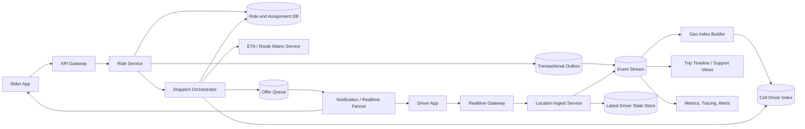

Generated by Codex with gpt-5

Selected problem: Ride-Sharing Dispatch

Scope: Design the real-time backend that ingests rider requests and driver location updates, finds good matches within seconds, assigns exactly one driver to a rider, and keeps the trip state and live map updated until completion.

## Problem framing

This is the classic "design Uber/Lyft dispatch" interview problem: a city-scale marketplace where the hard parts are not just finding a nearby driver, but doing so with fresh-enough location data, realistic ETAs, strong assignment correctness, and graceful handling of retries, timeouts, cancellations, and partial failures.

In an interview, it is worth scoping explicitly. Here the focus is dispatch and trip lifecycle. Full payments, fraud, long-term pricing science, turn-by-turn navigation, and driver incentives are out of scope unless the interviewer pushes there.

Functional requirements:

- Riders can request a ride with pickup, destination, product type, and optional preferences.
- Drivers can go online/offline and continuously publish location and availability updates.
- The system finds eligible nearby drivers and sends ride offers in seconds.
- Exactly one driver should be assigned to a rider request.
- Riders and drivers can accept, cancel, time out, arrive, start trip, and complete trip.
- Both sides can see live trip status and approximate vehicle location after assignment.
- The system should support retries, re-dispatch after rejection or timeout, and support lookup of ride state.
- Operators need visibility into queue depth, dispatch latency, failed offers, stale driver state, and city-level incidents.

Non-functional requirements:

- Low dispatch latency: a rider should usually see an offer result within a few seconds.
- High availability for city-level dispatch even if some workers or downstream systems fail.
- No double assignment of the same driver to two riders or two drivers to one ride.
- Horizontal scalability by market, city, and geospatial shard.
- Eventual consistency is acceptable for location freshness, but assignment state needs stronger guarantees.
- Battery- and bandwidth-aware mobile behavior: the backend should not assume a fixed high-frequency location cadence from every device at all times.
- Good observability, replayability, and auditability for disputes and incident recovery.

Scale assumptions:

- Assume about 5 million completed rides per day globally.
- Assume 300,000 to 500,000 drivers may be online globally at peak, with tens of thousands online in a top metro.
- Assume peak rider request traffic around 2,000 requests per second globally, with perhaps 50 to 150 requests per second in a busiest city during spikes.
- Assume location updates are adaptive rather than uniform: foreground drivers may report every 2 to 5 seconds, while lower-power or background states may be less frequent.
- Assume dispatch candidate selection starts from a small nearby set, and expensive ETA computation is only run on the top few dozen candidates, not the full city supply.
- Assume raw location events are append-only and high-volume, but the serving path mostly reads the latest driver state plus derived geospatial indexes.

Core APIs:

```http
POST /v1/rides
Idempotency-Key: rider_123:req_456
{
  "riderId": "r_123",
  "pickup": {
    "lat": 37.7766,
    "lng": -122.4172
  },
  "dropoff": {
    "lat": 37.7941,
    "lng": -122.3942
  },
  "productType": "standard",
  "paymentProfileId": "pay_9",
  "clientRequestId": "req_456"
}
-> 202 Accepted
{
  "rideId": "ride_01JS4Q6VYF5N5S9M4MM8K93A7X",
  "status": "searching"
}

POST /v1/drivers/{driverId}/availability
{
  "online": true,
  "productTypes": ["standard", "xl"],
  "vehicleId": "veh_88",
  "cityId": "sf"
}

POST /v1/drivers/{driverId}/location
{
  "sequence": 982144,
  "occurredAt": "2026-04-24T22:58:14Z",
  "lat": 37.7758,
  "lng": -122.4181,
  "heading": 90,
  "speedMps": 11.2
}

POST /v1/ride-offers/{offerId}/accept
{
  "driverId": "d_456",
  "driverStateVersion": 184221
}

POST /v1/rides/{rideId}/events
{
  "eventType": "rider_cancelled",
  "actorId": "r_123",
  "reason": "changed_mind"
}

GET /v1/rides/{rideId}
-> 200 OK
{
  "status": "driver_assigned",
  "driverId": "d_456",
  "etaSeconds": 190,
  "tripId": "trip_999"
}
```

Core data model:

| Entity | Key | Important fields | Notes |
| --- | --- | --- | --- |
| `RideRequest` | `ride_id` | `rider_id`, `pickup_point`, `dropoff_point`, `product_type`, `status`, `created_at`, `city_id` | Durable source of truth for the rider request |
| `DriverState` | `driver_id` | `city_id`, `current_point`, `current_cell`, `availability`, `vehicle_type`, `last_location_at`, `version` | Latest mutable driver state |
| `DriverLocationEvent` | `driver_id + occurred_at` | `lat`, `lng`, `heading`, `speed`, `sequence` | Append-only history and replay input |
| `RideOffer` | `offer_id` | `ride_id`, `driver_id`, `dispatch_round`, `expires_at`, `status` | One candidate offer attempt |
| `Assignment` | `ride_id` | `driver_id`, `accepted_offer_id`, `assigned_at`, `state_version` | Strongly guarded one-to-one binding |
| `Trip` | `trip_id` | `ride_id`, `rider_id`, `driver_id`, `status`, `started_at`, `completed_at` | Lifecycle after assignment |
| `CellDriverIndex` | `city_id + cell_id` | `online_driver_ids`, `freshness_watermark` | Usually a derived in-memory or fast KV structure |
| `DispatchOutbox` | `event_id` | `aggregate_type`, `aggregate_id`, `payload`, `published_at` | Reliable fanout to streams and queues |
| `SurgeZone` | `city_id + cell_id + time_bucket` | `supply`, `demand`, `multiplier` | Optional derived control signal |

## Architecture



High-level design:

- Split the system into two paths:
  - a correctness path for ride state and assignment
  - a high-volume derived-data path for location, indexing, and candidate search
- Keep rider request state and assignment state in a transactional store, because "who got matched to whom" is the part that cannot be casually eventually consistent.
- Treat driver location as an event stream plus a latest-state materialized view. That is a direct DDIA-style move: immutable events feed derived indexes, caches, and downstream consumers.
- Partition dispatch by city or metro first. A global control plane can exist, but the hot assignment loop should be region-local because latency, road graph, and failure domains are local.
- Maintain a geospatial index of currently available drivers keyed by hierarchical cells, then use an expanding search from the rider pickup point to find candidates quickly.
- Rank candidates in two stages:
  - a cheap filter using cell proximity, freshness, heading, product type, and availability
  - a more expensive ETA stage on the best few candidates
- Use queues or streams between intake, dispatch, and notification so retries and downstream slowness do not block the rider-facing API.

Practical request flow:

1. A rider creates a `RideRequest`; the Ride Service stores it transactionally and emits a dispatch-needed event through an outbox.
2. Driver apps send location heartbeats and availability changes to the realtime gateway.
3. The Location Ingest Service updates `DriverState`, appends `DriverLocationEvent`, and refreshes the driver's current cell in the derived geo index.
4. The Dispatch Orchestrator consumes the rider request event and queries the relevant nearby cells for fresh eligible drivers.
5. The orchestrator computes cheap scores first, then asks an ETA service or route-matrix subsystem for better travel-time estimates on the top candidates.
6. It creates one or a small batch of `RideOffer` records with expiry times and sends offers to drivers.
7. The first valid acceptance tries to atomically transition the ride from `searching` to `assigned` while also reserving the driver from `available` to `assigned`.
8. Losing offers are canceled, and rider and driver clients receive assignment updates.
9. Trip lifecycle events such as `driver_arrived`, `trip_started`, and `trip_completed` continue to flow through the same event backbone.
10. Analytics, support timelines, pricing, and marketplace balancing consume the stream asynchronously instead of sitting on the critical dispatch path.

Storage choices:

- Transactional ride store:
  - Use a relational database or strongly consistent transactional store for `RideRequest`, `RideOffer`, `Assignment`, and `Trip`.
  - This path needs conditional writes, unique constraints, and clean auditability.
- Latest driver state store:
  - Use a fast key-value or in-memory store for the newest state per driver.
  - The read pattern is point lookup by driver ID and frequent mutation, not heavy relational querying.
- Geospatial serving index:
  - Use a derived cell-based index keyed by `city + cell`.
  - This can live in a memory-first service backed by snapshots and stream replay.
- Event stream:
  - Use an append-only log for location updates, ride lifecycle events, outbox delivery, replay, and downstream consumers.
  - This reduces brittle RPC chains and makes incident recovery easier.
- History and analytics storage:
  - Move older detailed trip and location history to colder analytical storage.
  - The dispatch path should not scan raw event history.

Caching strategy:

- Cache nearby-cell expansions, road-network metadata, and static eligibility rules in dispatch workers.
- Cache ETAs only briefly and only when the cache key includes origin cell, destination cell, product type, and a freshness window; stale ETA caches are dangerous.
- Keep rider status and trip summaries in a read cache for frequent mobile polling or fanout reads.
- Do not treat cache state as authoritative for assignment. Cache misses should be annoying, not correctness-breaking.

Partitioning and sharding:

- Partition by `city_id` or `market_id` first, because most dispatch decisions are local and city failures should be isolated.
- Within a city, shard the geo index by cell range or hashed cell ownership, depending on density skew.
- Partition `DriverState` by `driver_id`, but maintain the cell index as a derived secondary structure.
- Partition event streams by city and then by driver or ride key to keep related ordering manageable.
- For dense downtown zones, allow adaptive sub-sharding or finer-resolution cells so hotspot cells do not overload one worker.

Consistency tradeoffs:

- Location reads are allowed to be slightly stale. A driver can move a few hundred meters between updates; this is acceptable if final scoring uses freshness thresholds and ETA recalculation.
- Assignment is different: use compare-and-swap, uniqueness constraints, or lease tokens so only one accept path can win.
- The system should be at-least-once internally. Retries can duplicate location events, offer deliveries, or status updates, so handlers must be idempotent.
- Reads from replicas or derived views may lag. If the rider status screen briefly trails the transactional truth, that is acceptable; if assignment truth splits, it is not.
- Keep a clear home region per city for active dispatch. Multi-region failover is useful, but active-active dispatch without strong fencing makes double assignment much easier.

Bottlenecks to call out in an interview:

- Hot downtown cells with many riders and many drivers.
- ETA explosion if every candidate requires a full routing call.
- Notification fanout spikes during weather surges or mass transit disruptions.
- Driver-state freshness gaps due to poor mobile connectivity or aggressive battery saving.
- Duplicate accepts and timeout races near offer expiry.
- Downstream routing or map-provider latency becoming the hidden dispatch bottleneck.

## Deep dives

### Nearby-driver search and ranking

Grokking's original solution uses a quadtree-style spatial structure for nearby search. The modern interview answer should keep the same idea but generalize it: maintain a hierarchical spatial index over currently available drivers and expand outward from the pickup location until enough candidates are found.

Practical approach:

- Map each driver's latest position into a cell ID.
- Start with the rider's pickup cell.
- Expand to neighboring cells in rings until enough eligible drivers are found or the search radius cap is reached.
- Filter candidates before expensive scoring:
  - driver is online and not already reserved
  - vehicle/product type matches
  - location sample is fresh enough
  - driver is not too far in travel time
  - optional marketplace filters such as acceptance health or airport queue state
- Use two-stage ranking:
  - Stage 1: straight-line distance, cell distance, heading, and freshness
  - Stage 2: travel-time ranking on the top K candidates

Why this matters:

- Straight-line distance is cheap but often wrong in cities with bridges, one-way streets, and traffic.
- Travel time is better, but a full routing call for every driver is too expensive.
- Therefore the system should do coarse pruning first and only then run ETA on a small candidate set.

### Assignment correctness and offer orchestration

The hardest correctness problem is preventing double booking while staying fast.

Recommended flow:

- Dispatch creates one or a small batch of offers, each with an expiry timestamp.
- Each offer references the ride state version and driver state version used when it was produced.
- When a driver accepts, the assignment service performs an atomic conditional write:
  - ride must still be `searching`
  - offer must still be `open`
  - driver must still be `available`
  - driver state version must still be compatible
- If the conditional write succeeds, the system creates `Assignment` and flips the driver to `assigned`.
- If it fails, the accept is rejected as stale and the driver is told the ride was already taken or expired.

Dispatch policy tradeoff:

- Sequential offers minimize duplicate accepts but increase rider wait time.
- Small-batch offers to the top 2 to 3 candidates usually give a better latency/efficiency balance.
- Very large fanout wastes driver attention and increases cancel noise.

DDIA is useful here conceptually: exactly-once end-to-end is a poor promise for a networked distributed workflow. The practical answer is at-least-once delivery plus idempotent state transitions and transactional guards at the assignment boundary.

### Location streaming and trip tracking

Location ingestion is high volume and should not be tightly coupled to the transactional ride path.

Recommended pattern:

- Driver apps publish heartbeats and location deltas to a realtime ingress tier.
- The system appends those events to a stream and updates a latest-state materialized view.
- Derived consumers update the geo index, recompute rider ETAs, feed support tools, and write analytical history.
- Once a ride is assigned, rider and driver apps subscribe to trip-specific updates over a realtime channel such as WebSocket or push-assisted long-lived connections.

Important interview nuance:

- Pre-match map rendering does not require server-push of every nearby driver's location to every rider in a city.
- It is usually better to let clients pull or subscribe to a bounded local view with throttling, while keeping the true dispatch loop server-side.
- Raw location history should have tighter retention and access controls than coarse ride state because it is privacy-sensitive.

## Modern considerations

Today, a stronger answer than the older book version is to use a hierarchical global cell system such as H3 or S2 for the serving index, then rank a small candidate set by travel time rather than pure geometric distance. Mobile platforms also make a fixed "every driver reports every three seconds forever" assumption unrealistic: foreground updates can be frequent, but background updates are power-constrained and should be adaptive, batched, and freshness-aware. That pushes the backend toward "best fresh-enough state plus ETA correction" instead of pretending location is perfectly current. Event streams and derived materialized views are a better fit than chaining synchronous RPC calls for every ride, but the final assignment step still needs a transactional guardrail. A practical interview answer should also mention privacy boundaries around exact trajectories, city-local isolation for latency and fault containment, and graceful degradation when routing data is slow or missing.

## Interview follow-ups

- How do you prevent assigning the same driver to two riders?
  - Keep driver availability and ride assignment in a transactional path with a conditional state transition or lease token. The first valid accept wins, and all later accepts fail as stale.
- Why not just query all available drivers within a city?
  - Because dispatch needs to stay low-latency. Use a cell index to prune to a small candidate set first, then spend routing budget only on the most promising drivers.
- Why is ETA better than nearest straight-line distance?
  - Urban road networks, one-way streets, bridges, and traffic make geometric proximity a weak proxy. ETA is a better measure of pickup experience, so use it on the top candidates after cheap pruning.
- What happens if your routing or map provider becomes slow?
  - Fall back to a cheaper heuristic such as cell distance plus recent traffic class, keep the market running in degraded mode, and backfill better ETA estimates asynchronously.
- How would you support pooled rides later?
  - Add a route-insertion optimizer that evaluates whether a new pickup and dropoff can be inserted into an existing driver's planned route without violating detour and SLA limits. The dispatch search becomes constrained optimization rather than one-to-one matching.
- What data would you replicate across regions?
  - Control-plane data, rider and driver accounts, and analytical streams can replicate broadly, but active dispatch authority should usually stay tied to a city's home region with explicit failover to avoid split-brain assignments.
