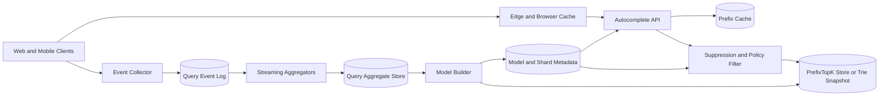

Generated by Codex with gpt-5

Selected problem: Search Autocomplete

Scope: Design a low-latency autocomplete service that returns top suggestions for a typed prefix, learns from query activity over time, and handles hot prefixes, moderation, and multilingual growth without rebuilding everything on every keystroke.

## Problem framing

This is the classic "design Google search suggestions" or "typeahead" interview problem. Alex Xu frames it around a brutally simple user-facing requirement: every keystroke can trigger a request, so suggestion reads must be extremely fast. Grokking's interview style also applies cleanly here: clarify prefix-only versus infix matching, top-K size, language scope, freshness needs, and latency targets before arguing about data structures. The interview answer usually starts with a trie or prefix tree, but DDIA adds the more durable framing: autocomplete is a derived read model built from query logs, aggregation, filtering, and ranking pipelines, so the real design question is how to keep that read model fresh, cheap, and rebuildable.

Functional requirements:

- Return the top 5 to 10 suggestions for a typed prefix.
- Support prefix matching first; treat infix or typo tolerance as an extension.
- Rank suggestions by popularity, recency, and product-specific quality signals.
- Support locale- or market-specific suggestions.
- Learn from submitted searches and optionally click-through feedback.
- Filter blocked, unsafe, policy-violating, or low-quality suggestions.
- Expose stable APIs for clients on web and mobile.
- Provide a fallback when the hottest prefix cache or one shard is degraded.

Non-functional requirements:

- Very low read latency; P95 should typically stay under 100 ms end to end.
- High availability because autocomplete is on the critical path of search UX.
- Read-heavy traffic with large fan-in on a small set of hot prefixes.
- Eventual consistency is acceptable for ranking freshness, but unsafe suggestions should be suppressible quickly.
- Horizontal scalability across prefixes, locales, and ranking model versions.
- Cheap rebuild and rollback when ranking logic or filtering rules change.
- Efficient caching at browser, edge, and service layers.

Scale assumptions:

- Assume 10 million daily active users.
- Assume 10 search sessions per active user per day.
- Assume the client starts querying after the first 2 characters and debounces, resulting in about 6 autocomplete requests per search session on average.
- That gives roughly 7,000 average QPS and around 35,000 to 50,000 peak QPS for suggestions.
- Assume 20% of submitted queries are new or meaningfully rare over a rolling day, which creates a very large long tail.
- Assume suggestions are short strings, but the aggregate prefix index is large because popular queries are duplicated across many prefixes.
- These are interview sizing assumptions, not statements about any current product.

## Core APIs

```http
GET /v1/suggestions?q=dinn&limit=5&locale=en-US&market=US&sessionId=s_123
-> 200 OK
{
  "suggestions": [
    {
      "text": "dinner recipes",
      "score": 0.93,
      "source": "prefix_index",
      "modelVersion": "2026-04-23T15:00:00Z"
    },
    {
      "text": "dinner ideas",
      "score": 0.89,
      "source": "prefix_index",
      "modelVersion": "2026-04-23T15:00:00Z"
    }
  ],
  "cacheTtlSeconds": 300
}

POST /v1/suggestion-events
{
  "sessionId": "s_123",
  "locale": "en-US",
  "prefix": "dinn",
  "suggestionText": "dinner recipes",
  "eventType": "click",
  "eventAt": "2026-04-23T15:30:00Z"
}
-> 202 Accepted

POST /internal/suppression-rules
{
  "scope": "locale",
  "locale": "en-US",
  "query": "unsafe phrase",
  "reason": "policy_violation"
}
-> 202 Accepted
```

API notes:

- The read API should be simple and cache-friendly. The client supplies a normalized prefix, locale, and limit.
- Event logging should be asynchronous. The UI should not block on click or submit telemetry.
- Suggestions should carry a `modelVersion` or generation so operators can compare old and new ranking behavior.
- Suppression and moderation APIs are internal control-plane interfaces, not client-facing public APIs.

## Core data model

| Entity | Key | Important fields | Notes |
| --- | --- | --- | --- |
| `QueryEvent` | `event_id` | `raw_query`, `normalized_query`, `locale`, `market`, `user_agent`, `event_type`, `created_at` | Append-only source log for submitted queries and feedback |
| `QueryAggregate` | `locale + normalized_query + time_bucket` | `count`, `clicks`, `submit_count`, `trend_weight` | Aggregated counts over hourly or daily windows |
| `SuggestionMetadata` | `locale + normalized_query` | `display_text`, `language`, `quality_flags`, `last_seen_at` | Canonical suggestion record |
| `PrefixTopK` | `locale + prefix + model_version` | `top_suggestions`, `scores`, `updated_at` | Read-optimized materialized view for serving |
| `TrieSnapshot` | `locale + model_version` | `serialized_trie_ref`, `created_at` | Optional snapshot artifact if serving from tries |
| `SuppressionRule` | `scope + query_or_pattern` | `reason`, `action`, `expires_at`, `created_by` | Hard filter layer for unsafe or blocked suggestions |
| `ShardMap` | `locale + shard_range` | `storage_location`, `version`, `split_policy` | Keeps skew-aware prefix routing metadata |
| `ModelVersion` | `model_version` | `build_window`, `ranking_formula`, `status` | Supports rollout, rollback, and comparisons |

The key modeling decision is that `QueryEvent` is the source of truth and `PrefixTopK` is derived data. That is the DDIA lens that makes rebuilds, backfills, and ranking changes much easier to explain in an interview.

## Architecture



Main components:

- Event Collector: receives submitted-query, click, and impression events asynchronously.
- Query Event Log: durable append-only stream that supports replay and backfill.
- Streaming Aggregators: roll up raw query events into counts and trend windows.
- Model Builder: periodically or continuously materializes the top suggestions for each prefix.
- PrefixTopK Store or Trie Snapshot Store: the read-optimized serving layer.
- Suppression and Policy Filter: removes unsafe, blocked, or regionally restricted suggestions.
- Prefix Cache: holds the hottest prefixes and final responses close to the serving path.
- Edge and Browser Cache: absorbs repeated requests for common prefixes.

## Data flow

Read flow:

1. The client starts calling the autocomplete API after a minimum prefix length such as 2 characters.
2. Edge or browser cache serves the response when possible for hot prefixes.
3. On a cache miss, the API looks up the current `modelVersion` and prefix shard from routing metadata.
4. The API fetches the precomputed top suggestions for `(locale, prefix, modelVersion)`.
5. The policy filter removes suppressed suggestions and optionally fills gaps from a deeper candidate list.
6. The API returns the top N suggestions and a short cache TTL.

Learning flow:

1. The client emits events for submitted queries and optionally for suggestion clicks.
2. Events land in an append-only log.
3. Streaming jobs aggregate counts into time buckets and compute recency-aware scores.
4. The model builder reads aggregated counts and writes a new `PrefixTopK` generation.
5. Serving metadata flips traffic from the old generation to the new one gradually.
6. If the new build is bad, the API can route back to the prior generation quickly.

Moderation flow:

1. Operators or automated systems create a suppression rule.
2. The filter layer applies that rule immediately on reads where possible.
3. The next model build removes the bad suggestion from the materialized prefix index itself.

## Storage, caching, and partitioning

Storage choices:

- Event log:
  - Use a durable partitioned log for `QueryEvent` records.
  - This keeps ingestion write-friendly and replayable.
- Aggregate store:
  - Store query counts by locale, normalized query, and time bucket.
  - This is the input to ranking and prefix materialization.
- Serving store:
  - Use either a serialized trie snapshot per locale or a direct `PrefixTopK` key-value store.
  - In an interview, a trie is the classic answer. In a practical system, a direct prefix-to-topK mapping is often easier to cache, shard, and roll forward by version.
- Suppression store:
  - Keep it separate from ranking data so policy changes do not require a full rebuild just to hide one bad suggestion.

Caching strategy:

- Cache popular prefixes at the browser and edge because the same short prefixes are requested repeatedly.
- Cache the final filtered response, not just the raw trie node, so suppression logic does not rerun for the hottest keys.
- Use TTLs plus versioned cache keys so model rollouts do not require dangerous mass invalidation.
- Cache misses for rare prefixes can fall back to the serving store directly without hurting the overall system because the workload is highly skewed.

Partitioning and sharding:

- Do not shard only by first letter forever. Alex Xu points out the obvious skew: prefixes like `c` or `s` can be far hotter than `x`.
- Partition by `(locale, shard_range)` where shard ranges are based on observed historical distribution, not alphabet ranges alone.
- Keep a `ShardMap` so the service can split hot prefix ranges without changing the public API.
- Partition the event log and aggregate pipeline by normalized query hash, but serve reads by prefix shard. Those are different access patterns and should not be forced into one scheme.
- Expect hot prefixes such as `a`, `new`, or `weather` to dominate reads; precompute them aggressively and isolate them from the long tail.

## Consistency tradeoffs

- Suggestions are derived data, so eventual consistency is fine for normal ranking freshness.
- Suppression and safety rules need stronger read-path enforcement than normal popularity updates. It is better to hide a benign suggestion briefly than to surface a known-bad one.
- Click and submit events should be treated as at-least-once inputs with idempotent aggregation, not as exactly-once magical counters.
- A new model generation should be versioned and rolled out atomically at the routing layer, even if the underlying aggregate updates were asynchronous.
- Personalized or market-specific suggestions increase freshness and storage complexity. A strong interview answer usually starts with locale-level suggestions before adding per-user personalization.

## Bottlenecks and mitigations

Hot prefixes:

- Problem: a small number of prefixes dominate read traffic.
- Mitigation: aggressive edge caching, dedicated hot-prefix shards, and minimum prefix length before querying.

Write amplification in rebuilds:

- Problem: rebuilding every prefix on every query is too expensive.
- Mitigation: aggregate raw events first, then materialize the serving index in batches or microbatches.

Long-tail memory growth:

- Problem: storing top suggestions for every possible prefix explodes memory use.
- Mitigation: cap prefix length, drop ultra-rare prefixes from the serving layer, and fall back to deeper lookup or search index queries for rare cases.

Skewed shard distribution:

- Problem: naive alphabetic sharding gives uneven load.
- Mitigation: maintain a shard map based on real traffic and split hot ranges independently.

Unsafe or low-quality suggestions:

- Problem: a highly popular suggestion may still be disallowed.
- Mitigation: separate suppression rules from ranking data and enforce them in the read path before the response goes out.

Model rollout mistakes:

- Problem: a bad ranking formula can poison many prefixes quickly.
- Mitigation: build versioned generations, shadow them, compare metrics, and switch traffic gradually.

## Deep dives

- Read model choice:
  - Alex Xu's trie is the canonical interview data structure because it explains why prefix lookups can be constant-ish after bounded normalization and cached top K lists. The more general systems answer is "serve from a materialized prefix read model." That model can be implemented as a trie snapshot, a prefix-to-topK key-value table, or a specialized search index.

- Batch versus near-real-time updates:
  - The book solution rebuilds weekly because many autocomplete domains do not need second-by-second freshness. DDIA suggests the cleaner abstraction: raw query logs feed streaming aggregates, and those aggregates feed materialized serving views. Then the product can choose hourly, minute-level, or near-real-time rebuilds without rewriting the serving path.

- Ranking:
  - Pure frequency is the simplest ranking signal. A better interview answer adds recency weighting, click-through quality, and policy boosts or demotions. Keep the first version explainable: `score = popularity + freshness_weight + quality_adjustment`, then discuss richer models if asked.

- Moderation:
  - Alex Xu explicitly calls out a filter layer in front of trie cache. That is still the right mental model. Ranking chooses what is likely useful; policy decides what is allowed. Never bury safety logic inside a single offline build job with no fast override.

- Multilingual growth:
  - The book suggests Unicode and separate tries per country or language, which is the correct extension point. In practice, multilingual autocomplete also needs locale-aware normalization, tokenization, transliteration rules where relevant, and possibly separate ranking models by market because query popularity diverges heavily across regions.

- Rebuildability:
  - DDIA's derived-data argument is powerful here. If the prefix index is wrong, stale, or built with a bad formula, replay the query event log or recompute from aggregate buckets into a fresh `modelVersion` rather than trying to mutate every serving shard in place.

## Modern considerations

Autocomplete still benefits from aggressive HTTP caching, and [RFC 9111](https://www.rfc-editor.org/rfc/rfc9111) remains the current standard for cache behavior, freshness, and `Cache-Control` semantics at browser and intermediary layers. A plain trie is still the right interview answer, but current production tooling also supports richer prefix-serving approaches, such as Elasticsearch's [`search_as_you_type`](https://www.elastic.co/guide/en/elasticsearch/reference/current/search-as-you-type.html) field and Redis's trie-backed [autocomplete dictionary](https://redis.io/docs/latest/develop/ai/search-and-query/advanced-concepts/autocomplete/); those are useful evidence that "precompute prefix-friendly read models" is still the modern direction, not a dated trick. Managed key-value systems also still warn about hot partitions and skewed keyspaces, so naive first-letter sharding is not enough once prefixes like `a`, `new`, or `wea` dominate traffic ([DynamoDB hot partitions](https://docs.aws.amazon.com/amazondynamodb/latest/developerguide/throttling-key-range-limit-exceeded-mitigation.html)). The modern answer is not "one big trie server"; it is "a versioned, cached, rebuildable prefix read model fed from logs and aggregations."

## Interview follow-ups

- How would you support real-time trending suggestions?
  - Keep the serving path the same, but shorten aggregation windows and add more weight to recent counts. Hot trends can be materialized in a fast lane or overlay index and merged with the base prefix results at read time.

- What if suggestions differ by country or language?
  - Partition the read model by locale or market and build separate ranking generations. Sharing one global trie is usually the wrong answer once query behavior diverges materially across regions.

- Do we need to update the trie on every query?
  - Usually no. That creates too much write amplification and locks contention into the serving path. Log raw events, aggregate them asynchronously, and publish periodic or streaming read-model updates instead.

- How do you handle offensive or unsafe suggestions quickly?
  - Put a suppression filter in the read path and keep the rules in a separate control-plane store. Then remove the suggestion from the next rebuilt model generation so both immediate blocking and long-term cleanup happen.

- How do you deal with very hot prefixes?
  - Cache them heavily, isolate them onto dedicated shards if needed, and do not let them compete with the long tail for the same tiny cache or backend resources.

- What if the prefix is rare and not in cache?
  - Fall back to the serving store or a deeper candidate lookup. Rare prefixes are a small share of total traffic, so it is acceptable if they are slightly slower than the hottest prefixes.

- How would you rebuild after a bad ranking model rollout?
  - Replay from the event log or aggregate store into a new `modelVersion`, keep the old generation available, and switch traffic back if the new results regress.

- How do you reduce load from every keystroke?
  - Start querying only after a minimum prefix length, debounce the client, use browser and edge caches, and collapse identical in-flight requests at the service layer.

- Can this system support infix matching instead of only prefix matching?
  - Yes, but a plain trie is no longer the cleanest primary structure. You usually move toward analyzed search indexes, n-grams, or specialized as-you-type fields, which increases index size and complexity.

- What is the core DDIA tradeoff here?
  - The main tradeoff is between freshness and serving simplicity. The more work you precompute into a prefix read model, the faster reads become, but the more machinery you need for aggregation, versioning, and rebuilds.

The strongest interview answer is not just "use a trie." It is: define query logs as the source of truth, aggregate them asynchronously, publish a versioned prefix read model, cache hot prefixes aggressively, and keep safety rules independent from ranking so the service stays fast, rebuildable, and controllable.
