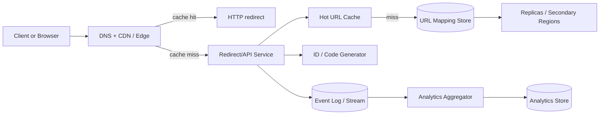

Generated by Codex with gpt-5

Selected problem: TinyURL

Scope: Design a highly available URL shortening service that creates compact aliases, resolves them with very low latency, and records click analytics without putting the redirect path at risk.

## Problem framing

This is the classic URL shortener problem: map a short code to a long URL, make redirects fast, and survive a very read-heavy workload with occasional viral hot keys.

Functional requirements:

- Create a short URL from a long URL.
- Redirect `/{shortCode}` to the original URL.
- Support optional custom aliases.
- Support link expiration.
- Record basic click analytics asynchronously.

Non-functional requirements:

- High availability. Redirect failures are user-visible immediately.
- Low latency on the redirect path.
- Horizontal scalability for both storage and read traffic.
- Predictable handling of hot keys when one short link goes viral.
- Abuse resistance: rate limits, invalid URL checks, and optional malware/phishing checks.

Scale assumptions:

- Assume 100 million new short URLs per day.
- Assume average read:write ratio is 15:1, but traffic is highly skewed and some links become extremely hot.
- Assume 10-year retention for active mappings; expired mappings can be archived or deleted earlier.
- Assume default alias length is 8 base62 characters for headroom. `62^8` gives more than enough namespace for interview-scale assumptions while reducing collision pressure compared with 6- or 7-character designs.
- Target redirect latency:
  - Edge cache hit: sub-50 ms user-perceived latency is reasonable.
  - Origin miss: still fast enough to feel instant, usually dominated by network rather than lookup cost.

These numbers are assumptions for interview discussion, not claims about current TinyURL production traffic.

Core APIs:

```http
POST /v1/urls
{
  "longUrl": "https://example.com/very/long/path",
  "customAlias": "optional",
  "expiresAt": "optional timestamp"
}
-> 201 Created
{
  "shortUrl": "https://sho.rt/abc123XY",
  "shortCode": "abc123XY",
  "expiresAt": "..."
}

GET /{shortCode}
-> 301 or 302 with Location: <longUrl>

GET /v1/urls/{shortCode}/stats
-> aggregated analytics
```

Core data model:

| Entity | Key | Important fields | Notes |
| --- | --- | --- | --- |
| `UrlMapping` | `short_code` | `long_url`, `normalized_url_hash`, `created_at`, `expires_at`, `owner_id`, `redirect_type`, `status` | Main serving record for redirects |
| `CustomAliasReservation` | `alias` | `owner_id`, `created_at` | Prevents alias races |
| `ClickEvent` | append-only event | `short_code`, `timestamp`, `country`, `referer`, `user_agent_family` | Written to log, not updated inline on redirect |
| `UrlDedupIndex` | `tenant_id + normalized_url_hash` | `short_code` | Optional optimization if product wants deduplication |

## Architecture



High-level design:

- Put a CDN or edge layer in front of the redirect path. This is the first defense against hot links.
- Route cache misses to a stateless redirect service.
- Store the authoritative `short_code -> long_url` mapping in a partitioned key-value store.
- Keep a separate cache tier for very hot mappings so the origin store is not hit on every redirect.
- Emit click events to an append-only log and aggregate them out of band.
- Use a dedicated code-generation path for non-custom aliases.

Create flow:

1. Client calls `POST /v1/urls`.
2. Service validates and canonicalizes the URL.
3. If `customAlias` is requested, reserve it atomically.
4. Otherwise allocate a unique ID, convert it to base62, and form the short code.
5. Persist the mapping.
6. Optionally warm cache with the new mapping.
7. Return the short URL.

Redirect flow:

1. Client requests `/{shortCode}`.
2. Edge checks cached redirect metadata first.
3. On miss, redirect service checks hot cache.
4. On cache miss, service reads `UrlMapping` from the primary store.
5. If link is active, return redirect response and asynchronously emit a click event.
6. If link is expired or missing, return `404` or `410` depending on product semantics.

Storage choices:

- Grokking leans toward a NoSQL key-value store because the dominant access pattern is a point lookup by short code.
- Alex Xu shows the same mapping with a relational table and then focuses on hash generation and redirect behavior.
- A practical synthesis is: use a distributed KV or wide-column store for the hot redirect path, and add relational systems only if broader product scope requires user, billing, or admin workflows.
- From the DDIA perspective, this is a textbook example of a service built from several specialized components: cache, primary store, append-only event stream, and analytics store.

Caching strategy:

- Cache `short_code -> redirect metadata` with TTL aligned to link expiration.
- Use negative caching for obviously invalid or expired codes to reduce repeated misses.
- Protect against cache stampede with request coalescing or single-flight on misses.
- Let edge/CDN absorb the hottest redirect traffic; keep origin cache as the second layer.

Partitioning and sharding:

- Partition the primary mapping store by a hash of `short_code`.
- Avoid time-range partitioning. DDIA's warning about hot spots applies directly: sequential or time-clustered keys create skew.
- A single viral short code is still a hot key even with good partitioning. Treat this as a caching and traffic-shaping problem, not just a sharding problem.

Consistency tradeoffs:

- The create path should give read-after-write behavior for the creator's newly generated link. In practice, write to the leader or quorum and route the first read to a fresh replica or primary region on misses.
- Redirect serving can tolerate eventual consistency across replicas after the initial write, as long as recent creates are handled carefully.
- Analytics should be explicitly eventual and at-least-once. Do not update a click counter in the same row synchronously on every redirect.

Bottlenecks to call out in an interview:

- Cache miss storms on a viral link.
- Uneven traffic from hot keys.
- Alias reservation races for custom codes.
- Storage growth from long retention and analytics volume.
- Abuse traffic from bots or bulk short-link generation.

## Deep dives

### Short-code generation

The books usually compare two families of solutions:

- Hash the long URL and handle collisions.
- Generate a unique ID and encode it in base62.

For an interview answer, base62 over a unique numeric ID is often the cleaner default:

- No collision-resolution loop on the hot path.
- Predictable alias length.
- Easy lookup because `short_code` is the primary key.

The tradeoff is predictability. If the service should not expose sequential behavior, add one of these:

- A reversible obfuscation layer over the numeric ID.
- Randomized code allocation backed by uniqueness checks.
- Per-tenant prefixes or namespaces for enterprise use cases.

### Redirect semantics

Alex Xu correctly highlights the product tradeoff:

- `301` reduces repeat load because clients may cache the redirect aggressively.
- `302` gives more control if analytics or destination changes matter.

Practical answer:

- Use `302` when analytics fidelity, policy checks, or destination mutability matter.
- Use `301` or `308` only when the mapping is effectively permanent and cacheability is desired.

### Storage-engine thinking

DDIA is the useful lens here:

- The serving workload is dominated by point reads and small writes, which fits a KV model well.
- Replication is primarily for availability, geographic proximity, and read scale.
- Partitioning should spread keys evenly, but application design still has to address hot spots.
- Click analytics is derived data. It belongs in a log plus downstream aggregates, not in the critical redirect write path.

### Expiration and cleanup

Do not scan the full table aggressively for expired rows.

Prefer:

- Lazy rejection on read if `expires_at` has passed.
- Background sweeps in low-priority batches.
- Cache eviction keyed to expiry.
- Optional archival of old analytics separate from live redirect metadata.

## Modern considerations

- Put an edge/CDN layer in front of redirects by default. Modern CDN platforms make it straightforward to cache GET responses and tune edge behavior with cache rules and cache-control semantics. This changes the practical bottleneck: for viral links, the first scaling lever is often edge cache hit rate, not database node count. Source example: [Cloudflare Cache docs](https://developers.cloudflare.com/cache/) and [default cache behavior](https://developers.cloudflare.com/cache/concepts/default-cache-behavior/).
- Use current HTTP redirect semantics, not just the older 301-vs-302 simplification. [RFC 9110](https://www.rfc-editor.org/rfc/rfc9110) clarifies when `307` and `308` are the method-preserving options. For a browser-centric URL shortener, `301`/`302` still remain the simplest interview answer, but `307`/`308` are worth mentioning if clients send non-GET methods.
- If the platform needs globally generated internal IDs, a time-ordered UUID can be reasonable today because [RFC 9562](https://www.rfc-editor.org/rfc/rfc9562) standardized UUIDv7 in May 2024. That said, UUIDv7 is usually better as an internal identifier than as the public short code because 128-bit values are too long for a compact alias.
- Current managed datastores still document hot-partition limits and recommend high-cardinality keys or write sharding. That is a modern operational confirmation of DDIA's older hot-spot discussion, not a vendor-specific architectural requirement. Example: [AWS DynamoDB partition key guidance](https://docs.aws.amazon.com/amazondynamodb/latest/developerguide/bp-partition-key-design.html).
- The main practical update since the books is execution style rather than the core data model: modern platforms lean harder on edge caching, operational hot-key mitigation, and cleaner separation between synchronous redirects and asynchronous analytics.
- The books' example traffic numbers should still be treated as illustrative assumptions, not current facts. The better answer in an interview is to state explicit assumptions and reason from them.

## Interview follow-ups

- How would the design change if short links must be private and require auth checks before redirect?
  - Add an auth check or signed-access token before resolving the destination, stop caching personalized redirects at the public edge, and treat the redirect path more like a protected read API than a public static lookup.
- How would you support custom domains per customer?
  - Store domain ownership and certificate state separately from the short-code mapping, route `host + short_code` to the lookup service, and keep per-domain TLS, DNS, and abuse controls in the control plane rather than mixing them into the hot lookup row.
- Would you choose `301`, `302`, `307`, or `308` for different product tiers?
  - Use `302` by default when analytics, link editing, or policy checks still matter. Use `301` or `308` only for effectively permanent mappings where cacheability is the goal, and mention `307` or `308` when method preservation matters for non-GET clients.
- How would you deduplicate repeated clicks from bots without losing useful analytics?
  - Keep the raw click log append-only, then apply bot filtering and session-level deduplication in downstream analytics jobs so the redirect path stays simple and the product can still recompute metrics with better heuristics later.
- How would you migrate from one primary store to another without breaking existing short codes?
  - Dual-write new mappings during migration, backfill historical rows, shadow-read the new store until parity is acceptable, and only then cut over the read path behind a feature flag. Because the short code is the stable public key, the migration should preserve identifiers and change only the backing store.
- What changes if the system must support link editing after creation?
  - Favor temporary redirects by default, invalidate caches aggressively on edit, and make the mapping row versioned so readers can reason about freshness. Editable destinations push the design away from aggressively permanent client-side caching.
- How would you design abuse prevention and takedown workflows?
  - Add rate limits, URL reputation checks, malware and phishing scans, and an admin moderation path that can disable or quarantine mappings quickly. Keep takedown state in the serving path so abusive links can be blocked immediately even if analytics or back-office systems lag.

Closing view:

For interview purposes, the strongest answer is not "use Redis plus some database." It is: keep the redirect path tiny, point-read optimized, and aggressively cached; keep analytics asynchronous; shard by short code; replicate for availability; and be explicit that hot links are an application-level skew problem as much as a database problem.
