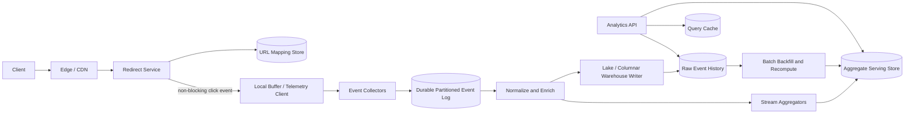

Generated by Codex with gpt-5

Selected problem: URL Shortener Analytics

Scope: Design the analytics subsystem for a URL shortener: capture click events, compute useful aggregates, and serve owner dashboards without slowing down redirects.

Source grounding: Grokking frames analytics as an extended URL shortener requirement and calls out the danger of updating a shared counter row on every popular redirect; Alex Xu highlights that redirect choice affects analytics fidelity; DDIA supplies the storage and processing lens for event logs, OLTP versus OLAP separation, materialized aggregates, stream windows, partitioning, replication, and idempotent recovery.

## Problem framing

The base URL shortener already creates short links and redirects `/{shortCode}` to the destination. This design focuses on what happens after a click is accepted: how to record the event, enrich it, aggregate it, and answer questions such as "how many people clicked this link today?", "where did traffic come from?", and "which campaigns are trending?".

Functional requirements:

- Track each successful redirect as a click event.
- Record useful dimensions: short code, owner or tenant, event time, ingest time, redirect status, referrer domain, country or region, device class, browser family, campaign parameters, and bot classification.
- Show dashboards with total clicks, unique visitors, top referrers, geography, devices, and time-series charts.
- Support filters by link, owner, time range, bucket size, and dimensions.
- Support near-real-time metrics for recent traffic and historical reports for longer ranges.
- Allow raw or semi-raw export for authorized owners, subject to privacy and retention rules.
- Support backfills when enrichment logic or bot filtering changes.

Non-functional requirements:

- The redirect path must remain low latency even if analytics is delayed or temporarily degraded.
- Event ingestion should be durable enough that normal failures do not silently lose large blocks of clicks.
- Analytics can be eventually consistent. A dashboard can lag redirects by seconds or minutes if it exposes freshness clearly.
- The pipeline must tolerate duplicate, late, and out-of-order events.
- Hot links must not overload one database row, stream partition, or aggregate key.
- Query serving should be fast for common dashboards and cost-controlled for ad hoc exploration.
- Raw event data must have explicit retention, access control, and PII minimization.

Scale assumptions:

- Assume an established public shortener with 50,000 successful redirects per second on average and peaks around 10x higher during campaigns or viral events.
- Assume each normalized click event is roughly 1 KB after enrichment, before columnar compression.
- At 50,000 events per second, raw intake is about 4.3 billion events per day, or about 4.3 TB per day before compression.
- Assume most dashboards query one owner or one link over the last day, week, or month.
- Assume a small number of links can dominate traffic, so the design must handle skew rather than relying on uniform distribution.

Core APIs:

```http
GET /v1/links/{shortCode}/analytics?from=2026-05-01T00:00:00Z&to=2026-05-02T00:00:00Z&bucket=hour&dimensions=country,referrer&metrics=clicks,unique_visitors
-> 200 OK
{
  "shortCode": "abc123XY",
  "freshThrough": "2026-05-02T00:00:15Z",
  "bucket": "hour",
  "series": [...]
}

GET /v1/owners/{ownerId}/analytics/top-links?from=...&to=...&limit=100
-> 200 OK

POST /internal/click-events/batch
{
  "events": [
    {
      "eventId": "optional client/request id",
      "shortCode": "abc123XY",
      "eventTime": "2026-05-03T12:00:01Z",
      "requestId": "edge-or-origin-request-id",
      "referrer": "https://example.com/path",
      "userAgent": "...",
      "ip": "203.0.113.10"
    }
  ]
}
-> 202 Accepted

GET /v1/links/{shortCode}/analytics/export?from=...&to=...
-> 202 Accepted
{
  "exportJobId": "exp_..."
}
```

Core data model:

| Entity | Key | Important fields | Notes |
| --- | --- | --- | --- |
| `ClickEvent` | `event_id` | `short_code`, `owner_id`, `event_time`, `ingest_time`, `request_id`, `redirect_status`, `referrer_domain`, `country`, `device_type`, `browser_family`, `campaign`, `bot_score`, `privacy_flags` | Immutable raw event, stored in the log and historical store |
| `LinkDimension` | `short_code` | `owner_id`, `created_at`, `destination_domain`, `status`, `custom_domain`, `campaign_metadata` | Small dimension table used for enrichment and authorization |
| `AggregateBucket` | `owner_id + short_code + bucket_start + bucket_size + dimension_key + dimension_value` | `click_count`, `unique_visitor_sketch`, `bot_filtered_count`, `last_updated_at`, `source_watermark` | Query-serving row for common dashboards |
| `OwnerTopLinks` | `owner_id + bucket_start + metric` | `ranked_short_codes`, `counts`, `last_updated_at` | Precomputed leaderboard to avoid scanning all links per owner |
| `ExportJob` | `export_job_id` | `owner_id`, `scope`, `status`, `created_at`, `completed_at`, `output_uri` | Async export control plane |

## Architecture



High-level design:

- Keep redirects and analytics separated. The redirect service emits an event but does not synchronously update counters.
- Use a local in-process or sidecar buffer so a transient collector issue does not directly add latency to every redirect.
- Event collectors validate schemas, batch writes, assign missing event IDs, and append events to a durable partitioned log.
- Stream processors normalize fields, enrich events, filter obvious bot traffic, and maintain short-window aggregates.
- Store raw events in a columnar historical store so new metrics can be recomputed later.
- Store dashboard-ready aggregates in a low-latency serving store keyed by owner, link, time bucket, and dimension.
- Use batch backfills to repair aggregates after bugs, late data, schema changes, or new enrichment logic.

Data flow:

1. A browser requests a short URL.
2. The redirect service resolves the mapping and returns the redirect.
3. The redirect service emits a click event asynchronously with `short_code`, `request_id`, `event_time`, and request metadata.
4. The collector writes the event to the durable log and returns an acknowledgment to the telemetry client.
5. A stream job enriches the event with owner metadata, referrer domain, device class, geography, and bot score.
6. Aggregation jobs update time buckets such as per-minute, per-hour, and per-day click counts.
7. A warehouse writer stores normalized events in compressed columnar files or a columnar analytics database.
8. The Analytics API serves common dashboards from aggregates and uses the historical store for exports or less common queries.

Storage choices:

- The URL mapping store remains optimized for point reads by short code. It should not become the click counter database.
- The event log is the source of ordering, replay, and fan-out. It lets independent consumers build aggregates, exports, abuse signals, and data quality checks from the same immutable input.
- The aggregate serving store should be write-friendly and key-addressable, because dashboards repeatedly read the same link/time/dimension buckets.
- The raw event history should be OLAP-oriented. DDIA's OLTP versus OLAP split applies directly: analytics queries scan many events but only a few columns, so columnar storage and compression are a better fit than the redirect store.
- Materialized aggregates are a performance layer, not the source of truth. Keep raw events long enough to recompute important metrics.

Caching strategy:

- Cache common dashboard responses by `owner_id`, `short_code`, time range, bucket size, dimensions, and metric set.
- Use short TTLs for recent windows and longer TTLs for closed historical windows.
- Cache authorization and link metadata separately from metric results.
- Do not cache private owner analytics at public edges unless the product has a secure tenant-aware edge cache.
- Use aggregate version or watermark fields so stale cached results can be detected and refreshed.

Partitioning and sharding:

- Ingest topics can be partitioned by event ID or request ID to keep collector writes balanced.
- Aggregation topics should be repartitioned by `short_code` or `owner_id + short_code` so a processor can update per-link state locally.
- Hot links need a second level of sharding. For extreme traffic, partition by `short_code + salt`, compute partial aggregates, then merge them into final buckets.
- Raw history should be partitioned primarily by event date or hour, with clustering by owner or short code if those filters dominate queries.
- Avoid a single mutable `click_count` row per short code. Grokking's telemetry question points at exactly this failure mode: a popular link can create severe write contention.

Consistency tradeoffs:

- The redirect result should be strongly available and fast; analytics freshness can lag.
- Event ingestion is usually at-least-once. Duplicate events are expected during retries.
- Use deterministic event IDs where possible, such as a hash of request ID, short code, event time, and collector source, then deduplicate in a bounded time window.
- For aggregate writes, counters are not naturally idempotent. Include source topic, partition, offset, or event ID metadata so retries do not double-apply increments.
- Use event time for product metrics and ingest time for pipeline health. Late events can either update prior buckets or be tracked as late-arrival corrections.
- Query responses should expose `freshThrough` or a similar watermark so users understand the current lag.

Bottlenecks to call out in an interview:

- Synchronous counter updates on redirect.
- Collector overload and backpressure during campaign spikes.
- Hot stream partitions caused by viral short links.
- High-cardinality dimensions such as full URL referrers or raw user agents.
- Memory pressure from exact unique visitor sets.
- Expensive dashboard queries that scan raw events instead of aggregates.
- Late events and retries causing incorrect counters.
- Bot traffic that inflates metrics unless filtering is versioned and replayable.

## Deep dives

### Redirect semantics and analytics fidelity

Alex Xu's URL shortener chapter calls out a practical tradeoff: permanent redirects reduce load because clients can cache them, while temporary redirects make it easier to observe repeat clicks. For an analytics-heavy shortener, default to temporary redirects such as `302` unless the product explicitly wants permanent browser caching.

This does not mean analytics should hold the redirect open. The redirect service should emit telemetry asynchronously after it has enough context to know the redirect outcome. If the telemetry client is down, the service should either buffer within limits or shed analytics before it harms redirect availability. A missed analytics event is bad; a failed redirect is worse for the core product.

### Event schema and enrichment

Keep the raw emitted event small and stable:

- `short_code`
- `request_id`
- `event_time`
- `redirect_status`
- source IP or derived privacy-preserving network fields
- user agent string
- referrer
- request host or custom domain
- campaign query parameters when present

Then enrich downstream:

- Parse user agent into browser family, OS family, and device class.
- Convert referrer URL into referrer domain and campaign source.
- Resolve coarse geography from IP and discard or transform raw IP according to retention policy.
- Join `short_code` to `LinkDimension` so events carry `owner_id` and destination metadata.
- Assign a bot score using versioned rules so old events can be reprocessed consistently.

This keeps the redirect service simple and lets the analytics pipeline evolve without redeploying the serving path for every metric change.

### Stream windows and late events

DDIA's distinction between event time and processing time matters for click analytics. If a stream processor restarts and drains a backlog, processing-time metrics can show a fake spike. Product dashboards should bucket by event time: when the click happened from the user's perspective or, for server-side redirects, when the service received the request.

Use watermarks to decide when a bucket is mostly complete. For example:

- Keep minute buckets mutable for a short correction period.
- Close hourly and daily buckets after a longer lateness threshold.
- Track late events that arrive after closure.
- Publish corrections when accuracy matters, or expose late-event counts when the product accepts small drift.

This is especially important for mobile, edge, or buffered clients. Even server-side URL redirects can produce delayed events if local telemetry buffers replay after a collector outage.

### Click counts, deduplication, and uniques

Click count is the simplest metric, but retries make it easy to overcount. The pipeline should deduplicate on `event_id` within a time-bounded state store. If the event ID is generated at the redirect service, collector retries preserve identity. If the collector generates it after receiving a request, duplicate collector submissions need another stable key such as request ID plus short code.

Unique visitors are harder. Exact uniqueness requires storing sets of visitor identifiers, which can become expensive and privacy-sensitive. A common interview answer is:

- Use exact dedup for small windows or low-volume links when feasible.
- Use probabilistic sketches such as HyperLogLog for unique visitors at scale.
- Store sketches per bucket and dimension, then merge sketches for larger ranges.
- Keep raw events for recomputation if the approximation or privacy rules change.

The important tradeoff is explicit: exact counts cost memory and can retain sensitive identifiers; sketches are compact and mergeable but approximate.

### Hot link mitigation

Hash partitioning spreads normal links well, but a single viral short code is still a hot key. DDIA's hot-spot warning applies even when the key distribution is otherwise good.

Use two-stage aggregation:

1. Assign each event for a hot link to one of many virtual shards, such as `short_code + shard_id`.
2. Maintain partial counters and sketches per virtual shard.
3. Periodically merge partials into final link-level buckets.

This avoids one processor or one aggregate row receiving every write for a viral link. The cost is more merge work and slightly more complex freshness semantics.

### Query serving model

Most product dashboards should not query raw events directly. Serve them from precomputed aggregate buckets:

- Link time series: `short_code + bucket_start + bucket_size`.
- Dimension breakdowns: add `dimension_key + dimension_value`.
- Owner overview: precompute owner-level totals and top links.
- Recent traffic: read minute buckets with short TTL caching.
- Historical traffic: read hourly or daily buckets and cache more aggressively.

Raw event scans belong to exports, investigations, and offline analytics. This matches DDIA's advice to combine specialized tools: a serving store for low-latency product reads, a log for durable event flow, and an OLAP store for large scans.

### Failure handling and replay

The event log should be the recovery boundary. Collectors acknowledge only after durable append. Stream processors checkpoint offsets and state. Aggregate writes should be idempotent by storing the last applied source offsets or by writing deterministic aggregate versions.

When a processor fails:

- Restart from the last checkpoint.
- Replay unprocessed events from the log.
- Rebuild local state from checkpoints or from compacted state topics.
- Recompute affected aggregate windows if duplicate suppression state is uncertain.

When enrichment rules change:

- Version the rule set.
- Run a batch backfill from raw events.
- Write new aggregate versions.
- Cut dashboards over after validation.

This treats aggregates as derived data, which is the clean DDIA mental model for recovery and evolution.

## Modern considerations

Modern URL analytics should assume incomplete client signals, significant bot traffic, and stricter expectations around privacy. Referrers, cookies, user agents, and IP-derived geography are useful but imperfect inputs, so dashboards should avoid pretending that every "unique visitor" is a real person. Minimize raw identifiers, use coarse dimensions where possible, separate customer-visible analytics from internal abuse analytics, and make retention explicit. The core architecture from the books still holds: keep OLTP redirects separate from OLAP analytics, use an append-only event log as the durable integration point, materialize common aggregates for fast reads, and preserve raw history for replay. The main modern emphasis is operational: schema evolution, versioned enrichment, bot filtering, backfills, tenant isolation, and hot-key mitigation are first-class parts of the design rather than afterthoughts.

## Interview follow-ups

- How do you keep analytics from increasing redirect latency?
  - Emit click events asynchronously through a bounded local buffer or telemetry sidecar, acknowledge collector writes only after durable append, and degrade analytics before blocking redirects.

- Why not increment `click_count` in the URL mapping row on every redirect?
  - A popular link would turn one row into a write hotspot, increase redirect latency, and couple analytics failures to the core redirect path. Append events first, then update derived aggregates out of band.

- How would you handle a viral short link that overloads one stream partition?
  - Detect hot keys, shard the link across virtual aggregate shards, compute partial counts per shard, and merge partials into final buckets. This trades a little freshness and complexity for much higher write parallelism.

- How do you deduplicate events if delivery is at-least-once?
  - Generate stable event IDs as early as possible, deduplicate within a bounded state window, and make aggregate writes idempotent by tracking source offsets or event IDs that have already contributed.

- How do you support both near-real-time dashboards and long historical reports?
  - Serve recent and common queries from materialized aggregate buckets, store raw normalized events in a columnar historical store, and use async export or OLAP queries for long-range ad hoc analysis.

- How do you compute unique visitors?
  - Use exact sets only for small scopes. At scale, store mergeable probabilistic sketches per bucket and dimension, while documenting that unique visitor counts are approximate and sensitive to bot and privacy filtering.

- What do you do with late or out-of-order events?
  - Bucket metrics by event time, maintain watermarks, keep recent buckets mutable for corrections, and either update older buckets or track late events separately after the allowed lateness window.

- How would the design change if analytics is used for billing?
  - Tighten durability and auditability, preserve immutable raw events longer, make deduplication deterministic, add reconciliation jobs, expose correction records, and avoid approximate metrics for billable counts.

- How do you add a new dimension such as campaign source after launch?
  - Add the field to the schema in a backward-compatible way, update enrichment to populate it, backfill from raw events where possible, and write new aggregate versions before exposing the dimension in dashboards.

- How do privacy requirements affect the architecture?
  - Store raw identifiers only when necessary, hash or truncate IPs, limit raw event access, aggregate before display, enforce tenant authorization in the Analytics API, and separate retention policies for raw events, aggregates, and exports.

Closing view:

The strongest interview answer is to treat URL shortener analytics as a derived-data system. The redirect service emits immutable events; a durable log provides replay and fan-out; stream jobs produce fresh aggregates; a columnar store keeps history for recomputation; and the dashboard reads precomputed views with explicit freshness and accuracy tradeoffs.
