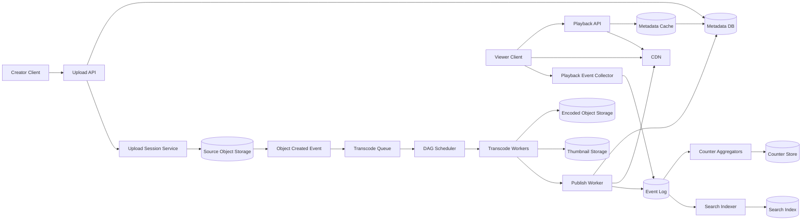

Generated by Codex with gpt-5

Selected problem: Video Streaming Platform

Scope: Design a global video-on-demand platform that supports resumable creator uploads, transcoding, metadata/search, and adaptive-bitrate playback on web, mobile, and TV clients; exclude recommendations, ads, and live streaming from the first version.

## Problem framing

This is the classic "design YouTube / Netflix-style VOD platform" interview. Grokking is useful for the interview flow: clarify scope, define APIs early, size uploads versus reads, and separate large media blobs from metadata. Alex Xu adds the practical serving path: object storage for source and encoded media, an asynchronous transcoding pipeline, CDN-based delivery, and a metadata control plane. DDIA sharpens the deeper answer: treat search indexes, counters, and playback-ready state as derived data maintained from durable logs and background workflows, not as one giant transactional database.

Functional requirements:

- Creators can upload videos reliably, including resume after interrupted uploads.
- Viewers can start playback quickly and switch quality as network conditions change.
- The platform stores title, description, thumbnails, duration, visibility, and playback status for each video.
- Users can search by video title and basic metadata.
- The system records view events and maintains approximate counters such as views and likes.
- The platform supports comments or simple engagement metadata as secondary product features.
- Operators can block, unpublish, or remove videos.

Non-functional requirements:

- High availability for playback and metadata lookup.
- Very low startup latency for popular videos.
- Durable media ingest so uploaded source videos are not lost.
- Horizontal scalability for storage, transcoding throughput, metadata reads, and global delivery.
- Eventual consistency is acceptable for counters, search freshness, and some moderation propagation, but not for returning a manifest before the encoded assets exist.
- Cost control matters because media egress and transcoding dominate infrastructure spend.
- Fault isolation is important so one malformed upload or one hot video does not destabilize the whole service.

Scale assumptions:

- Assume 10 million daily active users and about 5 play sessions per active user per day, which gives about 50 million plays per day.
- Assume peak playback-session starts are about 6 times the daily average, so the control plane should handle a few thousand playback starts per second while CDN segment traffic is much larger.
- Assume 100,000 uploads per day with average source size around 500 MB, which implies about 50 TB of raw ingest per day before replication and packaging overhead.
- Assume videos are encoded into 6 to 10 adaptive-bitrate renditions for common device and bandwidth tiers.
- Assume more than 95% of delivered bytes should come from edge caches for hot content; origin fetches and cold playback must still work.
- Assume most traffic is read-heavy, but one newly viral video can create severe hotspot behavior in manifests, segments, thumbnails, and counters.

## Core APIs

```http
POST /v1/uploads
{
  "title": "How quorum writes work",
  "description": "Distributed systems explainer",
  "visibility": "public",
  "contentType": "video/mp4",
  "sizeBytes": 734003200
}
-> 201 Created
{
  "videoId": "vid_8f42",
  "uploadSessionId": "us_991",
  "uploadUrl": "https://upload.example.com/presigned/...",
  "partSizeBytes": 8388608,
  "expiresAt": "2026-04-26T18:15:00Z"
}

POST /v1/uploads/us_991/complete
{
  "parts": [
    {"partNumber": 1, "etag": "etag-1"},
    {"partNumber": 2, "etag": "etag-2"}
  ]
}
-> 202 Accepted
{
  "videoId": "vid_8f42",
  "state": "PROCESSING"
}

GET /v1/videos/vid_8f42/playback?deviceClass=mobile&drm=widevine
-> 200 OK
{
  "videoId": "vid_8f42",
  "state": "READY",
  "manifestUrl": "https://cdn.example.com/v/vid_8f42/master.m3u8?token=...",
  "thumbnailUrl": "https://cdn.example.com/t/vid_8f42/default.jpg",
  "durationSeconds": 612
}

GET /v1/search?q=quorum+writes&limit=20&cursor=opaque
-> 200 OK
{
  "results": [
    {
      "videoId": "vid_8f42",
      "title": "How quorum writes work",
      "thumbnailUrl": "https://cdn.example.com/t/vid_8f42/default.jpg",
      "viewCount": 104920
    }
  ],
  "nextCursor": "opaque2"
}

POST /v1/playback-events
{
  "videoId": "vid_8f42",
  "sessionId": "ps_44",
  "eventType": "play_started",
  "positionSeconds": 0,
  "occurredAt": "2026-04-26T18:16:03Z"
}
-> 202 Accepted
```

API notes:

- Upload initiation should return a resumable upload session plus a pre-authorized object-storage target, not force the API servers to proxy the entire file.
- Playback returns a signed manifest URL rather than the raw media bytes.
- Search is a separate read model, not a table scan over the metadata store.
- Playback and engagement events should be asynchronous fire-and-forget writes into an event pipeline.

## Core data model

| Entity | Key | Important fields | Notes |
| --- | --- | --- | --- |
| `Video` | `video_id` | `uploader_id`, `title`, `description`, `visibility`, `state`, `duration_seconds`, `created_at`, `ready_at` | Canonical control-plane record |
| `UploadSession` | `upload_session_id` | `video_id`, `storage_key`, `part_size`, `expires_at`, `status` | Tracks resumable uploads |
| `VideoAsset` | `video_id + rendition_id` | `codec`, `resolution`, `bitrate`, `segment_prefix`, `manifest_ref`, `drm_profile`, `checksum` | One encoded rendition or packaged output |
| `ThumbnailAsset` | `video_id + thumbnail_type` | `object_ref`, `width`, `height`, `generated_at` | Small hot-read assets |
| `PlaybackPolicy` | `video_id + client_profile` | `manifest_ref`, `geo_rules`, `token_policy`, `drm_config` | Keeps manifest choice separate from canonical metadata |
| `VideoSearchDocument` | `video_id` | `title_terms`, `description_terms`, `language`, `quality_signals`, `published_at` | Derived search index document |
| `PlaybackEvent` | append-only event | `video_id`, `session_id`, `event_type`, `position`, `occurred_at` | Source of truth for analytics and counters |
| `VideoCounter` | `video_id + counter_type + time_bucket` | `count`, `last_aggregated_offset` | Derived approximate counters |
| `ModerationState` | `video_id` | `status`, `reasons`, `review_state`, `effective_at` | Read at playback-authorize time |

The key modeling choice is to keep `Video` and `UploadSession` as transactional control-plane data, while search, counters, recommendations, and some moderation signals are derived state fed by logs and background workers.

## Architecture



High-level design:

- Keep the hot media path and the control plane separate. API servers should authorize, route, and return metadata, but video bytes should come from object storage and CDN.
- Store the source upload and the encoded renditions separately. The source is for reprocessing; the encoded outputs are for serving.
- Use an asynchronous pipeline from upload completion to playback readiness. Do not block user requests on transcoding.
- Maintain search, counters, and later recommendations as derived systems fed by durable events.
- Make playback authorization cheap: metadata lookup, policy check, signed manifest generation, and then direct CDN fetches.

Main components:

- Upload API and Session Service:
  - Creates the `Video` and `UploadSession` records and returns a resumable upload target.
- Source Object Storage:
  - Durable landing zone for raw uploads.
- Transcode Queue and DAG Scheduler:
  - Breaks processing into independent tasks such as inspection, transcoding, thumbnail generation, packaging, and DRM preparation.
- Transcode Workers:
  - CPU/GPU-heavy fleet that runs the DAG tasks.
- Encoded Object Storage:
  - Stores packaged renditions, manifests, subtitles, and preview clips.
- Metadata DB and Cache:
  - Holds canonical video state and serves playback/control-plane reads.
- CDN:
  - Serves manifests, segments, thumbnails, and static assets close to viewers.
- Event Log:
  - Durable append-only stream for playback events, moderation events, and publish lifecycle events.
- Search Index and Counter Aggregators:
  - Derived systems that consume the log and stay eventually consistent.

Data flow:

Upload and publish flow:

1. The creator calls `POST /v1/uploads`.
2. The API writes an initial `Video` row in `UPLOADING` state plus an `UploadSession`.
3. The client uploads media directly to source object storage, usually in multipart chunks.
4. When the upload completes, object storage emits an event and the video enters the transcode queue.
5. The DAG scheduler fans the job out into validation, thumbnail generation, encoding, packaging, and optional DRM steps.
6. Workers write encoded renditions and manifests to encoded storage.
7. A publish worker verifies required assets exist, flips the `Video` state to `READY`, warms metadata cache, and makes the CDN path eligible for playback.

Playback flow:

1. The viewer requests playback metadata for a `video_id`.
2. The playback API reads cached video metadata and moderation state.
3. If the video is `READY`, the API returns a signed manifest URL.
4. The player fetches the manifest and media segments from the CDN, which pulls from encoded storage on cache miss.
5. The player emits `play_started`, heartbeat, and completion events asynchronously.
6. Aggregation jobs update approximate counters and analytics dashboards from the event log.

Search flow:

1. Publish and metadata-change events are appended to the event log.
2. The search indexer tokenizes title and description, builds the search document, and writes it to the search index.
3. Search APIs query the index, not the metadata OLTP database.

Storage choices:

- Source media:
  - Use durable object storage. DDIA's point about specialized storage applies here: blobs and metadata have very different access patterns and should not share one engine.
- Encoded assets:
  - Also use object storage, organized by `video_id/rendition/segment`.
- Metadata:
  - Use a replicated transactional store for `Video`, `UploadSession`, and moderation status.
- Search:
  - Use a separate search index because title/description retrieval is an index problem, not a primary-key lookup problem.
- Events and counters:
  - Put playback events in a partitioned log and build aggregates incrementally.

Caching strategy:

- CDN is the primary cache for manifests, segments, thumbnails, and subtitle files.
- Keep a metadata cache in front of the canonical metadata store for playback authorization and video detail pages.
- Cache negative lookups for deleted or blocked videos for short TTLs to avoid repeated database hits.
- Warm edge caches for newly promoted or scheduled content only when the business case justifies it; most long-tail videos can stay cold until first view.
- Add TTL jitter or versioned manifest URLs so cache invalidation is explicit during republishes or takedowns.

Partitioning and sharding:

- Shard metadata primarily by `video_id`, not only by `uploader_id`, to avoid overloading a single shard for a celebrity creator.
- Keep a secondary access path for uploader dashboards rather than letting the primary shard key optimize every query.
- Partition playback event logs by `video_id` or by a stable hash of `(video_id, session_id)` so one viral video does not collapse one partition forever.
- Search uses its own partitioning strategy, usually by term/index shard rather than by `video_id`.
- CDN hotspots are not solved by metadata sharding alone; hot manifests and segments need edge replication, request collapsing, and token generation that does not hit the primary DB on every segment fetch.

Consistency tradeoffs:

- Upload completion versus playback readiness needs clear state transitions. A user may see `PROCESSING` for some time, but the system must not advertise `READY` until the required manifests and at least one playable rendition are durable.
- Metadata replication can be asynchronous for most reads, but playback authorization for a newly blocked video may need a fresher read path or short-lived cache bypass.
- View counts, likes, and search freshness should be eventually consistent. They are classic derived-data problems.
- Playback event processing should be idempotent. Retries are unavoidable, so counters should dedupe by event ID or tracked stream offset rather than increment blindly.
- If a transcode stage fails after some outputs were written, rerunning the job should be safe. Treat stage outputs as immutable or replaceable by version, not as partially mutated shared state.

Bottlenecks to call out in an interview:

- Transcoding backlog during traffic spikes or after a large creator upload event.
- Hot videos that create manifest, thumbnail, or segment stampedes.
- Metadata DB overload if signed playback policies are generated synchronously from the primary store on every request.
- Slow or malformed uploads tying up session state.
- Search indexing lag after a publish burst.
- CDN cache misses on cold long-tail content.
- Counter inflation if playback events are retried without idempotency.

## Deep dives

### Publish state machine

The cleanest answer is to model video lifecycle explicitly:

- `UPLOADING`
- `UPLOADED`
- `PROCESSING`
- `READY`
- `BLOCKED` or `DELETED`

Why this matters:

- It keeps the API honest. Users can poll or receive notifications without overloading the transcode pipeline.
- It avoids the common bug where metadata exists before playback assets are actually durable.
- It gives moderation and takedown workflows an obvious override path.

Practical rule:

- Only transition to `READY` after a completion worker verifies the encoded storage objects, manifests, thumbnails, and required metadata rows all exist.

### Transcoding and packaging pipeline

Alex Xu's DAG model is the right interview abstraction because the work is naturally parallel but not fully independent.

Typical pipeline stages:

1. Validate container, duration, audio tracks, and corruption.
2. Extract technical metadata and generate thumbnails.
3. Transcode to an adaptive-bitrate ladder.
4. Package outputs into manifests and media segments.
5. Apply DRM packaging or encryption where needed.
6. Publish playback metadata and emit completion events.

Why a DAG beats one giant worker:

- Different creators or product tiers may require different pipelines.
- Thumbnail generation and some audio/video tasks can run in parallel.
- Retries become smaller and cheaper when a failed stage can be replayed without redoing every prior step.

### Search, counters, and analytics as derived data

This is where DDIA improves the interview answer.

- The control plane should not synchronously update search indexes and counters in the same transaction as playback or upload APIs.
- Instead, emit durable events such as `VideoPublished`, `VideoMetadataUpdated`, `PlaybackStarted`, and `PlaybackCompleted`.
- Search indexers and counter aggregators consume those events and update their own stores.

Benefits:

- Rebuildability: if ranking logic or counter definitions change, reprocess the log.
- Isolation: a temporary search outage should not stop uploads or playback.
- Clear semantics: counter staleness is acceptable, but losing canonical video state is not.

### Popularity-aware delivery and cost control

Serving every video as if it were hot is wasteful.

- Keep all source videos and at least one playback-safe encoded set in durable object storage.
- Let the CDN absorb repeated demand for hot content.
- Precompute more renditions and prewarm more edges for high-value or predicted-hot videos.
- Store fewer renditions for very cold content, or generate some derivative assets lazily if startup latency tradeoffs are acceptable.

This is the practical middle ground between the books' "put videos in CDN" simplification and a real platform's long-tail economics.

## Modern considerations

For modern client delivery, the default VOD answer is still adaptive bitrate streaming over HTTP, but the packaging details matter more than the old book versions suggest: serve HLS and often MPEG-DASH where needed, prefer CMAF/fMP4 packaging when it reduces duplicated segment storage across protocols, reserve low-latency HLS techniques for live or interactive use cases instead of ordinary VOD, use signed manifests or signed segment URLs plus DRM where business rules require them, and treat HTTP/3 as a useful delivery optimization when the CDN and player stack support it rather than as a prerequisite for correctness.

## Interview follow-ups

- How would you extend this design to support live streaming?
  - Replace the batch-style publish flow with chunked real-time ingest, shorter segments, tighter end-to-end latency targets, a live-origin path separate from VOD packaging, and stricter error budgets because waiting for retries is much less acceptable.
- How would you avoid double-counting views?
  - Emit playback events with stable IDs, define a view using product rules such as minimum watch time or milestones, and aggregate with idempotent consumers keyed by event ID or stream offset.
- What if one video suddenly goes viral?
  - Push the hot path to CDN and edge caches, replicate manifests aggressively, collapse duplicate origin fetches, separate counter ingestion from playback authorization, and avoid any per-segment dependency on the metadata primary database.
- How would you support resumable uploads reliably?
  - Create upload sessions with multipart chunk manifests, let the client retry only failed parts, verify checksums per part and for the assembled object, and expire abandoned sessions with background cleanup.
- Why not store videos directly in the metadata database?
  - Media blobs and metadata have radically different size, read, and failure characteristics; object storage handles massive immutable blobs better, while the metadata store is optimized for small control-plane records and indexed queries.
- How would you shard comments and likes?
  - Treat them as separate domains from core playback metadata, shard by `video_id` or `(video_id, time_bucket)` depending access patterns, and keep counters derived from append-only events instead of doing large transactional fan-in on a single row.
