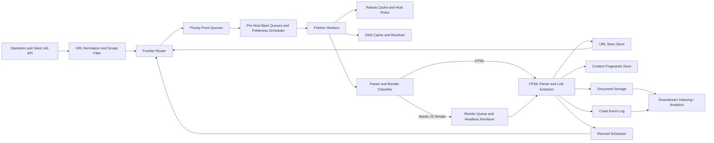

Generated by Codex with gpt-5

Selected problem: Web Crawler

Scope: Design a large-scale, HTML-first web crawler for search indexing that discovers new URLs, respects host politeness and robots rules, deduplicates content, and keeps important pages reasonably fresh.

Also see <https://wiki.derricklin.net/software-development/System%20Design%20Interview/#web-crawler>

## Problem framing

This is the classic "design Googlebot" interview question. Grokking emphasizes the minimum crawler loop: start from seed URLs, fetch pages, extract links, dedupe, and repeat. Alex Xu frames the real interview difficulty more accurately: the hard parts are URL frontier design, politeness, prioritization, freshness, robustness, and avoiding bad content. DDIA supplies the missing systems lens: frontier queues, dedupe tables, document storage, and downstream indexing are separate dataflow stages, so the design should favor partitioned state, replayable logs, and idempotent consumers rather than pretending the entire pipeline is one giant transaction.

Functional requirements:

- Discover pages from seed URLs and extracted links.
- Fetch HTML content over HTTP and HTTPS for the base design.
- Respect robots rules and per-host politeness limits.
- Normalize URLs and avoid revisiting the same URL unnecessarily.
- Detect duplicate content across different URLs.
- Extract outgoing links and schedule newly discovered URLs.
- Persist fetched content and metadata for downstream indexing.
- Recrawl important or frequently changing pages.
- Expose operator controls for seed management, scope rules, and crawl inspection.

Non-functional requirements:

- High throughput and horizontal scalability across hosts and frontier partitions.
- High durability for crawl state; worker failure should not lose large sections of frontier.
- Bounded pressure on origin sites; the crawler must behave politely.
- Extensibility for new MIME types, rendering paths, or anti-spam modules.
- Good observability for coverage, freshness, failure rate, and host-level backoff.
- Eventual consistency is acceptable for crawl completeness, but host politeness state should not be sloppy.
- Efficient storage because most content is cold after the first fetch.

Scale assumptions:

- Assume 1 billion canonical HTML pages actively managed and up to 10 billion discovered URLs over time.
- Assume 20,000 average fetches per second and roughly 100,000 peak across regions during broad crawls plus recrawls.
- Assume average stored compressed HTML plus core metadata is about 100 to 150 KB per retained page.
- Assume the frontier, dedupe sets, and host politeness tables are much larger than RAM, so the design needs disk-backed queues and persistent stores.
- Assume only a fraction of pages justify aggressive recrawl; the long tail can be revisited slowly.
- These are interview sizing assumptions, not claims about the current size of the public web.

## Core APIs

This system is mostly internal. The useful APIs are operator and worker contracts, not public product APIs.

```http
POST /v1/crawl/jobs
{
  "jobId": "search-index-us",
  "seedUrls": [
    "https://example.com/",
    "https://news.example.com/"
  ],
  "allowDomains": ["example.com"],
  "contentTypes": ["text/html"],
  "priority": "normal"
}
-> 202 Accepted
{
  "jobId": "search-index-us",
  "status": "scheduled"
}

POST /internal/frontier/enqueue
{
  "canonicalUrl": "https://example.com/a",
  "discoveredFrom": "https://example.com/",
  "host": "example.com",
  "score": 0.73,
  "nextEligibleAt": "2026-04-23T16:00:00Z"
}
-> 202 Accepted

POST /internal/fetch-results
{
  "canonicalUrl": "https://example.com/a",
  "statusCode": 200,
  "fetchedAt": "2026-04-23T16:00:01Z",
  "contentFingerprint": "sha256:9d5c...",
  "storageUri": "s3://crawl-bucket/2026/04/23/9d5c.html.gz",
  "outLinks": [
    "https://example.com/b",
    "https://blog.example.com/post-1"
  ],
  "needsRecrawlAt": "2026-04-24T16:00:00Z"
}
-> 202 Accepted

GET /v1/crawl/jobs/{jobId}
-> 200 OK
{
  "jobId": "search-index-us",
  "queuedUrls": 184000000,
  "fetchedUrls": 923000000,
  "blockedByRobots": 2400000,
  "duplicateContentRate": 0.27
}
```

API notes:

- `crawl/jobs` is a control-plane interface for operators.
- `frontier/enqueue` and `fetch-results` are internal idempotent contracts between stages.
- Fetch acknowledgement should happen after durable state updates, not after a best-effort in-memory queue write.

## Core data model

| Entity | Key | Important fields | Notes |
| --- | --- | --- | --- |
| `UrlRecord` | `url_hash` | `canonical_url`, `host`, `job_scope`, `first_seen_at`, `last_crawled_at`, `next_crawl_at`, `status` | Authoritative record per canonical URL |
| `FrontierEntry` | `host + priority_bucket + sequence` | `url_hash`, `score`, `discovered_from`, `next_eligible_at`, `retry_count` | Disk-backed frontier item with politeness delay |
| `HostState` | `host` | `robots_version`, `robots_fetched_at`, `crawl_delay_ms`, `next_allowed_at`, `failure_backoff` | Keeps per-host politeness and robots cache |
| `DocumentBlob` | `content_fingerprint` | `storage_uri`, `mime_type`, `compressed_size`, `checksum`, `fetched_at` | Blob storage keyed by content fingerprint |
| `ContentFingerprint` | `content_fingerprint` | `first_seen_url_hash`, `seen_count`, `last_seen_at` | Detects duplicate bodies across many URLs |
| `ExtractedLink` | `source_url_hash + target_url_hash` | `anchor_text`, `rel_flags`, `discovered_at` | Optional edge dataset for ranking or graph analysis |
| `CrawlEvent` | `event_id` | `url_hash`, `stage`, `status_code`, `latency_ms`, `worker_id`, `occurred_at` | Append-only event log for observability and replay |
| `RecrawlSchedule` | `url_hash` | `importance_score`, `change_rate`, `last_etag`, `next_crawl_at` | Controls freshness policy by importance and change history |

The key DDIA-style modeling choice is to separate source-of-truth state from derived state. `UrlRecord`, `HostState`, and `DocumentBlob` are durable primary data; queues, dashboards, and search indexes are derived views that can be rebuilt.

## Architecture



High-level architecture:

- Seed job API registers starting URLs and crawl scope.
- URL normalizer canonicalizes scheme, host, path, and obvious duplicates before queueing.
- Frontier router splits work into priority queues and per-host queues.
- Per-host back queues enforce politeness by ensuring only one active fetch stream per host bucket and by honoring `next_allowed_at`.
- Fetchers download pages, using cached DNS and cached robots rules on the critical path.
- Parser and link extractor validate content, compute fingerprints, extract links, and hand new URLs back to the frontier.
- Optional render workers handle the smaller set of pages that actually need browser rendering.
- Document storage keeps fetched content and metadata for downstream indexing or archival.
- Crawl event log records stage transitions for replay, debugging, metrics, and audits.
- Recrawl scheduler adjusts revisit frequency based on importance and observed change rate.

Practical data flow:

1. Operators submit seed URLs and scope rules.
2. The normalizer canonicalizes each seed URL and writes it into the frontier.
3. The frontier assigns each URL to a host queue and a priority bucket.
4. A fetch worker leases work from one host queue whose `next_allowed_at` has passed.
5. The worker checks cached robots rules, resolves DNS if needed, fetches the page, and records fetch metadata.
6. The parser validates the response, computes a content fingerprint, and drops exact duplicate bodies when appropriate.
7. The link extractor emits normalized outbound URLs.
8. The URL seen check filters already-known URLs; only new or eligible-recrawl URLs are re-enqueued.
9. The document blob and crawl event are durably written.
10. The recrawl scheduler updates `next_crawl_at` based on importance, failures, and observed page change history.

## Storage, caching, and partitioning

Storage choices:

- Frontier state:
  - Use a disk-backed queue or log-structured store. The frontier is too large and too durable to live only in memory.
- URL seen store:
  - Use a persistent key-value store keyed by canonical URL hash.
  - This is write-heavy and point-read heavy, so an LSM-style engine is a natural fit.
- Content storage:
  - Store raw or compressed documents in object storage or a blob store keyed by content fingerprint or crawl date.
  - Keep only hot metadata and tiny hot documents in cache.
- Crawl events:
  - Use an append-only partitioned log for fetch results, errors, and extracted-link events.
  - This supports replay, recomputation, and downstream indexing without tightly coupling every stage.
- Host state:
  - Keep it in a low-latency replicated KV store because politeness decisions sit on the critical path.

Caching strategy:

- Cache `robots.txt` and host policies aggressively, with periodic refresh and invalidation on expiry.
- Cache DNS results because name resolution becomes a measurable bottleneck at crawler scale.
- Cache hot URL hashes and hot content fingerprints in memory to reduce repeated dedupe lookups.
- Keep a small fetch-result cache for very recent retries, redirects, and transient failures.
- Do not rely on cache alone for correctness; false negatives in cache are acceptable, but false positives that permanently suppress URLs are dangerous.

Partitioning and sharding:

- Partition frontier ownership by canonical host or host hash. This makes politeness enforcement much easier than partitioning purely by URL hash.
- Within each host shard, keep separate priority buckets so important URLs do not get buried behind endless long-tail pages.
- Use hash partitioning for large `UrlRecord` and `ContentFingerprint` tables, but expect hot hosts and hot URLs to remain hot even under hashing.
- DDIA's warning on skew applies directly: a few massive hosts or viral URLs can still overload one partition, so the design needs host quotas, split-friendly routing, and backpressure instead of assuming hash partitioning magically fixes hot spots.
- Replicate metadata asynchronously for scale, but keep host-lease ownership simple: one active writer or lease holder per host queue at a time.

## Consistency tradeoffs

- Exactly-once crawling is not worth chasing end to end. At-least-once fetch plus idempotent downstream writes is the practical target.
- Duplicate fetches are cheaper than false dedupe drops. That is why a probabilistic structure such as a Bloom filter is better as a memory-saving hint than as the only authoritative "do not crawl" gate.
- Eventual consistency is acceptable for crawl completeness and reporting dashboards.
- Host politeness state needs tighter control. If two workers accidentally believe they both own the same host queue, the system can become impolite immediately.
- Recrawl schedules can be updated asynchronously, because being a little late on a revisit is usually acceptable.
- Index updates are derived data. Following DDIA, it is cleaner to rebuild or replay downstream consumers from a durable crawl log than to couple frontier, storage, and indexing in a distributed transaction.
- Read-after-write consistency is mainly relevant for operator tooling: when an operator blacklists a host or changes a scope rule, the control plane should propagate quickly enough to stop new fetches.

## Bottlenecks and mitigations

Hot hosts:

- Problem: a few large domains dominate discovered URLs and can consume workers.
- Mitigation: per-host queues, strict politeness windows, quotas, and dedicated high-capacity host buckets.

DNS and connection overhead:

- Problem: repeated resolution and handshake cost can dominate fetch latency.
- Mitigation: DNS caching, connection reuse, regional fetchers, and short timeouts.

Duplicate and near-duplicate content:

- Problem: mirrored pages, tracking params, and syndication waste bandwidth and storage.
- Mitigation: canonicalization before fetch, content fingerprinting after fetch, and optional near-duplicate detection offline.

Frontier durability:

- Problem: losing the frontier after a worker or node failure wastes days of crawl progress.
- Mitigation: disk-backed queues, checkpoints, and append-only crawl events.

Crawler traps and spam:

- Problem: infinite calendars, faceted URLs, and generated spam can absorb enormous crawl budget.
- Mitigation: URL pattern filters, depth/path limits, host-level anomaly detection, and manual operator overrides.

Render cost for modern sites:

- Problem: full browser rendering is much more expensive than HTML fetch and parse.
- Mitigation: keep HTML-first crawling, classify pages, and route only the necessary subset through a bounded render queue.

## Deep dives

- URL frontier design:
  - Alex Xu's core insight is the split between prioritization and politeness. A practical frontier uses front queues to choose important URLs first and back queues to make sure each host is crawled politely. That is more interview-useful than saying "use BFS" and stopping there.
- URL canonicalization versus content dedupe:
  - Grokking and Alex Xu both separate URL-seen and content-seen checks, and that distinction matters. Canonicalization removes superficial URL variance before fetch. Content fingerprints catch the different-URL-same-page case after fetch. These are complementary, not interchangeable.
- Freshness:
  - A real crawler is never "done." Alex Xu emphasizes recrawl frequency, and DDIA supplies the right mental model: freshness is a scheduling problem driven by change history, importance, and cost, not a giant synchronized recrawl.
- Fault tolerance:
  - Grokking and Alex Xu both suggest checkpoints. DDIA pushes the idea further: stage transitions should be replayable and idempotent. If a worker crashes after fetching but before persisting extracted links, the system should be able to reprocess that unit safely.
- Partitioning strategy:
  - Partitioning by host simplifies politeness and reduces cross-node coordination, but host-based partitioning creates skew for very large domains. DDIA's lesson is that partitioning is about choosing which pain you want: host-based sharding makes fairness easier, while purely hash-based sharding makes fairness harder. For crawlers, host-awareness is usually the right primary dimension.
- Extensibility:
  - Both books recommend modular protocol and MIME handlers. The interview-friendly answer is to keep fetch, parse, render, dedupe, and storage loosely coupled so HTML-only can become HTML plus PDF, image, or renderable content without rewriting the frontier.

## Modern considerations

Older crawler write-ups assume mostly server-rendered HTML and often treat old traffic numbers as if they were timeless. The safer 2026 version is: keep all scale figures clearly labeled as interview assumptions, follow the now-standardized [Robots Exclusion Protocol](https://www.rfc-editor.org/rfc/rfc9309) for `robots.txt`, honor page-level controls such as [robots meta tags and `X-Robots-Tag`](https://developers.google.com/search/docs/crawling-indexing/robots-meta-tag) when the page is crawlable, and treat JavaScript rendering as a selective extension rather than the base path. Google's current crawler guidance says Search uses an evergreen Chromium-based renderer for JavaScript pages and that [dynamic rendering is only a workaround](https://developers.google.com/search/docs/crawling-indexing/javascript/dynamic-rendering), with server-side rendering, static rendering, or hydration preferred in general ([JavaScript SEO basics](https://developers.google.com/search/docs/crawling-indexing/javascript/javascript-seo-basics)). In interview terms: start with HTML-first fetching, add a bounded render queue for exceptions, and avoid presenting dated page-count estimates or vendor choices as present-day facts.

## Interview follow-ups

- How would you prevent the crawler from overwhelming one website?
  - Partition work by host, keep a per-host queue with `next_allowed_at`, allow only one active fetch stream per host bucket, and back off on repeated failures or `429` and `503` responses.

- How would you keep the crawl fresh without recrawling everything constantly?
  - Store `last_crawled_at`, change history, and importance score per URL, then schedule revisits based on how frequently the page changes and how much the product cares about it. Important, fast-changing pages get short revisit windows; the long tail gets slower recrawl.

- Would you use a Bloom filter for URL dedupe?
  - Only as a space-saving hint or cache. A false positive can permanently suppress a unique page, so the authoritative seen check should live in a persistent exact store keyed by canonical URL hash.

- How would you handle JavaScript-heavy pages?
  - Keep the base crawler HTML-first, classify fetched pages, and send only the subset that truly requires rendering through a headless-browser pipeline. Full rendering is too expensive to make the default.

- What happens if a worker crashes after fetching a page but before processing extracted links?
  - Make stage writes idempotent, checkpoint or log fetch completion durably, and let another worker safely replay parse and extract for that fetch result. Favor replay over manual repair.

- How would you scale the system across multiple regions?
  - Run regional fetchers close to origin hosts, replicate frontier metadata and dedupe stores across regions as needed, and keep host ownership explicit so two regions do not both hammer the same site.

- How would you detect and control crawler traps?
  - Look for explosive URL growth patterns, repeated parameter permutations, deep path recursion, or hosts with extremely low yield. Then cap depth, filter URL patterns, reduce host budget, or blacklist the host entirely.

- If downstream indexing falls behind, should crawling stop?
  - Usually the crawler should degrade, not blindly continue at full speed. Use backpressure from storage and indexing pipelines, slow lower-priority host queues first, and preserve high-value crawls while the system recovers.
